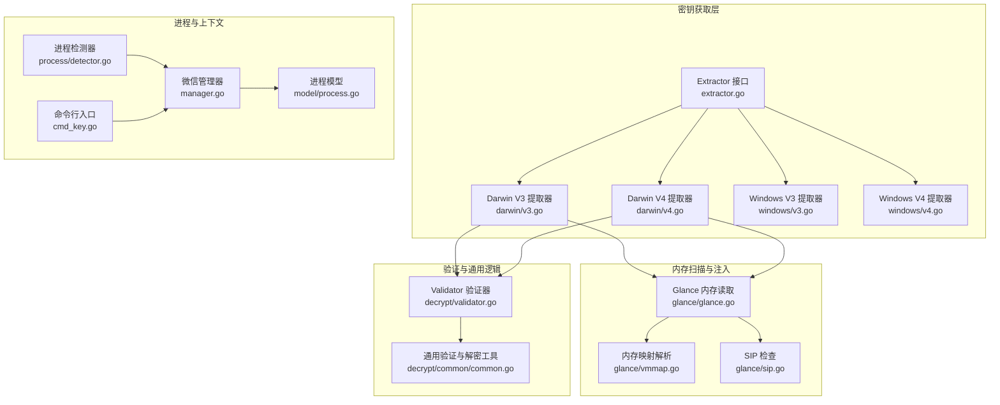
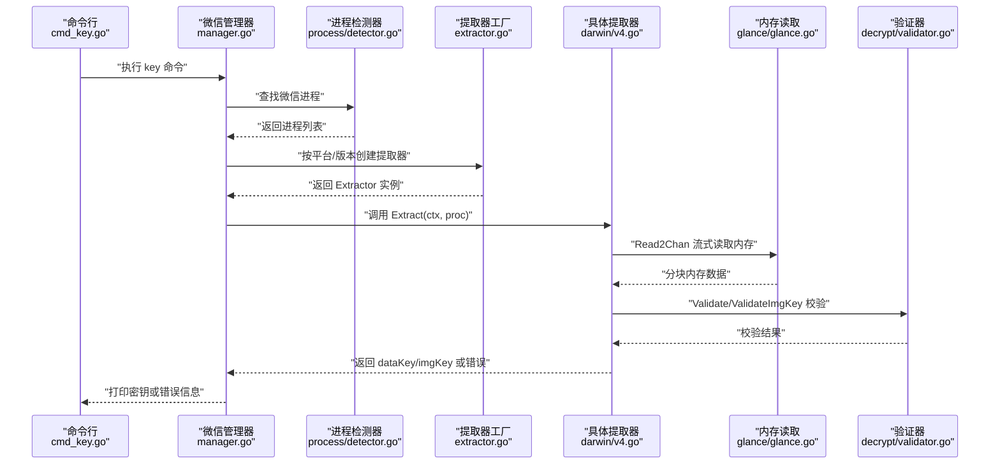
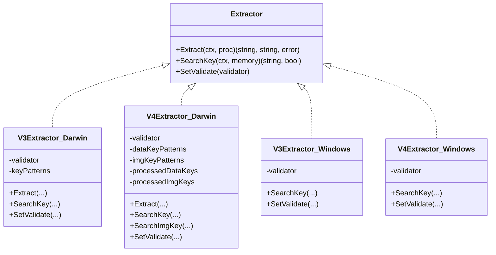
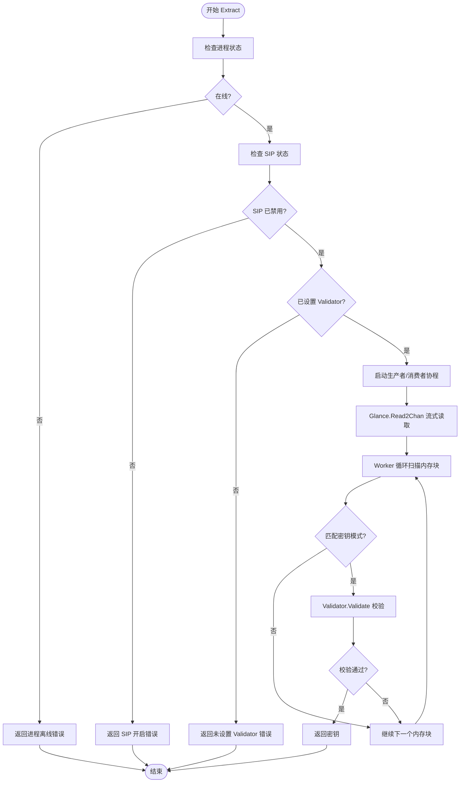
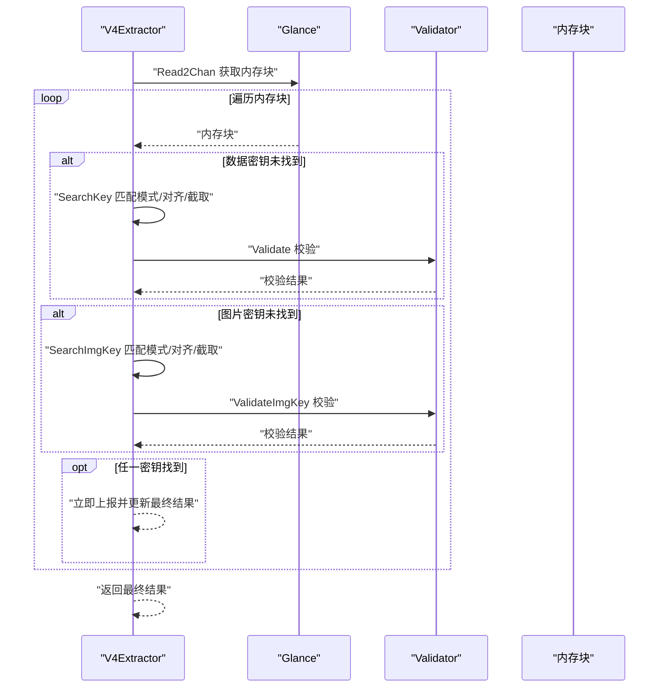
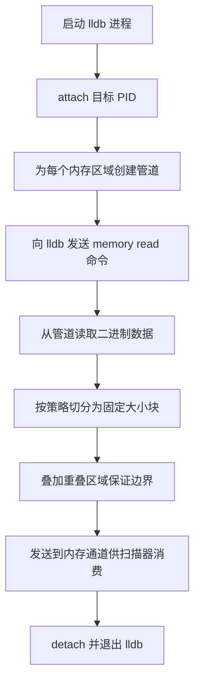
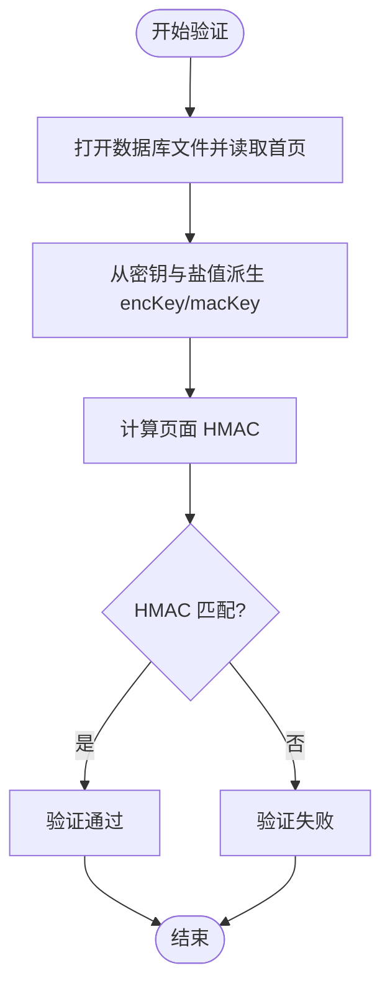
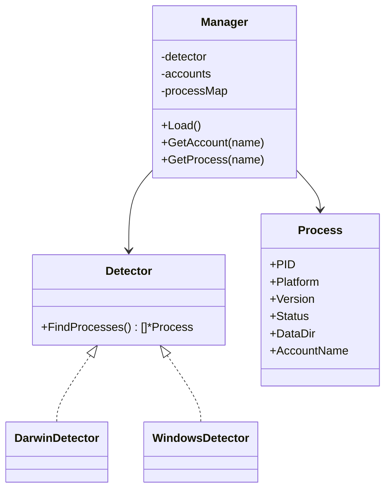
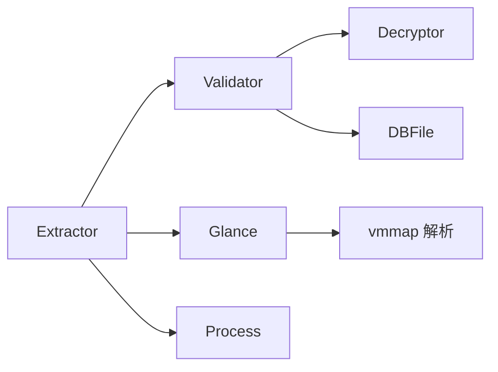

# 密钥获取机制

<cite>
**本文档引用的文件**
- [internal/wechat/key/extractor.go](file://internal/wechat/key/extractor.go)
- [internal/wechat/key/darwin/v3.go](file://internal/wechat/key/darwin/v3.go)
- [internal/wechat/key/darwin/v4.go](file://internal/wechat/key/darwin/v4.go)
- [internal/wechat/key/windows/v3.go](file://internal/wechat/key/windows/v3.go)
- [internal/wechat/key/windows/v4.go](file://internal/wechat/key/windows/v4.go)
- [internal/wechat/key/darwin/glance/glance.go](file://internal/wechat/key/darwin/glance/glance.go)
- [internal/wechat/key/darwin/glance/sip.go](file://internal/wechat/key/darwin/glance/sip.go)
- [internal/wechat/key/darwin/glance/vmmap.go](file://internal/wechat/key/darwin/glance/vmmap.go)
- [internal/wechat/decrypt/validator.go](file://internal/wechat/decrypt/validator.go)
- [internal/wechat/decrypt/common/common.go](file://internal/wechat/decrypt/common/common.go)
- [internal/wechat/process/detector.go](file://internal/wechat/process/detector.go)
- [internal/wechat/model/process.go](file://internal/wechat/model/process.go)
- [internal/wechat/manager.go](file://internal/wechat/manager.go)
- [cmd/chatlog/cmd_key.go](file://cmd/chatlog/cmd_key.go)
- [internal/errors/wechatdb_errors.go](file://internal/errors/wechatdb_errors.go)
</cite>

## 目录
1. [简介](#简介)
2. [项目结构](#项目结构)
3. [核心组件](#核心组件)
4. [架构总览](#架构总览)
5. [详细组件分析](#详细组件分析)
6. [依赖关系分析](#依赖关系分析)
7. [性能考虑](#性能考虑)
8. [故障排除指南](#故障排除指南)
9. [结论](#结论)

## 简介
本文件系统性阐述微信数据库密钥获取机制，覆盖 Windows 与 macOS 平台、V3/V4 版本差异，详述密钥提取器工作流、内存扫描技术、进程注入方式与密钥验证过程。文档同时提供跨平台密钥获取的实践指导、密钥格式与用途说明，并给出常见问题排查与安全注意事项。

## 项目结构
密钥获取功能主要分布在以下模块：
- 提取器接口与工厂：负责按平台与版本选择合适的提取器实现
- 平台特定实现：macOS 的 V3/V4 提取器与 Windows 的占位实现
- 内存扫描与注入：基于 lldb 的内存读取与分块传输
- 密钥验证：通过数据库首页校验密钥有效性
- 进程发现与上下文：进程状态、平台与版本信息

**图表来源**
- [internal/wechat/key/extractor.go](file://internal/wechat/key/extractor.go#L25-L39)
- [internal/wechat/key/darwin/v3.go](file://internal/wechat/key/darwin/v3.go#L40-L112)
- [internal/wechat/key/darwin/v4.go](file://internal/wechat/key/darwin/v4.go#L55-L147)
- [internal/wechat/key/windows/v3.go](file://internal/wechat/key/windows/v3.go#L9-L24)
- [internal/wechat/key/windows/v4.go](file://internal/wechat/key/windows/v4.go#L9-L24)
- [internal/wechat/key/darwin/glance/glance.go](file://internal/wechat/key/darwin/glance/glance.go#L135-L154)
- [internal/wechat/key/darwin/glance/vmmap.go](file://internal/wechat/key/darwin/glance/vmmap.go#L35-L45)
- [internal/wechat/key/darwin/glance/sip.go](file://internal/wechat/key/darwin/glance/sip.go#L10-L37)
- [internal/wechat/decrypt/validator.go](file://internal/wechat/decrypt/validator.go#L24-L49)
- [internal/wechat/decrypt/common/common.go](file://internal/wechat/decrypt/common/common.go#L32-L69)
- [internal/wechat/process/detector.go](file://internal/wechat/process/detector.go#L14-L25)
- [internal/wechat/model/process.go](file://internal/wechat/model/process.go#L3-L12)
- [internal/wechat/manager.go](file://internal/wechat/manager.go#L52-L76)
- [cmd/chatlog/cmd_key.go](file://cmd/chatlog/cmd_key.go#L24-L36)

**章节来源**
- [internal/wechat/key/extractor.go](file://internal/wechat/key/extractor.go#L1-L40)
- [internal/wechat/process/detector.go](file://internal/wechat/process/detector.go#L1-L37)
- [internal/wechat/model/process.go](file://internal/wechat/model/process.go#L1-L25)

## 核心组件
- 提取器接口与工厂
  - 接口定义了 Extract、SearchKey 与 SetValidate 方法，支持按平台与版本选择具体实现
  - 工厂函数根据 platform 与 version 返回对应 Extractor 实例
- Darwin V3/V4 提取器
  - V3：基于 Glance 读取内存，多协程并行扫描，按固定模式偏移提取 32 字节密钥并通过 Validator 校验
  - V4：分别搜索数据密钥与图片密钥，支持并发与去重，使用专用图片密钥校验器
- Windows 提取器
  - 当前为占位实现（TODO），尚未提供具体搜索逻辑
- 内存扫描与注入
  - 通过 lldb 将目标进程内存区域读取到管道，再以分块方式流式传输至扫描器
  - macOS 上需检查 SIP 状态，否则无法读取内存
- 密钥验证
  - Validator 基于数据库首页与密钥派生算法进行 HMAC 校验，确保密钥正确性
  - V4 同时支持图片密钥校验

**章节来源**
- [internal/wechat/key/extractor.go](file://internal/wechat/key/extractor.go#L13-L39)
- [internal/wechat/key/darwin/v3.go](file://internal/wechat/key/darwin/v3.go#L29-L38)
- [internal/wechat/key/darwin/v4.go](file://internal/wechat/key/darwin/v4.go#L40-L53)
- [internal/wechat/key/windows/v3.go](file://internal/wechat/key/windows/v3.go#L9-L24)
- [internal/wechat/key/windows/v4.go](file://internal/wechat/key/windows/v4.go#L9-L24)
- [internal/wechat/key/darwin/glance/glance.go](file://internal/wechat/key/darwin/glance/glance.go#L135-L154)
- [internal/wechat/key/darwin/glance/sip.go](file://internal/wechat/key/darwin/glance/sip.go#L10-L37)
- [internal/wechat/decrypt/validator.go](file://internal/wechat/decrypt/validator.go#L51-L60)

## 架构总览
下图展示了密钥获取的整体流程：命令行触发 -> 进程发现 -> 平台/版本选择 -> 内存扫描 -> 密钥提取 -> 验证 -> 返回结果。

**图表来源**
- [cmd/chatlog/cmd_key.go](file://cmd/chatlog/cmd_key.go#L24-L36)
- [internal/wechat/manager.go](file://internal/wechat/manager.go#L52-L76)
- [internal/wechat/process/detector.go](file://internal/wechat/process/detector.go#L14-L25)
- [internal/wechat/key/extractor.go](file://internal/wechat/key/extractor.go#L25-L39)
- [internal/wechat/key/darwin/v4.go](file://internal/wechat/key/darwin/v4.go#L55-L147)
- [internal/wechat/key/darwin/glance/glance.go](file://internal/wechat/key/darwin/glance/glance.go#L135-L154)
- [internal/wechat/decrypt/validator.go](file://internal/wechat/decrypt/validator.go#L51-L60)

## 详细组件分析

### 提取器接口与工厂
- 接口职责
  - Extract：从目标进程提取数据密钥与图片密钥
  - SearchKey：在给定内存块中搜索匹配模式并返回密钥
  - SetValidate：注入 Validator 用于密钥校验
- 工厂选择
  - Windows V3/V4 与 Darwin V3/V4 分支实例化
  - 其他组合返回不支持平台/版本错误

**图表来源**
- [internal/wechat/key/extractor.go](file://internal/wechat/key/extractor.go#L13-L23)
- [internal/wechat/key/darwin/v3.go](file://internal/wechat/key/darwin/v3.go#L29-L38)
- [internal/wechat/key/darwin/v4.go](file://internal/wechat/key/darwin/v4.go#L40-L53)
- [internal/wechat/key/windows/v3.go](file://internal/wechat/key/windows/v3.go#L9-L24)
- [internal/wechat/key/windows/v4.go](file://internal/wechat/key/windows/v4.go#L9-L24)

**章节来源**
- [internal/wechat/key/extractor.go](file://internal/wechat/key/extractor.go#L13-L39)

### Darwin V3 密钥提取器
- 关键特性
  - 并发扫描：根据 CPU 核数动态确定工作协程数量，上限 8
  - 流式内存读取：通过 Glance.Read2Chan 将内存分块传输
  - 模式匹配：在内存中从后向前查找预设字节模式，按偏移提取 32 字节密钥
  - 校验：使用 Validator.Validate 对密钥进行数据库首页校验
  - SIP 检查：要求关闭 SIP 才能读取内存
- 错误处理
  - 进程离线、SIP 开启、未设置 Validator、无有效密钥等场景返回明确错误

**图表来源**
- [internal/wechat/key/darwin/v3.go](file://internal/wechat/key/darwin/v3.go#L40-L112)
- [internal/wechat/key/darwin/glance/glance.go](file://internal/wechat/key/darwin/glance/glance.go#L135-L154)
- [internal/wechat/key/darwin/glance/sip.go](file://internal/wechat/key/darwin/glance/sip.go#L10-L37)
- [internal/wechat/decrypt/validator.go](file://internal/wechat/decrypt/validator.go#L51-L53)

**章节来源**
- [internal/wechat/key/darwin/v3.go](file://internal/wechat/key/darwin/v3.go#L40-L188)
- [internal/wechat/key/darwin/glance/glance.go](file://internal/wechat/key/darwin/glance/glance.go#L135-L228)
- [internal/wechat/key/darwin/glance/sip.go](file://internal/wechat/key/darwin/glance/sip.go#L10-L37)
- [internal/wechat/decrypt/validator.go](file://internal/wechat/decrypt/validator.go#L51-L53)

### Darwin V4 密钥提取器
- 关键特性
  - 双密钥搜索：独立搜索数据密钥与图片密钥，支持并发与去重
  - 模式与对齐：针对零填充模式进行 16 字节对齐，避免无效片段
  - 去重机制：使用并发安全 map 记录已处理密钥，减少重复校验
  - 校验策略：数据密钥使用 Validator.Validate，图片密钥使用 Validator.ValidateImgKey
- 并发控制
  - 生产者协程持续推送内存块；多个消费者协程并行处理；任一密钥找到即优先上报，最终汇总返回

**图表来源**
- [internal/wechat/key/darwin/v4.go](file://internal/wechat/key/darwin/v4.go#L55-L147)
- [internal/wechat/key/darwin/v4.go](file://internal/wechat/key/darwin/v4.go#L216-L285)
- [internal/wechat/key/darwin/v4.go](file://internal/wechat/key/darwin/v4.go#L287-L356)
- [internal/wechat/decrypt/validator.go](file://internal/wechat/decrypt/validator.go#L55-L60)

**章节来源**
- [internal/wechat/key/darwin/v4.go](file://internal/wechat/key/darwin/v4.go#L55-L356)
- [internal/wechat/decrypt/validator.go](file://internal/wechat/decrypt/validator.go#L55-L60)

### Windows 提取器（现状与建议）
- 现状
  - V3/V4 提取器类存在但未实现具体逻辑（SearchKey 返回空值）
- 建议
  - 参考 Darwin 实现，结合 Windows 进程内存访问能力设计模式匹配与校验流程
  - 若无直接内存读取权限，可考虑替代方案（如从已知路径读取或使用官方接口）

**章节来源**
- [internal/wechat/key/windows/v3.go](file://internal/wechat/key/windows/v3.go#L17-L20)
- [internal/wechat/key/windows/v4.go](file://internal/wechat/key/windows/v4.go#L17-L20)

### 内存扫描与注入（Darwin）
- lldb 注入流程
  - 通过 mkfifo 创建命名管道，使用 lldb memory read 命令将进程内存写入管道
  - 读取端异步接收数据并按固定大小分块发送到扫描通道
- 内存区域过滤
  - 使用 vmmap 解析内存映射，按 Darwin 版本选择 MALLOC_NANO 或 MALLOC_SMALL 类型区域
  - 支持重叠分块，保证边界模式匹配的完整性
- SIP 要求
  - macOS 上若 SIP 未禁用，无法读取目标进程内存，需提示用户关闭 SIP

**图表来源**
- [internal/wechat/key/darwin/glance/glance.go](file://internal/wechat/key/darwin/glance/glance.go#L231-L385)
- [internal/wechat/key/darwin/glance/vmmap.go](file://internal/wechat/key/darwin/glance/vmmap.go#L35-L45)
- [internal/wechat/key/darwin/glance/vmmap.go](file://internal/wechat/key/darwin/glance/vmmap.go#L122-L141)

**章节来源**
- [internal/wechat/key/darwin/glance/glance.go](file://internal/wechat/key/darwin/glance/glance.go#L135-L228)
- [internal/wechat/key/darwin/glance/vmmap.go](file://internal/wechat/key/darwin/glance/vmmap.go#L122-L187)
- [internal/wechat/key/darwin/glance/sip.go](file://internal/wechat/key/darwin/glance/sip.go#L10-L37)

### 密钥验证机制
- 验证对象
  - 数据密钥：使用数据库首页与密钥派生算法进行 HMAC 校验
  - 图片密钥：V4 专用校验器，针对图片解密场景
- 验证流程
  - 打开数据库文件，读取首页与盐值
  - 派生加密密钥与 MAC 密钥
  - 计算并比对 HMAC，确保密钥正确
- 错误类型
  - 不支持的平台/版本、密钥长度不符、校验失败等

**图表来源**
- [internal/wechat/decrypt/validator.go](file://internal/wechat/decrypt/validator.go#L24-L49)
- [internal/wechat/decrypt/common/common.go](file://internal/wechat/decrypt/common/common.go#L79-L98)

**章节来源**
- [internal/wechat/decrypt/validator.go](file://internal/wechat/decrypt/validator.go#L51-L60)
- [internal/wechat/decrypt/common/common.go](file://internal/wechat/decrypt/common/common.go#L32-L69)
- [internal/wechat/decrypt/common/common.go](file://internal/wechat/decrypt/common/common.go#L79-L98)

### 进程发现与上下文
- 进程检测器
  - 根据平台返回对应 Detector 实现，查找微信进程并封装为 Process 列表
- 进程模型
  - 包含 PID、平台、版本、状态、数据目录等关键信息
- 管理器
  - 组织进程发现、账号映射与密钥获取入口

**图表来源**
- [internal/wechat/process/detector.go](file://internal/wechat/process/detector.go#L9-L25)
- [internal/wechat/manager.go](file://internal/wechat/manager.go#L36-L76)
- [internal/wechat/model/process.go](file://internal/wechat/model/process.go#L3-L12)

**章节来源**
- [internal/wechat/process/detector.go](file://internal/wechat/process/detector.go#L14-L37)
- [internal/wechat/model/process.go](file://internal/wechat/model/process.go#L1-L25)
- [internal/wechat/manager.go](file://internal/wechat/manager.go#L52-L93)

## 依赖关系分析
- 组件耦合
  - Extractor 依赖 Validator 进行密钥校验
  - Darwin 提取器依赖 Glance 进行内存读取
  - Validator 依赖 Decryptor 与 DBFile 进行校验
- 平台差异
  - macOS 需要 SIP 状态检查与 lldb 注入
  - Windows 提取器目前为空实现，需后续完善
- 错误传播
  - 进程离线、SIP 开启、无内存区域、校验失败等错误被上抛至调用方

**图表来源**
- [internal/wechat/key/extractor.go](file://internal/wechat/key/extractor.go#L26-L38)
- [internal/wechat/key/darwin/v3.go](file://internal/wechat/key/darwin/v3.go#L40-L52)
- [internal/wechat/key/darwin/v4.go](file://internal/wechat/key/darwin/v4.go#L55-L67)
- [internal/wechat/key/darwin/glance/glance.go](file://internal/wechat/key/darwin/glance/glance.go#L135-L154)
- [internal/wechat/decrypt/validator.go](file://internal/wechat/decrypt/validator.go#L24-L49)

**章节来源**
- [internal/wechat/key/extractor.go](file://internal/wechat/key/extractor.go#L26-L38)
- [internal/wechat/decrypt/validator.go](file://internal/wechat/decrypt/validator.go#L24-L49)

## 性能考虑
- 并发与吞吐
  - Darwin 提取器根据 CPU 核数动态调整工作协程数，最大 8 个，平衡 CPU 与 I/O
  - 内存分块采用固定数量策略，结合最小块大小与重叠区域，提升匹配准确率
- I/O 优化
  - 使用命名管道与流式读取，避免一次性加载大内存区域
  - 通过 vmmap 过滤可写内存区域，减少无关扫描
- 资源控制
  - 使用 context 控制协程生命周期，及时取消未完成任务
  - 去重机制降低重复校验成本

[本节为通用性能讨论，无需列出具体文件来源]

## 故障排除指南
- 常见错误与原因
  - 进程离线：确认微信进程在线且状态为 online
  - SIP 开启：macOS 上需禁用 SIP 才能读取内存
  - 未设置 Validator：确保在提取器上设置 Validator
  - 无内存区域：vmmap 未能解析到可写内存区域
  - 校验失败：密钥不正确或数据库文件损坏
- 排查步骤
  - 检查进程状态与平台/版本识别
  - 确认 SIP 状态（macOS）
  - 验证数据库文件路径与版本对应关系
  - 观察日志输出，定位扫描阶段与校验阶段的问题
- 相关错误类型
  - 进程离线、SIP 开启、无内存区域、密钥长度不符、校验失败等

**章节来源**
- [internal/wechat/key/darwin/v3.go](file://internal/wechat/key/darwin/v3.go#L41-L52)
- [internal/wechat/key/darwin/glance/sip.go](file://internal/wechat/key/darwin/glance/sip.go#L10-L37)
- [internal/errors/wechatdb_errors.go](file://internal/errors/wechatdb_errors.go#L8-L13)

## 结论
该密钥获取机制通过平台化的提取器、流式的内存扫描与严格的密钥验证，实现了对微信 V3/V4 数据库密钥的稳定提取。Darwin 平台已具备完整的实现，Windows 平台尚待完善。实际部署时应关注 SIP 状态、内存区域过滤与并发参数配置，以获得最佳性能与成功率。