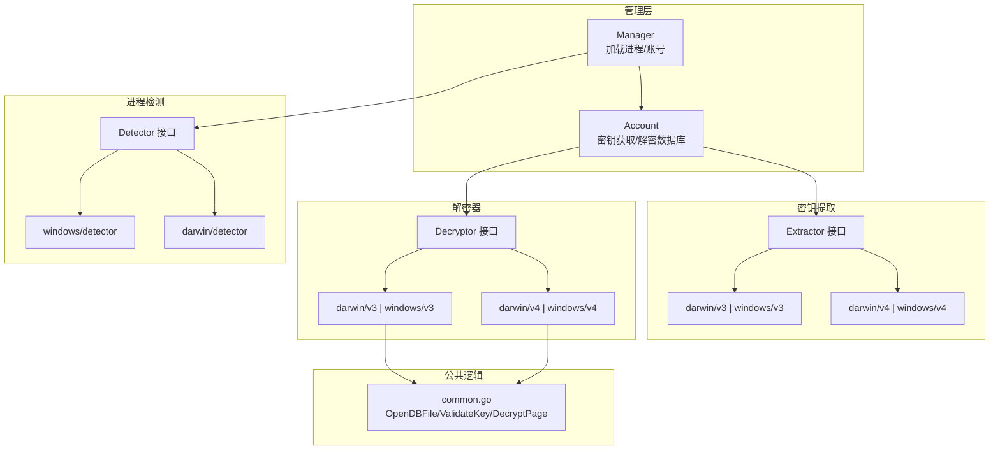
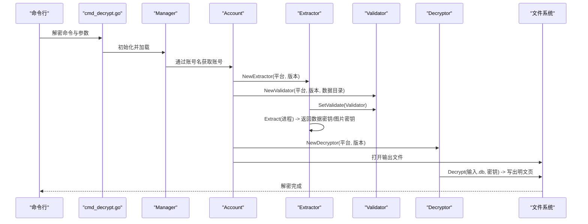
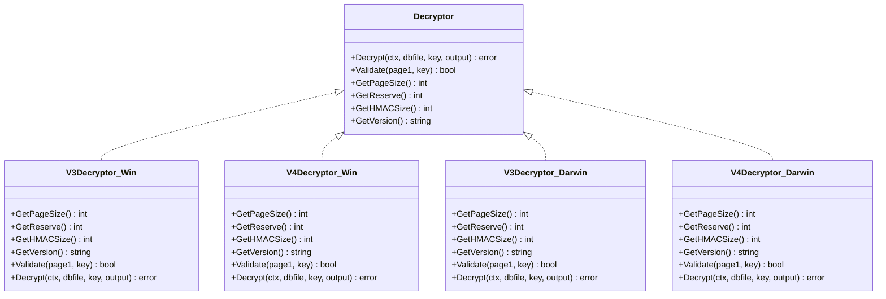
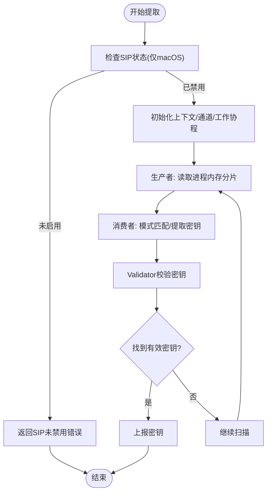
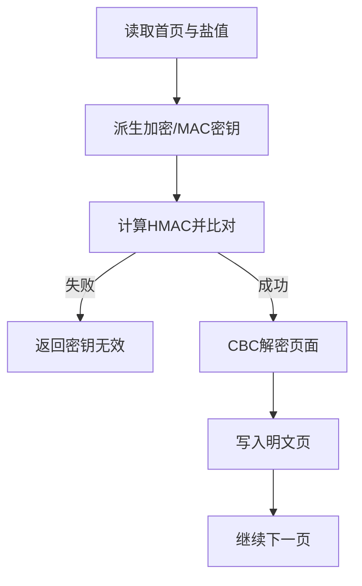
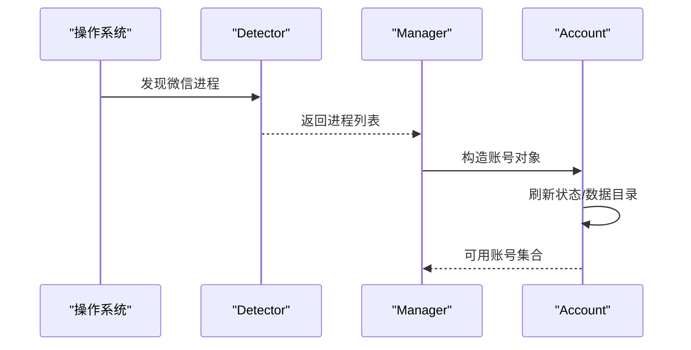
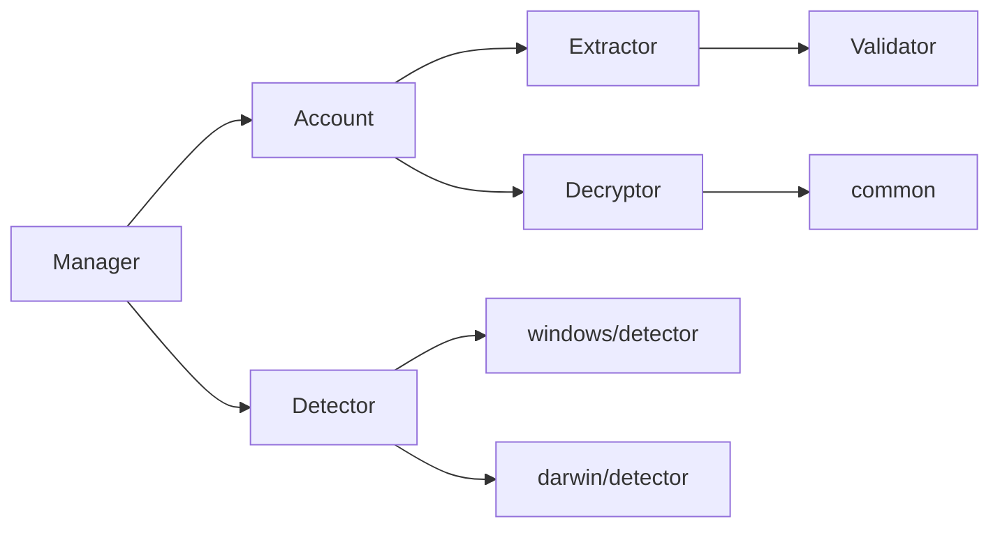

# 数据解密功能

<cite>
**本文引用的文件**
- [internal/wechat/decrypt/decryptor.go](file://internal/wechat/decrypt/decryptor.go)
- [internal/wechat/decrypt/common/common.go](file://internal/wechat/decrypt/common/common.go)
- [internal/wechat/decrypt/darwin/v3.go](file://internal/wechat/decrypt/darwin/v3.go)
- [internal/wechat/decrypt/darwin/v4.go](file://internal/wechat/decrypt/darwin/v4.go)
- [internal/wechat/decrypt/windows/v3.go](file://internal/wechat/decrypt/windows/v3.go)
- [internal/wechat/decrypt/windows/v4.go](file://internal/wechat/decrypt/windows/v4.go)
- [internal/wechat/key/extractor.go](file://internal/wechat/key/extractor.go)
- [internal/wechat/key/darwin/v3.go](file://internal/wechat/key/darwin/v3.go)
- [internal/wechat/key/darwin/v4.go](file://internal/wechat/key/darwin/v4.go)
- [internal/wechat/key/windows/v3.go](file://internal/wechat/key/windows/v3.go)
- [internal/wechat/key/windows/v4.go](file://internal/wechat/key/windows/v4.go)
- [internal/wechat/manager.go](file://internal/wechat/manager.go)
- [internal/wechat/wechat.go](file://internal/wechat/wechat.go)
- [internal/wechat/process/detector.go](file://internal/wechat/process/detector.go)
- [cmd/chatlog/cmd_decrypt.go](file://cmd/chatlog/cmd_decrypt.go)
</cite>

## 目录
1. [简介](#简介)
2. [项目结构](#项目结构)
3. [核心组件](#核心组件)
4. [架构总览](#架构总览)
5. [组件详解](#组件详解)
6. [依赖关系分析](#依赖关系分析)
7. [性能与复杂度](#性能与复杂度)
8. [故障排查指南](#故障排查指南)
9. [结论](#结论)
10. [附录](#附录)

## 简介
本文件系统性阐述微信数据库文件解密功能的设计与实现，覆盖密钥获取、数据文件扫描、解密算法、结果验证、跨平台差异（Windows/macOS）、跨版本差异（V3/V4），以及进程检测与数据文件监控等关键环节。文档同时提供调用示例路径、参数配置建议与常见问题的解决方案。

## 项目结构
围绕“解密”主题，核心代码分布在以下模块：
- 解密器接口与实现：按平台与版本划分，统一对外暴露 Decrypt/Validate/GetPageSize/GetReserve/GetHMACSize/GetVersion 等能力
- 密钥提取器接口与实现：按平台与版本划分，负责从微信进程内存中提取数据密钥与图片密钥
- 公共逻辑：通用数据库页解析、密钥派生与校验、CBC 解密与 HMAC 验证
- 进程检测：按平台选择合适的进程探测器，发现微信实例并构建账号上下文
- 管理层：聚合进程发现、账号封装、解密入口

图表来源
- [internal/wechat/manager.go](file://internal/wechat/manager.go#L51-L76)
- [internal/wechat/wechat.go](file://internal/wechat/wechat.go#L66-L116)
- [internal/wechat/decrypt/decryptor.go](file://internal/wechat/decrypt/decryptor.go#L33-L48)
- [internal/wechat/key/extractor.go](file://internal/wechat/key/extractor.go#L25-L39)
- [internal/wechat/decrypt/common/common.go](file://internal/wechat/decrypt/common/common.go#L32-L69)
- [internal/wechat/process/detector.go](file://internal/wechat/process/detector.go#L13-L25)

章节来源
- [internal/wechat/manager.go](file://internal/wechat/manager.go#L51-L76)
- [internal/wechat/wechat.go](file://internal/wechat/wechat.go#L66-L116)
- [internal/wechat/decrypt/decryptor.go](file://internal/wechat/decrypt/decryptor.go#L33-L48)
- [internal/wechat/key/extractor.go](file://internal/wechat/key/extractor.go#L25-L39)
- [internal/wechat/decrypt/common/common.go](file://internal/wechat/decrypt/common/common.go#L32-L69)
- [internal/wechat/process/detector.go](file://internal/wechat/process/detector.go#L13-L25)

## 核心组件
- 解密器接口与工厂
  - 接口定义了 Decrypt/Validate/GetPageSize/GetReserve/GetHMACSize/GetVersion 等方法
  - 工厂根据平台与版本返回对应实现（darwin/v3、darwin/v4、windows/v3、windows/v4）
- 密钥提取器接口与工厂
  - 接口定义了 Extract/SearchKey/SetValidate
  - 工厂根据平台与版本返回对应实现；macOS V3/V4 使用内存扫描与模式匹配，Windows V3/V4 当前为占位实现（待完善）
- 公共逻辑
  - OpenDBFile：打开数据库文件，读取盐值、首页、总页数
  - ValidateKey：基于 HMAC 验证首页密钥有效性
  - DecryptPage：执行 CBC 解密与 HMAC 校验
- 进程检测
  - 按平台选择 Detector 实现，发现微信进程并构建账号模型
- 管理层与账号
  - Manager 聚合进程发现与账号封装
  - Account 负责密钥获取与数据库解密

章节来源
- [internal/wechat/decrypt/decryptor.go](file://internal/wechat/decrypt/decryptor.go#L12-L31)
- [internal/wechat/decrypt/decryptor.go](file://internal/wechat/decrypt/decryptor.go#L33-L48)
- [internal/wechat/key/extractor.go](file://internal/wechat/key/extractor.go#L13-L23)
- [internal/wechat/key/extractor.go](file://internal/wechat/key/extractor.go#L25-L39)
- [internal/wechat/decrypt/common/common.go](file://internal/wechat/decrypt/common/common.go#L25-L69)
- [internal/wechat/decrypt/common/common.go](file://internal/wechat/decrypt/common/common.go#L79-L98)
- [internal/wechat/decrypt/common/common.go](file://internal/wechat/decrypt/common/common.go#L100-L138)
- [internal/wechat/process/detector.go](file://internal/wechat/process/detector.go#L9-L11)
- [internal/wechat/process/detector.go](file://internal/wechat/process/detector.go#L13-L25)
- [internal/wechat/manager.go](file://internal/wechat/manager.go#L51-L76)
- [internal/wechat/wechat.go](file://internal/wechat/wechat.go#L66-L116)

## 架构总览
下图展示了从命令行到最终解密输出的关键调用链路，以及跨平台与跨版本的差异化实现。

图表来源
- [cmd/chatlog/cmd_decrypt.go](file://cmd/chatlog/cmd_decrypt.go#L29-L43)
- [internal/wechat/manager.go](file://internal/wechat/manager.go#L100-L110)
- [internal/wechat/wechat.go](file://internal/wechat/wechat.go#L66-L116)
- [internal/wechat/key/extractor.go](file://internal/wechat/key/extractor.go#L25-L39)
- [internal/wechat/decrypt/decryptor.go](file://internal/wechat/decrypt/decryptor.go#L33-L48)

## 组件详解

### 解密器接口与实现（按平台/版本）
- 接口职责
  - Decrypt：逐页读取加密数据库，执行 HMAC 校验与 AES-CBC 解密，写出明文页
  - Validate：基于首页盐值与派生密钥计算 HMAC，验证密钥有效性
  - GetPageSize/GetReserve/GetHMACSize/GetVersion：返回解密器参数与版本标识
- 平台与版本差异
  - Windows V3：页面大小 4096，PBKDF2 迭代次数 64000，HMAC-SHA1
  - Windows V4：页面大小 4096，PBKDF2 迭代次数 256000，HMAC-SHA512
  - macOS V3：页面大小 1024，HMAC-SHA1；密钥直接作为加密密钥，不进行 PBKDF2
  - macOS V4：页面大小 4096，PBKDF2 迭代次数 256000，HMAC-SHA512；与 Windows V4 参数一致
- 关键流程
  - 打开数据库文件，读取首页与盐值
  - 验证密钥（Validate）
  - 按页循环：读取页 -> HMAC 校验 -> CBC 解密 -> 写出明文页

图表来源
- [internal/wechat/decrypt/decryptor.go](file://internal/wechat/decrypt/decryptor.go#L12-L31)
- [internal/wechat/decrypt/windows/v3.go](file://internal/wechat/decrypt/windows/v3.go#L24-L52)
- [internal/wechat/decrypt/windows/v4.go](file://internal/wechat/decrypt/windows/v4.go#L23-L51)
- [internal/wechat/decrypt/darwin/v3.go](file://internal/wechat/decrypt/darwin/v3.go#L23-L49)
- [internal/wechat/decrypt/darwin/v4.go](file://internal/wechat/decrypt/darwin/v4.go#L26-L54)

章节来源
- [internal/wechat/decrypt/decryptor.go](file://internal/wechat/decrypt/decryptor.go#L12-L31)
- [internal/wechat/decrypt/windows/v3.go](file://internal/wechat/decrypt/windows/v3.go#L54-L74)
- [internal/wechat/decrypt/windows/v4.go](file://internal/wechat/decrypt/windows/v4.go#L53-L73)
- [internal/wechat/decrypt/darwin/v3.go](file://internal/wechat/decrypt/darwin/v3.go#L51-L72)
- [internal/wechat/decrypt/darwin/v4.go](file://internal/wechat/decrypt/darwin/v4.go#L56-L76)

### 密钥提取器接口与实现（按平台/版本）
- 接口职责
  - Extract：从微信进程内存中提取数据密钥与图片密钥
  - SearchKey：在内存片段中搜索密钥模式并验证
  - SetValidate：注入 Validator 用于密钥有效性验证
- macOS V3
  - 使用 Glance 读取进程内存，多协程扫描，基于固定模式偏移提取 32 字节密钥
  - 需要关闭 SIP（系统完整性保护）以允许内存读取
- macOS V4
  - 同时搜索数据密钥（32 字节）与图片密钥（16 字节），支持多模式与对齐策略
  - 使用并发生产者/消费者模型，去重已处理密钥，优先返回双密钥组合
- Windows V3/V4
  - 当前为占位实现，尚未实现内存扫描逻辑（TODO）

图表来源
- [internal/wechat/key/darwin/v3.go](file://internal/wechat/key/darwin/v3.go#L40-L112)
- [internal/wechat/key/darwin/v4.go](file://internal/wechat/key/darwin/v4.go#L55-L147)
- [internal/wechat/key/windows/v3.go](file://internal/wechat/key/windows/v3.go#L17-L20)
- [internal/wechat/key/windows/v4.go](file://internal/wechat/key/windows/v4.go#L17-L20)

章节来源
- [internal/wechat/key/extractor.go](file://internal/wechat/key/extractor.go#L13-L23)
- [internal/wechat/key/extractor.go](file://internal/wechat/key/extractor.go#L25-L39)
- [internal/wechat/key/darwin/v3.go](file://internal/wechat/key/darwin/v3.go#L40-L112)
- [internal/wechat/key/darwin/v4.go](file://internal/wechat/key/darwin/v4.go#L55-L147)
- [internal/wechat/key/windows/v3.go](file://internal/wechat/key/windows/v3.go#L17-L20)
- [internal/wechat/key/windows/v4.go](file://internal/wechat/key/windows/v4.go#L17-L20)

### 公共逻辑：数据库页解析、密钥派生与解密
- OpenDBFile：打开数据库文件，统计总页数，读取首页与盐值，判断是否已解密
- ValidateKey：基于派生的 MAC 密钥对首页进行 HMAC 计算并与存储值比对
- DecryptPage：先校验 HMAC，再用 CBC 模式解密，拼接保留区后返回明文页

图表来源
- [internal/wechat/decrypt/common/common.go](file://internal/wechat/decrypt/common/common.go#L32-L69)
- [internal/wechat/decrypt/common/common.go](file://internal/wechat/decrypt/common/common.go#L79-L98)
- [internal/wechat/decrypt/common/common.go](file://internal/wechat/decrypt/common/common.go#L100-L138)

章节来源
- [internal/wechat/decrypt/common/common.go](file://internal/wechat/decrypt/common/common.go#L32-L69)
- [internal/wechat/decrypt/common/common.go](file://internal/wechat/decrypt/common/common.go#L79-L98)
- [internal/wechat/decrypt/common/common.go](file://internal/wechat/decrypt/common/common.go#L100-L138)

### 进程检测与账号管理
- Manager 负责加载微信进程列表，转换为 Account 列表并维护映射
- Account 封装账号信息，负责刷新状态、获取密钥与解密数据库
- Detector 根据运行时平台选择具体实现（windows/detector 或 darwin/detector）

图表来源
- [internal/wechat/manager.go](file://internal/wechat/manager.go#L51-L76)
- [internal/wechat/wechat.go](file://internal/wechat/wechat.go#L41-L64)
- [internal/wechat/process/detector.go](file://internal/wechat/process/detector.go#L13-L25)

章节来源
- [internal/wechat/manager.go](file://internal/wechat/manager.go#L51-L76)
- [internal/wechat/wechat.go](file://internal/wechat/wechat.go#L41-L64)
- [internal/wechat/process/detector.go](file://internal/wechat/process/detector.go#L13-L25)

## 依赖关系分析
- 组件耦合
  - Account 依赖 Manager 的进程发现与账号封装
  - Account 依赖 Extractor 与 Decryptor 的平台/版本实现
  - Extractor 依赖 Validator 进行密钥有效性验证
  - Decryptor 依赖 common 提供的数据库页解析与解密工具
- 外部依赖
  - macOS V3/V4 依赖 Glance 库进行内存读取（需 SIP 关闭）
  - 使用 PBKDF2 进行密钥派生，HMAC 与 AES-CBC 进行完整性与机密性保证

图表来源
- [internal/wechat/wechat.go](file://internal/wechat/wechat.go#L66-L116)
- [internal/wechat/decrypt/decryptor.go](file://internal/wechat/decrypt/decryptor.go#L33-L48)
- [internal/wechat/key/extractor.go](file://internal/wechat/key/extractor.go#L25-L39)
- [internal/wechat/decrypt/common/common.go](file://internal/wechat/decrypt/common/common.go#L32-L69)
- [internal/wechat/process/detector.go](file://internal/wechat/process/detector.go#L13-L25)

章节来源
- [internal/wechat/wechat.go](file://internal/wechat/wechat.go#L66-L116)
- [internal/wechat/decrypt/decryptor.go](file://internal/wechat/decrypt/decryptor.go#L33-L48)
- [internal/wechat/key/extractor.go](file://internal/wechat/key/extractor.go#L25-L39)
- [internal/wechat/decrypt/common/common.go](file://internal/wechat/decrypt/common/common.go#L32-L69)
- [internal/wechat/process/detector.go](file://internal/wechat/process/detector.go#L13-L25)

## 性能与复杂度
- 解密复杂度
  - 每页读取与解密为 O(1)，总复杂度 O(N)，N 为页数
  - HMAC 校验与 AES-CBC 解密均为常数时间操作
- 内存扫描复杂度
  - macOS V3/V4 使用多协程扫描，时间复杂度近似 O(K×M)，K 为扫描窗口数量，M 为模式匹配成本
  - 通过通道与去重机制降低重复工作
- 参数影响
  - PBKDF2 迭代次数越高，密钥派生越慢，安全性更高
  - 页面大小越大，单次 IO 更高效，但内存占用与对齐要求更高

[本节为通用性能讨论，无需列出章节来源]

## 故障排查指南
- 常见错误与定位
  - “平台/版本不受支持”：确认传入的平台字符串与版本号组合正确
  - “微信账号未在线”：确保微信进程处于在线状态
  - “SIP 已启用（macOS）”：需要关闭 SIP 才能读取进程内存
  - “密钥无效”：核对密钥来源与数据库版本一致性
  - “文件读取失败/Stat失败”：检查数据库文件路径与权限
  - “解密操作被取消”：检查上下文取消信号
- 建议排查步骤
  - 确认 Manager.Load 成功发现微信进程
  - 确认 Account.GetKey 成功返回密钥
  - 确认 Validator 与 Extractor 的 SetValidate 正确设置
  - 检查解密器参数（页面大小/HMAC长度/哈希函数）与数据库版本匹配
  - 观察日志输出，定位最早出现的错误位置

章节来源
- [internal/wechat/manager.go](file://internal/wechat/manager.go#L51-L76)
- [internal/wechat/wechat.go](file://internal/wechat/wechat.go#L66-L116)
- [internal/wechat/key/darwin/v3.go](file://internal/wechat/key/darwin/v3.go#L45-L48)
- [internal/wechat/decrypt/common/common.go](file://internal/wechat/decrypt/common/common.go#L32-L69)

## 结论
该解密功能通过清晰的接口抽象与平台/版本分层设计，实现了对 Windows 与 macOS 上微信 V3/V4 数据库的安全解密。密钥提取采用多协程扫描与模式匹配，结合 Validator 的 HMAC 校验，确保密钥有效性。公共模块统一了数据库页解析、密钥派生与解密流程，便于扩展与维护。未来可在 Windows V3/V4 上完善内存扫描实现，并持续优化扫描效率与稳定性。

[本节为总结性内容，无需列出章节来源]

## 附录

### 支持的平台与版本
- Windows：V3（页面大小 4096，PBKDF2 迭代 64000，HMAC-SHA1）；V4（页面大小 4096，PBKDF2 迭代 256000，HMAC-SHA512）
- macOS：V3（页面大小 1024，HMAC-SHA1，密钥直传）；V4（页面大小 4096，PBKDF2 迭代 256000，HMAC-SHA512）

章节来源
- [internal/wechat/decrypt/windows/v3.go](file://internal/wechat/decrypt/windows/v3.go#L17-L22)
- [internal/wechat/decrypt/windows/v4.go](file://internal/wechat/decrypt/windows/v4.go#L17-L21)
- [internal/wechat/decrypt/darwin/v3.go](file://internal/wechat/decrypt/darwin/v3.go#L17-L21)
- [internal/wechat/decrypt/darwin/v4.go](file://internal/wechat/decrypt/darwin/v4.go#L17-L24)

### 跨平台差异与注意事项
- macOS 需要关闭 SIP 才能读取进程内存
- Windows V3/V4 的密钥提取器当前为占位实现，尚未实现内存扫描逻辑
- macOS V3 不进行 PBKDF2 派生，直接使用密钥作为加密密钥

章节来源
- [internal/wechat/key/darwin/v3.go](file://internal/wechat/key/darwin/v3.go#L45-L48)
- [internal/wechat/key/windows/v3.go](file://internal/wechat/key/windows/v3.go#L17-L20)
- [internal/wechat/key/windows/v4.go](file://internal/wechat/key/windows/v4.go#L17-L20)
- [internal/wechat/decrypt/darwin/v3.go](file://internal/wechat/decrypt/darwin/v3.go#L51-L62)

### 密钥提取步骤（macOS）
- 确保 SIP 已关闭
- 创建 Extractor（darwin/v3 或 darwin/v4）
- 设置 Validator（基于平台/版本与数据目录）
- 调用 Extract 获取数据密钥与图片密钥
- 若返回空密钥，检查模式匹配与内存扫描范围

章节来源
- [internal/wechat/key/darwin/v3.go](file://internal/wechat/key/darwin/v3.go#L40-L112)
- [internal/wechat/key/darwin/v4.go](file://internal/wechat/key/darwin/v4.go#L55-L147)

### 解密参数配置
- 平台与版本：通过命令行或配置传入 platform 与 version
- 数据目录：用于初始化 Validator（macOS V4 图片密钥校验）
- 工作目录与数据目录：用于定位数据库文件与临时输出

章节来源
- [cmd/chatlog/cmd_decrypt.go](file://cmd/chatlog/cmd_decrypt.go#L12-L19)
- [cmd/chatlog/cmd_decrypt.go](file://cmd/chatlog/cmd_decrypt.go#L45-L63)
- [internal/wechat/wechat.go](file://internal/wechat/wechat.go#L94-L97)

### 错误处理策略
- 早期失败：平台/版本不支持、进程不可用、SIP 未关闭
- 中期失败：密钥无效、文件读取失败、解密哈希校验失败
- 取消处理：支持上下文取消，优雅退出

章节来源
- [internal/wechat/decrypt/decryptor.go](file://internal/wechat/decrypt/decryptor.go#L33-L48)
- [internal/wechat/key/darwin/v3.go](file://internal/wechat/key/darwin/v3.go#L41-L48)
- [internal/wechat/decrypt/common/common.go](file://internal/wechat/decrypt/common/common.go#L32-L69)

### 调用示例（代码路径）
- 命令行入口：decrypt 子命令接收 platform/version/data-dir/data-key/work-dir 等参数
- 管理层入口：Manager.DecryptDatabase(accountName, dbPath, outputPath)
- 账号入口：Account.GetKey(ctx) 与 Account.DecryptDatabase(ctx, dbPath, outputPath)

章节来源
- [cmd/chatlog/cmd_decrypt.go](file://cmd/chatlog/cmd_decrypt.go#L29-L43)
- [internal/wechat/manager.go](file://internal/wechat/manager.go#L100-L110)
- [internal/wechat/wechat.go](file://internal/wechat/wechat.go#L118-L141)