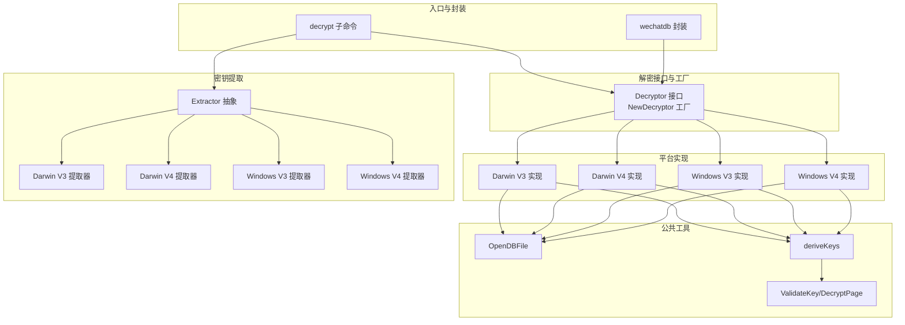
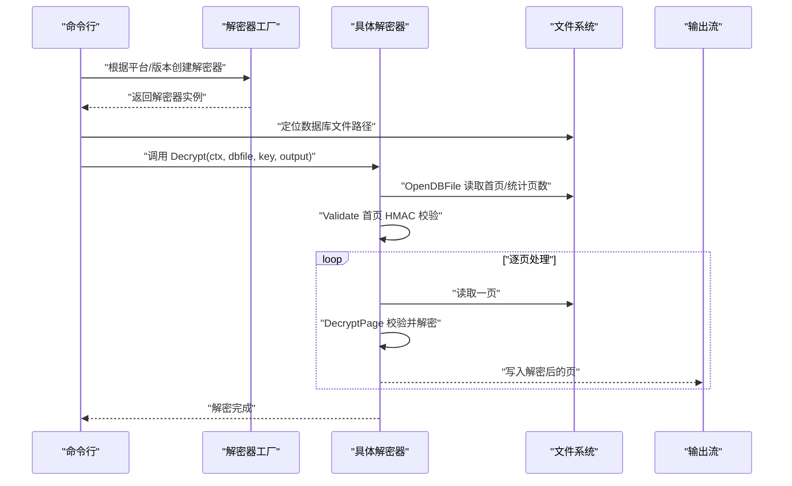
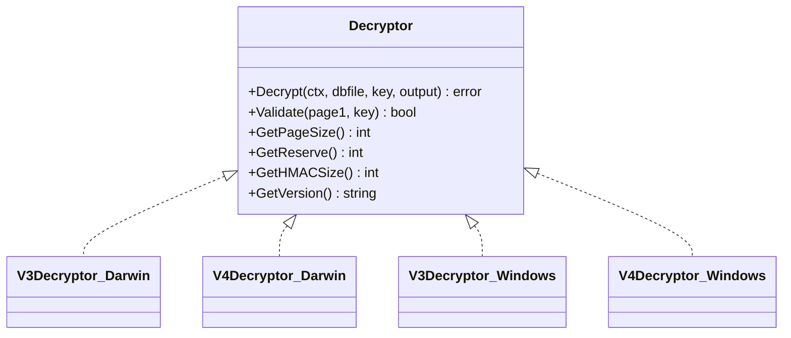
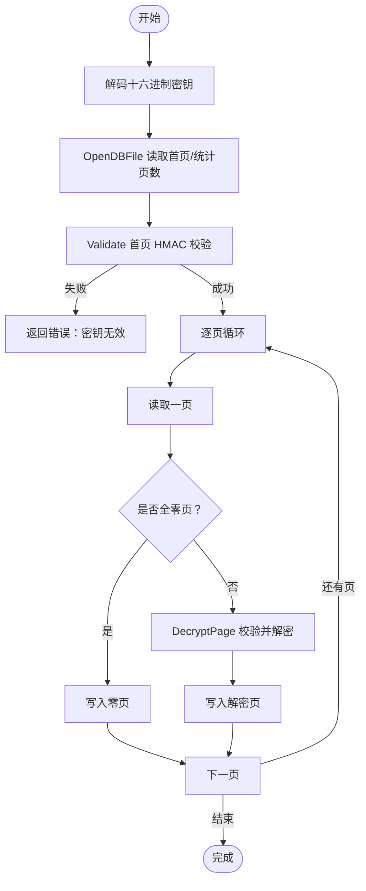
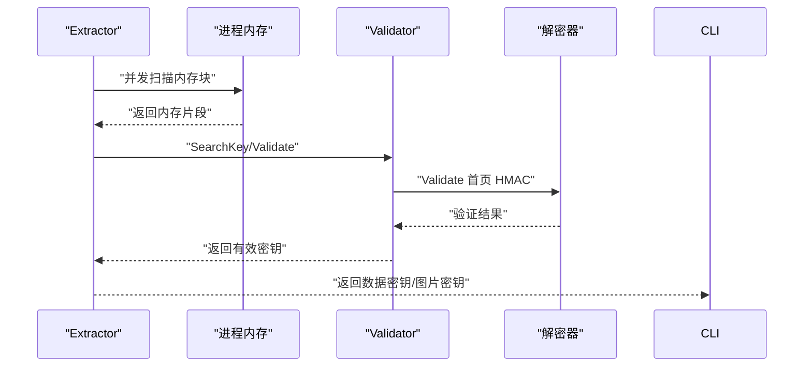
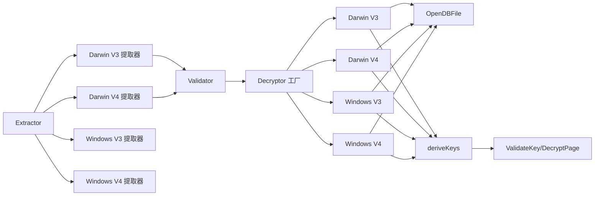

# 文件解密流程

<cite>
**本文引用的文件**
- [internal/wechat/decrypt/decryptor.go](file://internal/wechat/decrypt/decryptor.go)
- [internal/wechat/decrypt/validator.go](file://internal/wechat/decrypt/validator.go)
- [internal/wechat/decrypt/common/common.go](file://internal/wechat/decrypt/common/common.go)
- [internal/wechat/decrypt/darwin/v3.go](file://internal/wechat/decrypt/darwin/v3.go)
- [internal/wechat/decrypt/darwin/v4.go](file://internal/wechat/decrypt/darwin/v4.go)
- [internal/wechat/decrypt/windows/v3.go](file://internal/wechat/decrypt/windows/v3.go)
- [internal/wechat/decrypt/windows/v4.go](file://internal/wechat/decrypt/windows/v4.go)
- [internal/wechat/key/extractor.go](file://internal/wechat/key/extractor.go)
- [internal/wechat/key/darwin/v3.go](file://internal/wechat/key/darwin/v3.go)
- [internal/wechat/key/darwin/v4.go](file://internal/wechat/key/darwin/v4.go)
- [internal/wechat/key/windows/v3.go](file://internal/wechat/key/windows/v3.go)
- [internal/wechat/key/windows/v4.go](file://internal/wechat/key/windows/v4.go)
- [cmd/chatlog/cmd_decrypt.go](file://cmd/chatlog/cmd_decrypt.go)
- [internal/wechatdb/wechatdb.go](file://internal/wechatdb/wechatdb.go)
- [internal/errors/wechatdb_errors.go](file://internal/errors/wechatdb_errors.go)
</cite>

## 目录
1. [简介](#简介)
2. [项目结构](#项目结构)
3. [核心组件](#核心组件)
4. [架构总览](#架构总览)
5. [详细组件分析](#详细组件分析)
6. [依赖关系分析](#依赖关系分析)
7. [性能考量](#性能考量)
8. [故障排查指南](#故障排查指南)
9. [结论](#结论)
10. [附录](#附录)

## 简介
本文件面向需要批量解密微信数据库文件的用户与开发者，系统性阐述解密流程、V3/V4版本的数据文件格式差异、解密算法与数据验证机制、跨平台实现差异、文件扫描与匹配逻辑、性能优化与错误处理策略，并提供完整解密流程图与最佳实践建议。读者可据此完成从密钥提取到数据库解密、再到结果验证的全流程。

## 项目结构
围绕“解密”主题，代码主要分布在以下模块：
- 解密接口与工厂：统一抽象与平台/版本选择
- 平台实现：Darwin(V3/V4) 与 Windows(V3/V4)
- 公共工具：文件打开、密钥派生、HMAC校验、页面解密
- 密钥提取：进程内存扫描与密钥验证
- 命令行入口：decrypt 子命令
- 数据库封装：解密后数据库访问层

图表来源
- [internal/wechat/decrypt/decryptor.go](file://internal/wechat/decrypt/decryptor.go#L34-L48)
- [internal/wechat/decrypt/darwin/v3.go](file://internal/wechat/decrypt/darwin/v3.go#L34-L62)
- [internal/wechat/decrypt/darwin/v4.go](file://internal/wechat/decrypt/darwin/v4.go#L38-L66)
- [internal/wechat/decrypt/windows/v3.go](file://internal/wechat/decrypt/windows/v3.go#L36-L64)
- [internal/wechat/decrypt/windows/v4.go](file://internal/wechat/decrypt/windows/v4.go#L35-L63)
- [internal/wechat/decrypt/common/common.go](file://internal/wechat/decrypt/common/common.go#L32-L98)
- [internal/wechat/key/extractor.go](file://internal/wechat/key/extractor.go#L26-L39)
- [internal/wechat/key/darwin/v3.go](file://internal/wechat/key/darwin/v3.go#L34-L112)
- [internal/wechat/key/darwin/v4.go](file://internal/wechat/key/darwin/v4.go#L48-L147)
- [cmd/chatlog/cmd_decrypt.go](file://cmd/chatlog/cmd_decrypt.go#L29-L43)
- [internal/wechatdb/wechatdb.go](file://internal/wechatdb/wechatdb.go#L23-L59)

章节来源
- [internal/wechat/decrypt/decryptor.go](file://internal/wechat/decrypt/decryptor.go#L1-L49)
- [internal/wechat/decrypt/common/common.go](file://internal/wechat/decrypt/common/common.go#L1-L139)
- [internal/wechat/key/extractor.go](file://internal/wechat/key/extractor.go#L1-L40)
- [cmd/chatlog/cmd_decrypt.go](file://cmd/chatlog/cmd_decrypt.go#L1-L64)
- [internal/wechatdb/wechatdb.go](file://internal/wechatdb/wechatdb.go#L1-L132)

## 核心组件
- 解密接口与工厂
  - Decryptor 接口定义了统一的解密能力：Decrypt、Validate、GetPageSize、GetReserve、GetHMACSize、GetVersion。
  - NewDecryptor 根据平台与版本返回对应实现，支持 windows/v3、windows/v4、darwin/v3、darwin/v4。
- 平台实现
  - Darwin V3/V4 与 Windows V3/V4 各自实现 deriveKeys、Validate、Decrypt，差异体现在页面大小、PBKDF2 迭代次数、哈希函数与 HMAC 大小。
- 公共工具
  - OpenDBFile：打开数据库文件、计算总页数、读取首页并校验是否已解密。
  - ValidateKey：基于派生的 MAC 密钥对首页进行 HMAC 校验。
  - DecryptPage：对单页执行 CBC 解密前的 MAC 校验与 AES-CBC 解密。
- 密钥提取
  - Extractor 抽象：统一 Extract 与 SearchKey 能力，并通过 Validator 设置验证器。
  - Darwin V3/V4：基于内存扫描与模式匹配，多协程并发扫描，命中即验证并通过通道返回。
  - Windows V3/V4：占位实现，预留扩展点。

章节来源
- [internal/wechat/decrypt/decryptor.go](file://internal/wechat/decrypt/decryptor.go#L12-L48)
- [internal/wechat/decrypt/common/common.go](file://internal/wechat/decrypt/common/common.go#L25-L138)
- [internal/wechat/key/extractor.go](file://internal/wechat/key/extractor.go#L13-L39)
- [internal/wechat/key/darwin/v3.go](file://internal/wechat/key/darwin/v3.go#L29-L192)
- [internal/wechat/key/darwin/v4.go](file://internal/wechat/key/darwin/v4.go#L40-L365)

## 架构总览
下图展示了从命令行触发到最终输出解密数据库的整体流程，以及密钥提取与解密验证的关键交互。

图表来源
- [cmd/chatlog/cmd_decrypt.go](file://cmd/chatlog/cmd_decrypt.go#L29-L43)
- [internal/wechat/decrypt/decryptor.go](file://internal/wechat/decrypt/decryptor.go#L34-L48)
- [internal/wechat/decrypt/common/common.go](file://internal/wechat/decrypt/common/common.go#L32-L69)
- [internal/wechat/decrypt/common/common.go](file://internal/wechat/decrypt/common/common.go#L100-L138)

## 详细组件分析

### 解密接口与工厂
- Decryptor 接口职责清晰：解密、验证、参数查询。
- NewDecryptor 依据平台与版本映射到具体实现，未覆盖时返回不支持错误。

图表来源
- [internal/wechat/decrypt/decryptor.go](file://internal/wechat/decrypt/decryptor.go#L12-L31)
- [internal/wechat/decrypt/darwin/v3.go](file://internal/wechat/decrypt/darwin/v3.go#L24-L31)
- [internal/wechat/decrypt/darwin/v4.go](file://internal/wechat/decrypt/darwin/v4.go#L27-L35)
- [internal/wechat/decrypt/windows/v3.go](file://internal/wechat/decrypt/windows/v3.go#L25-L33)
- [internal/wechat/decrypt/windows/v4.go](file://internal/wechat/decrypt/windows/v4.go#L24-L32)

章节来源
- [internal/wechat/decrypt/decryptor.go](file://internal/wechat/decrypt/decryptor.go#L1-L49)

### Darwin V3 解密器
- 页面大小：1024 字节；HMAC 使用 SHA1；保留区含 IV 与 HMAC，按 AES 块大小对齐。
- 密钥派生：V3 不进行 PBKDF2，直接以输入密钥作为加密密钥，MAC 密钥由盐与固定异或后派生。
- 验证与解密：Validate 首页 HMAC；Decrypt 逐页读取，跳过全零页，其余页先校验再解密。

图表来源
- [internal/wechat/decrypt/darwin/v3.go](file://internal/wechat/decrypt/darwin/v3.go#L75-L165)
- [internal/wechat/decrypt/common/common.go](file://internal/wechat/decrypt/common/common.go#L32-L69)
- [internal/wechat/decrypt/common/common.go](file://internal/wechat/decrypt/common/common.go#L100-L138)

章节来源
- [internal/wechat/decrypt/darwin/v3.go](file://internal/wechat/decrypt/darwin/v3.go#L1-L186)
- [internal/wechat/decrypt/common/common.go](file://internal/wechat/decrypt/common/common.go#L1-L139)

### Darwin V4 解密器
- 页面大小：4096 字节；HMAC 使用 SHA512；PBKDF2 迭代次数更高；保留区同上。
- 密钥派生：先以 PBKDF2 生成加密密钥，再以派生密钥与盐异或后二次派生得到 MAC 密钥。
- 验证与解密：流程与 V3 类似，但参数与派生方式不同。

章节来源
- [internal/wechat/decrypt/darwin/v4.go](file://internal/wechat/decrypt/darwin/v4.go#L1-L195)
- [internal/wechat/decrypt/common/common.go](file://internal/wechat/decrypt/common/common.go#L1-L139)

### Windows V3 解密器
- 页面大小：4096 字节；HMAC 使用 SHA1；PBKDF2 迭代次数适中；保留区对齐。
- 密钥派生：两次 PBKDF2，先加密密钥，再以派生密钥派生 MAC 密钥。
- 验证与解密：流程与 Darwin V3 类似。

章节来源
- [internal/wechat/decrypt/windows/v3.go](file://internal/wechat/decrypt/windows/v3.go#L1-L193)
- [internal/wechat/decrypt/common/common.go](file://internal/wechat/decrypt/common/common.go#L1-L139)

### Windows V4 解密器
- 页面大小：4096 字节；HMAC 使用 SHA512；PBKDF2 迭代次数最高；保留区对齐。
- 密钥派生：与 Darwin V4 相同，两次 PBKDF2。
- 验证与解密：流程与 Darwin V4 类似。

章节来源
- [internal/wechat/decrypt/windows/v4.go](file://internal/wechat/decrypt/windows/v4.go#L1-L192)
- [internal/wechat/decrypt/common/common.go](file://internal/wechat/decrypt/common/common.go#L1-L139)

### 密钥提取与验证
- Extractor 抽象：统一 Extract 与 SearchKey，并设置 Validator。
- Darwin V3：单数据密钥，多协程扫描内存，命中后立即验证并返回。
- Darwin V4：双密钥（数据密钥与图片密钥），多协程并行搜索，分别验证并通过通道聚合返回。
- Windows V3/V4：占位实现，预留扩展。

图表来源
- [internal/wechat/key/extractor.go](file://internal/wechat/key/extractor.go#L13-L39)
- [internal/wechat/key/darwin/v3.go](file://internal/wechat/key/darwin/v3.go#L40-L112)
- [internal/wechat/key/darwin/v4.go](file://internal/wechat/key/darwin/v4.go#L55-L147)
- [internal/wechat/decrypt/validator.go](file://internal/wechat/decrypt/validator.go#L51-L60)

章节来源
- [internal/wechat/key/extractor.go](file://internal/wechat/key/extractor.go#L1-L40)
- [internal/wechat/key/darwin/v3.go](file://internal/wechat/key/darwin/v3.go#L1-L193)
- [internal/wechat/key/darwin/v4.go](file://internal/wechat/key/darwin/v4.go#L1-L366)
- [internal/wechat/decrypt/validator.go](file://internal/wechat/decrypt/validator.go#L1-L76)

### 命令行入口与数据库封装
- decrypt 子命令：解析平台、版本、数据目录、工作目录、数据密钥等参数，调用应用层执行解密。
- wechatdb：封装数据库访问，初始化数据源与仓库，提供消息、联系人、群组、媒体等查询接口。

章节来源
- [cmd/chatlog/cmd_decrypt.go](file://cmd/chatlog/cmd_decrypt.go#L1-L64)
- [internal/wechatdb/wechatdb.go](file://internal/wechatdb/wechatdb.go#L1-L132)

## 依赖关系分析
- 解密器依赖公共工具：OpenDBFile、ValidateKey、DecryptPage。
- 平台实现共享密钥派生逻辑，差异在参数与 PBKDF2 迭代次数。
- 密钥提取器依赖 Validator，Validator 再依赖具体解密器的 Validate。
- 命令行入口依赖解密器工厂与密钥提取器，最终通过 wechatdb 访问解密后的数据库。

图表来源
- [internal/wechat/decrypt/decryptor.go](file://internal/wechat/decrypt/decryptor.go#L34-L48)
- [internal/wechat/decrypt/common/common.go](file://internal/wechat/decrypt/common/common.go#L32-L98)
- [internal/wechat/key/extractor.go](file://internal/wechat/key/extractor.go#L26-L39)
- [internal/wechat/key/darwin/v3.go](file://internal/wechat/key/darwin/v3.go#L34-L112)
- [internal/wechat/key/darwin/v4.go](file://internal/wechat/key/darwin/v4.go#L48-L147)
- [internal/wechat/decrypt/validator.go](file://internal/wechat/decrypt/validator.go#L24-L49)

章节来源
- [internal/wechat/decrypt/decryptor.go](file://internal/wechat/decrypt/decryptor.go#L1-L49)
- [internal/wechat/decrypt/common/common.go](file://internal/wechat/decrypt/common/common.go#L1-L139)
- [internal/wechat/key/extractor.go](file://internal/wechat/key/extractor.go#L1-L40)
- [internal/wechat/key/darwin/v3.go](file://internal/wechat/key/darwin/v3.go#L1-L193)
- [internal/wechat/key/darwin/v4.go](file://internal/wechat/key/darwin/v4.go#L1-L366)
- [internal/wechat/decrypt/validator.go](file://internal/wechat/decrypt/validator.go#L1-L76)

## 性能考量
- 页面大小与迭代次数
  - V3 页面通常较小，V4 页面较大；V4 的 PBKDF2 迭代次数更高，解密初始化阶段 CPU 开销更大。
- 并发扫描
  - Darwin V3/V4 提取器采用多协程并发扫描内存，结合通道与上下文控制，提升命中效率。
- 零页优化
  - 解密器在遇到全零页时直接透传写回，避免不必要的解密计算。
- 内存对齐与缓冲
  - 保留区按 AES 块大小对齐，减少填充与边界处理成本。
- I/O 与上下文取消
  - 逐页读取与写入，支持上下文取消，避免长时间阻塞。

章节来源
- [internal/wechat/decrypt/darwin/v3.go](file://internal/wechat/decrypt/darwin/v3.go#L18-L49)
- [internal/wechat/decrypt/darwin/v4.go](file://internal/wechat/decrypt/darwin/v4.go#L20-L54)
- [internal/wechat/decrypt/windows/v3.go](file://internal/wechat/decrypt/windows/v3.go#L18-L52)
- [internal/wechat/decrypt/windows/v4.go](file://internal/wechat/decrypt/windows/v4.go#L18-L51)
- [internal/wechat/key/darwin/v3.go](file://internal/wechat/key/darwin/v3.go#L70-L80)
- [internal/wechat/key/darwin/v4.go](file://internal/wechat/key/darwin/v4.go#L85-L95)

## 故障排查指南
- 常见错误类型
  - 平台/版本不支持：创建解密器失败。
  - 文件打开/读取失败：无法打开数据库文件或读取不完整。
  - 密钥解码失败：输入密钥非十六进制。
  - 密钥无效：Validate 首页 HMAC 校验失败。
  - 解密哈希校验失败：单页解密前的 MAC 校验失败。
  - 操作被取消：上下文取消导致解密中断。
- 定位建议
  - 确认平台与版本参数正确，检查数据库文件路径与权限。
  - 若密钥无效，尝试重新提取或确认密钥长度与格式。
  - 若解密卡在某页，检查该页是否全零或损坏。
  - 在 macOS 上确保满足内存读取前置条件（如 SIP 状态）。

章节来源
- [internal/wechat/decrypt/decryptor.go](file://internal/wechat/decrypt/decryptor.go#L34-L48)
- [internal/wechat/decrypt/common/common.go](file://internal/wechat/decrypt/common/common.go#L32-L69)
- [internal/wechat/decrypt/common/common.go](file://internal/wechat/decrypt/common/common.go#L100-L138)
- [internal/wechat/key/darwin/v3.go](file://internal/wechat/key/darwin/v3.go#L41-L52)
- [internal/wechat/key/darwin/v4.go](file://internal/wechat/key/darwin/v4.go#L60-L67)

## 结论
本项目以清晰的接口抽象与平台化实现，提供了跨平台、跨版本的微信数据库解密能力。通过公共工具统一密钥派生与校验流程，配合密钥提取器的并发扫描与验证，能够高效、稳定地完成解密任务。建议在生产环境中结合上下文取消、零页优化与合理的并发策略，以获得更佳的性能与可靠性。

## 附录
- 解密流程要点
  - 选择解密器：根据平台与版本创建对应实现。
  - 打开数据库：读取首页并统计总页数，校验是否已解密。
  - 验证密钥：Validate 首页 HMAC，确认密钥有效。
  - 逐页解密：跳过全零页，其余页先校验后解密，写回输出。
  - 错误处理：针对不同阶段的错误进行分类处理与提示。
- 最佳实践
  - 优先使用 Validator 预验证密钥，减少无效解密尝试。
  - 在 macOS 上确保满足内存读取前置条件，避免提取失败。
  - 合理设置并发度与缓冲大小，平衡 CPU 与内存占用。
  - 使用上下文取消机制，支持长耗时操作的中断。