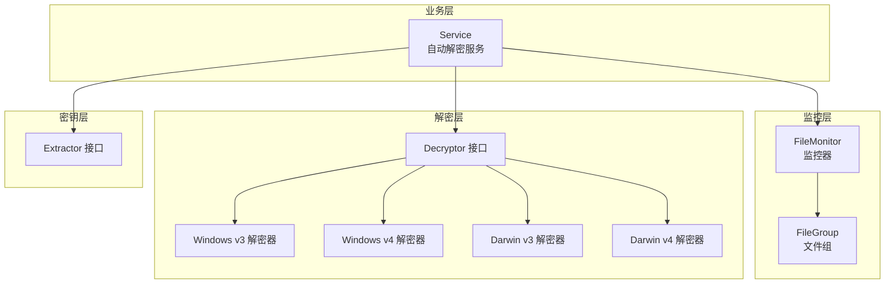
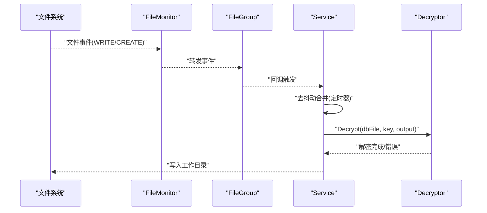
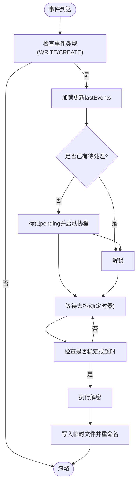
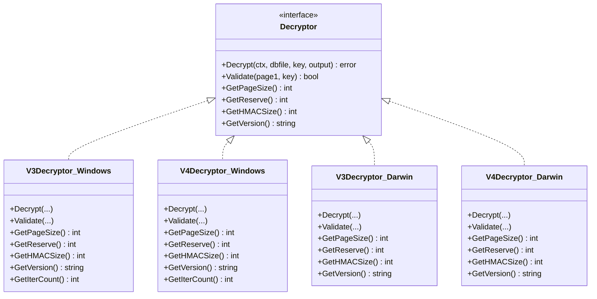
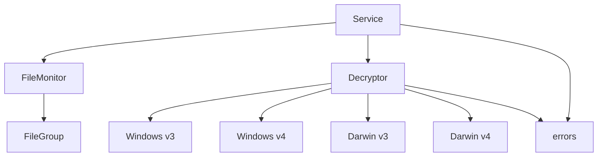

# 自动解密与文件监控

<cite>
**本文档引用的文件**
- [pkg/filemonitor/filemonitor.go](file://pkg/filemonitor/filemonitor.go)
- [pkg/filemonitor/filegroup.go](file://pkg/filemonitor/filegroup.go)
- [internal/chatlog/wechat/service.go](file://internal/chatlog/wechat/service.go)
- [internal/wechat/decrypt/decryptor.go](file://internal/wechat/decrypt/decryptor.go)
- [internal/wechat/decrypt/windows/v3.go](file://internal/wechat/decrypt/windows/v3.go)
- [internal/wechat/decrypt/windows/v4.go](file://internal/wechat/decrypt/windows/v4.go)
- [internal/wechat/decrypt/darwin/v3.go](file://internal/wechat/decrypt/darwin/v3.go)
- [internal/wechat/decrypt/darwin/v4.go](file://internal/wechat/decrypt/darwin/v4.go)
- [internal/wechat/key/extractor.go](file://internal/wechat/key/extractor.go)
- [internal/chatlog/conf/server.go](file://internal/chatlog/conf/server.go)
- [internal/errors/errors.go](file://internal/errors/errors.go)
- [internal/errors/wechat_errors.go](file://internal/errors/wechat_errors.go)
- [internal/errors/wechatdb_errors.go](file://internal/errors/wechatdb_errors.go)
- [cmd/chatlog/cmd_decrypt.go](file://cmd/chatlog/cmd_decrypt.go)
- [internal/chatlog/app.go](file://internal/chatlog/app.go)
</cite>

## 目录
1. [简介](#简介)
2. [项目结构](#项目结构)
3. [核心组件](#核心组件)
4. [架构总览](#架构总览)
5. [详细组件分析](#详细组件分析)
6. [依赖关系分析](#依赖关系分析)
7. [性能考量](#性能考量)
8. [故障排查指南](#故障排查指南)
9. [结论](#结论)
10. [附录](#附录)

## 简介
本文件面向“自动解密与文件监控”能力，系统性阐述以下内容：
- 自动解密功能的实现原理与流程，涵盖解密器选择、密钥验证、数据库页面级解密与输出。
- 文件监控机制的设计与实现，包括文件系统事件监听、文件匹配与分组、事件过滤与去抖动处理。
- 监控器的工作原理、监控范围配置、事件过滤机制与性能优化策略。
- 自动解密的配置示例与代码演示路径，展示如何设置监控规则、处理监控事件与实现解密任务队列。
- 监控精度、性能影响与故障恢复的处理方案。

## 项目结构
围绕自动解密与文件监控，项目的关键模块分布如下：
- 文件监控层：pkg/filemonitor 提供通用的文件组与监控器抽象，支持正则匹配、黑名单过滤、回调分发与动态刷新。
- 业务服务层：internal/chatlog/wechat/service 负责自动解密的业务编排，包括监控启动、事件去抖动、解密任务调度与结果落盘。
- 解密实现层：internal/wechat/decrypt 下按平台与版本划分具体解密器，统一通过接口抽象对外提供。
- 密钥提取层：internal/wechat/key 提供跨平台密钥提取与校验能力。
- 配置与错误处理：internal/chatlog/conf 提供运行配置；internal/errors 提供统一错误模型与分类。



**图表来源**
- [pkg/filemonitor/filemonitor.go](file://pkg/filemonitor/filemonitor.go#L15-L26)
- [pkg/filemonitor/filegroup.go](file://pkg/filemonitor/filegroup.go#L20-L29)
- [internal/chatlog/wechat/service.go](file://internal/chatlog/wechat/service.go#L26-L32)
- [internal/wechat/decrypt/decryptor.go](file://internal/wechat/decrypt/decryptor.go#L12-L31)
- [internal/wechat/key/extractor.go](file://internal/wechat/key/extractor.go#L13-L23)

**章节来源**
- [pkg/filemonitor/filemonitor.go](file://pkg/filemonitor/filemonitor.go#L1-L431)
- [pkg/filemonitor/filegroup.go](file://pkg/filemonitor/filegroup.go#L1-L183)
- [internal/chatlog/wechat/service.go](file://internal/chatlog/wechat/service.go#L1-L206)

## 核心组件
- 文件监控器 FileMonitor
  - 管理多个 FileGroup，封装 fsnotify.Watcher 的生命周期与事件转发。
  - 支持全局黑名单、动态添加/移除组、目录级监控与动态刷新。
- 文件组 FileGroup
  - 基于根目录与正则表达式匹配目标文件，支持黑名单过滤。
  - 提供回调注册与异步事件处理，确保高并发下的稳定性。
- 自动解密服务 Service
  - 启动/停止文件监控，注册数据库文件回调，实现事件去抖动与解密任务队列。
  - 将解密结果写入工作目录，并在必要时回退到原文件内容。
- 解密器 Decryptor
  - 按平台与版本选择具体实现，统一提供解密、校验、页面大小等能力。
- 密钥提取器 Extractor
  - 从进程或内存中提取密钥，配合 Validator 进行有效性校验。

**章节来源**
- [pkg/filemonitor/filemonitor.go](file://pkg/filemonitor/filemonitor.go#L15-L26)
- [pkg/filemonitor/filegroup.go](file://pkg/filemonitor/filegroup.go#L20-L29)
- [internal/chatlog/wechat/service.go](file://internal/chatlog/wechat/service.go#L26-L32)
- [internal/wechat/decrypt/decryptor.go](file://internal/wechat/decrypt/decryptor.go#L12-L31)
- [internal/wechat/key/extractor.go](file://internal/wechat/key/extractor.go#L13-L23)

## 架构总览
自动解密与文件监控的整体流程如下：
- 启动阶段：Service 创建 FileGroup（匹配 .db 文件），注册回调，启动 FileMonitor。
- 运行阶段：FileMonitor 监听文件系统事件，转发给匹配的 FileGroup；FileGroup 将事件交由 Service 的回调处理。
- 去抖动与队列：Service 对同一文件的多次事件进行去抖动合并，形成解密任务队列。
- 解密执行：根据配置选择解密器，执行解密并将结果写入工作目录。



**图表来源**
- [pkg/filemonitor/filemonitor.go](file://pkg/filemonitor/filemonitor.go#L416-L430)
- [pkg/filemonitor/filegroup.go](file://pkg/filemonitor/filegroup.go#L157-L182)
- [internal/chatlog/wechat/service.go](file://internal/chatlog/wechat/service.go#L97-L144)
- [internal/wechat/decrypt/decryptor.go](file://internal/wechat/decrypt/decryptor.go#L12-L31)

## 详细组件分析

### 文件监控器 FileMonitor
- 设计要点
  - 并发安全：使用互斥锁保护 groups、watchDirs、状态标志，避免竞态。
  - 动态监控：基于 FileGroup 的匹配结果动态增删目录监听，减少无效监控。
  - 全局黑名单：在添加目录前检查黑名单，避免监控无关路径。
  - 事件分发：将 fsnotify 事件转发给所有 FileGroup，由其自行判断是否处理。
- 关键方法
  - Start/Stop：创建/关闭 fsnotify.Watcher，管理 goroutine 生命周期。
  - AddGroup/RemoveGroup：动态维护监控组。
  - addWatchDir：添加目录监听并去重。
  - setupWatchForGroup：计算匹配目录并建立监听。
  - RefreshWatches：基于当前匹配结果刷新监听集合。
  - watchLoop：主循环处理事件与错误。
- 性能优化
  - 仅对匹配文件所在目录与根目录建立监听，降低系统调用与内存占用。
  - 事件转发前复制 FileGroup 列表，避免持有锁时间过长。
  - 目录创建事件时即时添加监听，保证后续文件事件能被捕捉。

```mermaid
classDiagram
class FileMonitor {
-groups : map[string]*FileGroup
-watcher : fsnotify.Watcher
-watchDirs : map[string]bool
-blacklist : []string
-mutex : RWMutex
-stopCh : chan struct{}
-wg : WaitGroup
-isRunning : bool
-stateMutex : RWMutex
+Start() error
+Stop() error
+AddGroup(group) error
+RemoveGroup(id) error
+RefreshWatches() error
+SetBlacklist(list) void
+Watcher() *fsnotify.Watcher
}
class FileGroup {
+ID : string
+RootDir : string
+Pattern : *Regexp
+PatternStr : string
+Blacklist : []string
+Callbacks : []FileChangeCallback
+Match(path) bool
+List() []string
+ListMatchingDirectories() map[string]bool
+HandleEvent(event) void
+AddCallback(cb) void
+RemoveCallback(cb) bool
}
FileMonitor --> FileGroup : "管理与转发"
```

**图表来源**
- [pkg/filemonitor/filemonitor.go](file://pkg/filemonitor/filemonitor.go#L15-L26)
- [pkg/filemonitor/filegroup.go](file://pkg/filemonitor/filegroup.go#L20-L29)

**章节来源**
- [pkg/filemonitor/filemonitor.go](file://pkg/filemonitor/filemonitor.go#L141-L200)
- [pkg/filemonitor/filemonitor.go](file://pkg/filemonitor/filemonitor.go#L202-L237)
- [pkg/filemonitor/filemonitor.go](file://pkg/filemonitor/filemonitor.go#L246-L304)
- [pkg/filemonitor/filemonitor.go](file://pkg/filemonitor/filemonitor.go#L306-L347)
- [pkg/filemonitor/filemonitor.go](file://pkg/filemonitor/filemonitor.go#L349-L414)
- [pkg/filemonitor/filemonitor.go](file://pkg/filemonitor/filemonitor.go#L416-L430)

### 文件组 FileGroup
- 匹配逻辑
  - 路径归一化后判断是否位于根目录下。
  - 正则匹配文件名，黑名单过滤相对路径。
- 回调机制
  - 注册多个回调函数，事件到达时异步逐个调用，避免阻塞。
- 工具方法
  - List：实时扫描根目录下匹配文件。
  - ListMatchingDirectories：提取匹配文件所在目录集合。

**章节来源**
- [pkg/filemonitor/filegroup.go](file://pkg/filemonitor/filegroup.go#L31-L50)
- [pkg/filemonitor/filegroup.go](file://pkg/filemonitor/filegroup.go#L77-L103)
- [pkg/filemonitor/filegroup.go](file://pkg/filemonitor/filegroup.go#L105-L136)
- [pkg/filemonitor/filegroup.go](file://pkg/filemonitor/filegroup.go#L138-L155)
- [pkg/filemonitor/filegroup.go](file://pkg/filemonitor/filegroup.go#L157-L182)

### 自动解密服务 Service
- 启停控制
  - StartAutoDecrypt：创建数据库文件组（匹配 .db，黑名单排除 fts），注册回调，启动监控器。
  - StopAutoDecrypt：停止监控器并释放资源。
- 事件处理与去抖动
  - DecryptFileCallback：仅处理 WRITE/CREATE 事件，记录最近事件时间，标记待处理。
  - waitAndProcess：以固定间隔轮询，当事件稳定或达到最大等待时间后触发解密。
- 解密执行
  - DecryptDBFile：根据平台与版本创建解密器，准备输出目录，写入临时文件并原子重命名。
  - 若数据库已解密，直接复制原文件内容作为输出。
- 任务队列
  - 通过 pendingActions 与 lastEvents 实现每个文件的串行化处理，避免并发冲突。



**图表来源**
- [internal/chatlog/wechat/service.go](file://internal/chatlog/wechat/service.go#L97-L144)
- [internal/chatlog/wechat/service.go](file://internal/chatlog/wechat/service.go#L146-L184)

**章节来源**
- [internal/chatlog/wechat/service.go](file://internal/chatlog/wechat/service.go#L70-L95)
- [internal/chatlog/wechat/service.go](file://internal/chatlog/wechat/service.go#L97-L144)
- [internal/chatlog/wechat/service.go](file://internal/chatlog/wechat/service.go#L146-L184)

### 解密器 Decryptor 与平台实现
- 接口抽象
  - Decrypt：执行解密，接收上下文、数据库文件路径、密钥与输出 writer。
  - Validate：验证密钥有效性。
  - GetPageSize/GetReserve/GetHMACSize/GetVersion：返回解密器参数。
- Windows v3/v4
  - 通过 PBKDF2 派生加密密钥与 HMAC 密钥，按页解密并写入输出。
- Darwin v3/v4
  - 类似 Windows，但派生方式与保留字节对齐略有差异。
- 错误处理
  - 提供“已解密”、“密钥错误”、“操作取消”等专用错误类型，便于上层判断与提示。



**图表来源**
- [internal/wechat/decrypt/decryptor.go](file://internal/wechat/decrypt/decryptor.go#L12-L31)
- [internal/wechat/decrypt/windows/v3.go](file://internal/wechat/decrypt/windows/v3.go#L24-L51)
- [internal/wechat/decrypt/windows/v4.go](file://internal/wechat/decrypt/windows/v4.go#L24-L51)
- [internal/wechat/decrypt/darwin/v3.go](file://internal/wechat/decrypt/darwin/v3.go#L23-L48)
- [internal/wechat/decrypt/darwin/v4.go](file://internal/wechat/decrypt/darwin/v4.go#L23-L48)

**章节来源**
- [internal/wechat/decrypt/decryptor.go](file://internal/wechat/decrypt/decryptor.go#L12-L48)
- [internal/wechat/decrypt/windows/v3.go](file://internal/wechat/decrypt/windows/v3.go#L54-L167)
- [internal/wechat/decrypt/windows/v4.go](file://internal/wechat/decrypt/windows/v4.go#L54-L166)
- [internal/wechat/decrypt/darwin/v3.go](file://internal/wechat/decrypt/darwin/v3.go#L51-L165)
- [internal/wechat/decrypt/darwin/v4.go](file://internal/wechat/decrypt/darwin/v4.go#L51-L166)

### 密钥提取器 Extractor
- 接口职责
  - Extract：从指定进程提取数据密钥与图片密钥。
  - SearchKey：在内存片段中搜索密钥。
  - SetValidate：设置解密校验器。
- 平台适配
  - 按平台与版本返回对应实现，统一错误处理。

**章节来源**
- [internal/wechat/key/extractor.go](file://internal/wechat/key/extractor.go#L13-L39)

## 依赖关系分析
- Service 依赖 FileMonitor 与 Decryptor，通过回调驱动解密流程。
- FileMonitor 依赖 fsnotify，内部管理 FileGroup 列表与目录监听集合。
- Decryptor 依赖平台与版本的具体实现，向上暴露统一接口。
- 错误模型由 internal/errors 提供，便于统一处理与上报。



**图表来源**
- [internal/chatlog/wechat/service.go](file://internal/chatlog/wechat/service.go#L26-L32)
- [pkg/filemonitor/filemonitor.go](file://pkg/filemonitor/filemonitor.go#L15-L26)
- [pkg/filemonitor/filegroup.go](file://pkg/filemonitor/filegroup.go#L20-L29)
- [internal/wechat/decrypt/decryptor.go](file://internal/wechat/decrypt/decryptor.go#L12-L31)
- [internal/errors/errors.go](file://internal/errors/errors.go#L13-L18)

**章节来源**
- [internal/chatlog/wechat/service.go](file://internal/chatlog/wechat/service.go#L1-L206)
- [pkg/filemonitor/filemonitor.go](file://pkg/filemonitor/filemonitor.go#L1-L431)
- [pkg/filemonitor/filegroup.go](file://pkg/filemonitor/filegroup.go#L1-L183)
- [internal/wechat/decrypt/decryptor.go](file://internal/wechat/decrypt/decryptor.go#L1-L49)
- [internal/errors/errors.go](file://internal/errors/errors.go#L1-L125)

## 性能考量
- 监控范围最小化
  - 仅对匹配文件所在目录与根目录建立监听，避免全盘扫描。
  - 目录创建事件时即时添加监听，确保新目录内的文件也能被捕捉。
- 事件处理去抖动
  - 通过固定间隔与最大等待时间合并高频事件，降低解密压力。
- 异步回调与串行化
  - FileGroup 回调异步执行，Service 对同一文件串行化处理，避免并发写冲突。
- 输出落盘策略
  - 先写临时文件，完成后原子重命名，减少部分写入导致的损坏风险。
- 错误快速返回
  - 对“已解密”等可快速判定的情况直接复制原文件内容，避免无意义的解密过程。

[本节为通用性能建议，无需列出章节来源]

## 故障排查指南
- 常见错误与定位
  - “不支持的平台/版本”：检查配置中的 platform 与 version 是否匹配可用实现。
  - “密钥错误/哈希校验失败”：确认密钥来源与有效性，必要时重新提取。
  - “数据库文件已解密”：直接复制原文件内容，无需再次解密。
  - “数据库连接失败/文件未找到”：检查数据目录与文件模式是否正确。
- 日志与调试
  - FileMonitor 与 Service 在关键路径均输出日志，便于定位事件丢失、解密失败等问题。
  - 建议在开发环境开启更详细的日志级别以辅助问题复现。
- 停止与重启
  - 通过 StopAutoDecrypt 停止监控器，确保 fsnotify 资源释放后再重新启动。

**章节来源**
- [internal/errors/wechat_errors.go](file://internal/errors/wechat_errors.go#L5-L17)
- [internal/errors/wechatdb_errors.go](file://internal/errors/wechatdb_errors.go#L16-L18)
- [internal/chatlog/wechat/service.go](file://internal/chatlog/wechat/service.go#L170-L179)
- [pkg/filemonitor/filemonitor.go](file://pkg/filemonitor/filemonitor.go#L406-L413)

## 结论
本方案通过“文件监控 + 去抖动 + 解密器抽象”的组合，实现了对微信数据库文件的自动化解密。FileMonitor 提供高效、可扩展的事件监听能力，Service 将事件转化为稳定的解密任务队列，解密器按平台与版本提供一致的 API。整体设计兼顾了监控精度、性能与可靠性，并提供了完善的错误处理与恢复策略。

[本节为总结性内容，无需列出章节来源]

## 附录

### 配置示例与代码演示路径
- 启动自动解密（UI入口）
  - 菜单项“开启自动解密”触发 Service.StartAutoDecrypt，后台异步执行。
  - 参考路径：[internal/chatlog/app.go](file://internal/chatlog/app.go#L353-L429)
- 命令行解密
  - decrypt 子命令支持传入 platform、version、data_dir、data_key、work_dir 等参数。
  - 参考路径：[cmd/chatlog/cmd_decrypt.go](file://cmd/chatlog/cmd_decrypt.go#L29-L63)
- 运行配置
  - ServerConfig 提供 data_dir、data_key、work_dir、platform、version 等字段。
  - 参考路径：[internal/chatlog/conf/server.go](file://internal/chatlog/conf/server.go#L7-L41)

**章节来源**
- [internal/chatlog/app.go](file://internal/chatlog/app.go#L353-L429)
- [cmd/chatlog/cmd_decrypt.go](file://cmd/chatlog/cmd_decrypt.go#L29-L63)
- [internal/chatlog/conf/server.go](file://internal/chatlog/conf/server.go#L7-L41)