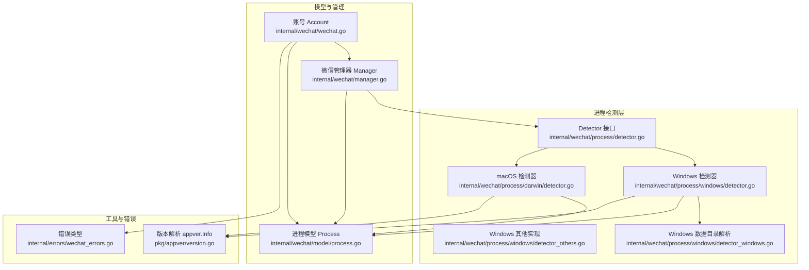
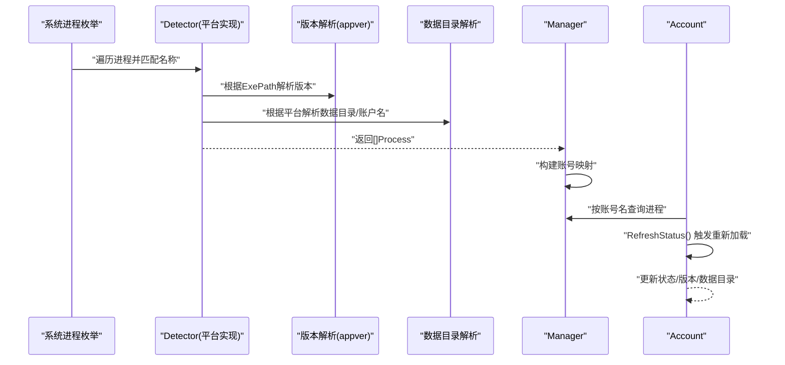
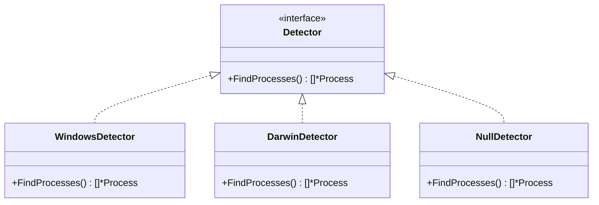
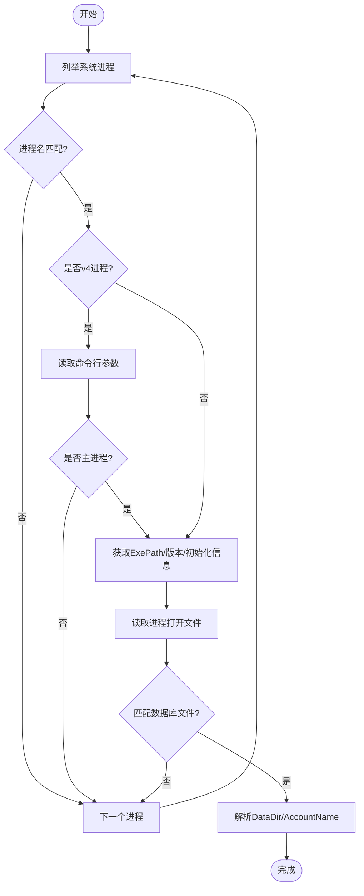
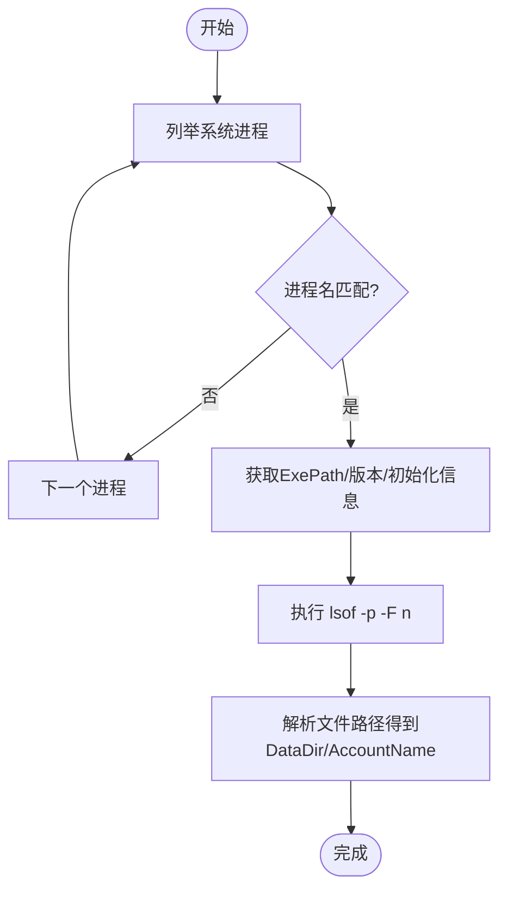
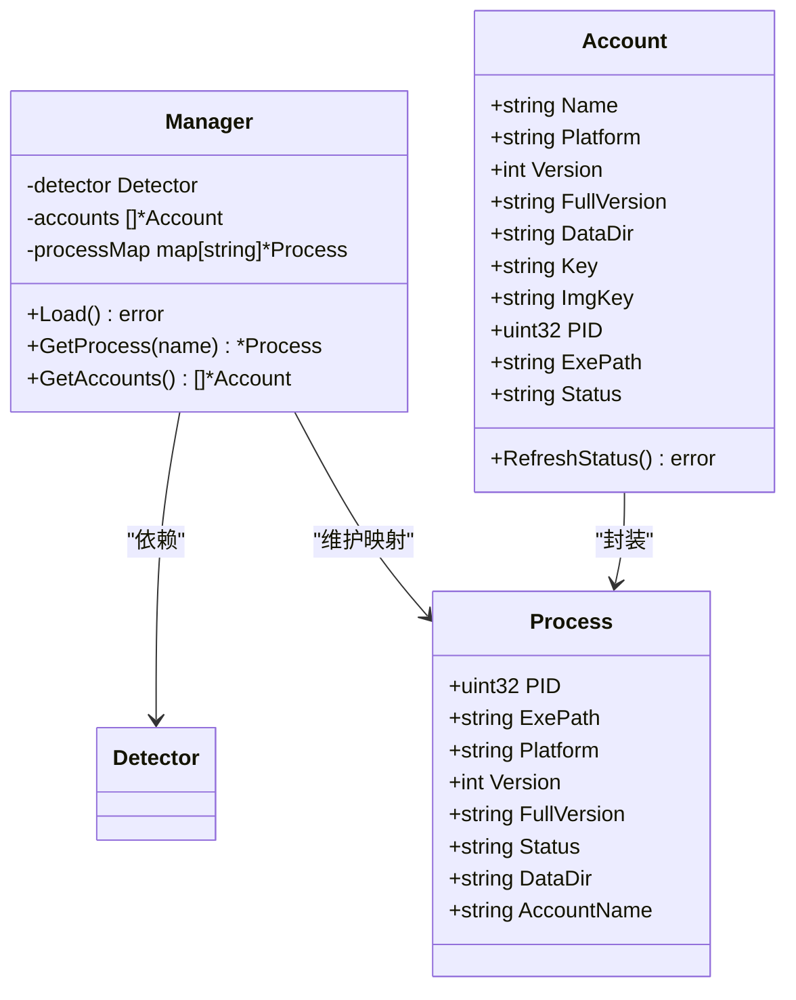
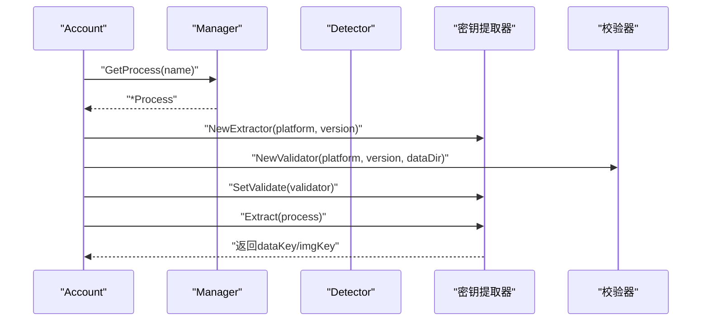
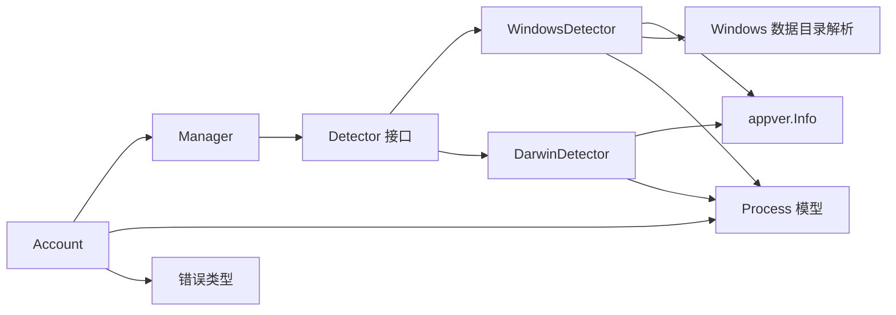

# 进程检测与监控

<cite>
**本文引用的文件**
- [internal/wechat/process/detector.go](file://internal/wechat/process/detector.go)
- [internal/wechat/process/windows/detector.go](file://internal/wechat/process/windows/detector.go)
- [internal/wechat/process/windows/detector_windows.go](file://internal/wechat/process/windows/detector_windows.go)
- [internal/wechat/process/windows/detector_others.go](file://internal/wechat/process/windows/detector_others.go)
- [internal/wechat/process/darwin/detector.go](file://internal/wechat/process/darwin/detector.go)
- [internal/wechat/model/process.go](file://internal/wechat/model/process.go)
- [internal/wechat/manager.go](file://internal/wechat/manager.go)
- [internal/wechat/wechat.go](file://internal/wechat/wechat.go)
- [pkg/appver/version.go](file://pkg/appver/version.go)
- [internal/errors/wechat_errors.go](file://internal/errors/wechat_errors.go)
</cite>

## 目录
1. [简介](#简介)
2. [项目结构](#项目结构)
3. [核心组件](#核心组件)
4. [架构总览](#架构总览)
5. [详细组件分析](#详细组件分析)
6. [依赖关系分析](#依赖关系分析)
7. [性能考量](#性能考量)
8. [故障排查指南](#故障排查指南)
9. [结论](#结论)
10. [附录](#附录)

## 简介
本文件系统性阐述本项目的“进程检测与监控”能力，重点覆盖微信进程的检测机制、进程状态跟踪与生命周期管理。内容涵盖：
- 进程发现算法与平台差异（Windows 与 macOS）
- 进程信息提取（PID、版本、数据目录等）
- 进程状态跟踪与在线/离线判定
- 进程通信与密钥提取流程中的状态依赖
- 异常处理与重试策略建议
- 权限与安全注意事项

## 项目结构
围绕进程检测与监控的关键模块组织如下：
- 接口与工厂：统一的 Detector 接口与按平台选择的工厂函数
- 平台实现：Windows 与 macOS 的具体检测逻辑
- 数据模型：进程信息结构体与状态常量
- 管理器：加载、映射与查询进程/账号
- 版本解析：应用版本提取
- 错误类型：统一的错误封装与状态提示

**图表来源**
- [internal/wechat/process/detector.go](file://internal/wechat/process/detector.go#L9-L25)
- [internal/wechat/process/windows/detector.go](file://internal/wechat/process/windows/detector.go#L20-L67)
- [internal/wechat/process/darwin/detector.go](file://internal/wechat/process/darwin/detector.go#L24-L58)
- [internal/wechat/process/windows/detector_others.go](file://internal/wechat/process/windows/detector_others.go#L10-L12)
- [internal/wechat/process/windows/detector_windows.go](file://internal/wechat/process/windows/detector_windows.go#L13-L48)
- [internal/wechat/model/process.go](file://internal/wechat/model/process.go#L3-L12)
- [internal/wechat/manager.go](file://internal/wechat/manager.go#L35-L98)
- [internal/wechat/wechat.go](file://internal/wechat/wechat.go#L13-L64)
- [pkg/appver/version.go](file://pkg/appver/version.go#L14-L25)
- [internal/errors/wechat_errors.go](file://internal/errors/wechat_errors.go#L55-L65)

**章节来源**
- [internal/wechat/process/detector.go](file://internal/wechat/process/detector.go#L1-L37)
- [internal/wechat/process/windows/detector.go](file://internal/wechat/process/windows/detector.go#L1-L102)
- [internal/wechat/process/darwin/detector.go](file://internal/wechat/process/darwin/detector.go#L1-L165)
- [internal/wechat/process/windows/detector_windows.go](file://internal/wechat/process/windows/detector_windows.go#L1-L49)
- [internal/wechat/process/windows/detector_others.go](file://internal/wechat/process/windows/detector_others.go#L1-L13)
- [internal/wechat/model/process.go](file://internal/wechat/model/process.go#L1-L25)
- [internal/wechat/manager.go](file://internal/wechat/manager.go#L1-L111)
- [internal/wechat/wechat.go](file://internal/wechat/wechat.go#L1-L111)
- [pkg/appver/version.go](file://pkg/appver/version.go#L1-L26)
- [internal/errors/wechat_errors.go](file://internal/errors/wechat_errors.go#L1-L66)

## 核心组件
- Detector 接口与工厂
  - 定义统一的 FindProcesses 方法，按运行时平台返回对应实现
  - 非支持平台返回空实现，避免崩溃
- 平台检测器
  - Windows：基于进程名过滤，v4 额外通过命令行参数区分；解析版本与数据目录
  - macOS：基于进程名过滤；通过 lsof 获取打开文件，定位数据库路径以推导数据目录与账户名
- 进程模型 Process
  - 字段：PID、可执行路径、平台、版本、完整版本、状态、数据目录、账户名
  - 状态常量：初始化、离线、在线
- 管理器 Manager
  - 负责加载进程、构建账号映射、提供按账号名查询
- 账号 Account
  - 封装进程信息，提供刷新状态与密钥提取入口
- 版本解析 appver.Info
  - 从可执行文件提取版本信息
- 错误类型
  - 统一的业务错误封装，便于上层处理与提示

**章节来源**
- [internal/wechat/process/detector.go](file://internal/wechat/process/detector.go#L9-L37)
- [internal/wechat/process/windows/detector.go](file://internal/wechat/process/windows/detector.go#L28-L101)
- [internal/wechat/process/darwin/detector.go](file://internal/wechat/process/darwin/detector.go#L32-L164)
- [internal/wechat/model/process.go](file://internal/wechat/model/process.go#L3-L24)
- [internal/wechat/manager.go](file://internal/wechat/manager.go#L51-L98)
- [internal/wechat/wechat.go](file://internal/wechat/wechat.go#L41-L111)
- [pkg/appver/version.go](file://pkg/appver/version.go#L14-L25)
- [internal/errors/wechat_errors.go](file://internal/errors/wechat_errors.go#L55-L65)

## 架构总览
下图展示了从进程发现到状态跟踪的整体流程，以及与密钥提取的关系。

**图表来源**
- [internal/wechat/process/windows/detector.go](file://internal/wechat/process/windows/detector.go#L28-L101)
- [internal/wechat/process/darwin/detector.go](file://internal/wechat/process/darwin/detector.go#L32-L164)
- [internal/wechat/process/windows/detector_windows.go](file://internal/wechat/process/windows/detector_windows.go#L13-L48)
- [internal/wechat/process/windows/detector_others.go](file://internal/wechat/process/windows/detector_others.go#L10-L12)
- [internal/wechat/manager.go](file://internal/wechat/manager.go#L51-L98)
- [internal/wechat/wechat.go](file://internal/wechat/wechat.go#L41-L64)
- [pkg/appver/version.go](file://pkg/appver/version.go#L14-L25)

## 详细组件分析

### Detector 接口与工厂
- 设计要点
  - 通过 NewDetector 根据 runtime.GOOS 返回对应平台实现
  - 非支持平台返回空实现，避免 panic
- 关键行为
  - FindProcesses 返回 []*model.Process
  - 可扩展：新增平台只需实现 Detector 接口并修改工厂分支

**图表来源**
- [internal/wechat/process/detector.go](file://internal/wechat/process/detector.go#L9-L37)
- [internal/wechat/process/windows/detector.go](file://internal/wechat/process/windows/detector.go#L20-L26)
- [internal/wechat/process/darwin/detector.go](file://internal/wechat/process/darwin/detector.go#L24-L30)

**章节来源**
- [internal/wechat/process/detector.go](file://internal/wechat/process/detector.go#L13-L37)

### Windows 平台检测器
- 进程发现算法
  - 枚举所有进程，按名称过滤（WeChat/Weixin）
  - v4 进程通过命令行参数进一步排除非主进程
- 版本与信息提取
  - 读取 ExePath，调用 appver.New 解析版本
  - 调用 initializeProcessInfo 通过进程打开文件定位数据库，推导数据目录与账户名
- 数据目录解析（Windows）
  - 通过进程 OpenFiles 获取句柄路径，匹配数据库文件后解析父路径层级得到 DataDir 与 AccountName
  - v4 与 v3 的数据库文件路径不同，需按版本切换

**图表来源**
- [internal/wechat/process/windows/detector.go](file://internal/wechat/process/windows/detector.go#L28-L101)
- [internal/wechat/process/windows/detector_windows.go](file://internal/wechat/process/windows/detector_windows.go#L13-L48)
- [pkg/appver/version.go](file://pkg/appver/version.go#L14-L25)

**章节来源**
- [internal/wechat/process/windows/detector.go](file://internal/wechat/process/windows/detector.go#L28-L101)
- [internal/wechat/process/windows/detector_windows.go](file://internal/wechat/process/windows/detector_windows.go#L13-L48)
- [internal/wechat/process/windows/detector_others.go](file://internal/wechat/process/windows/detector_others.go#L10-L12)

### macOS 平台检测器
- 进程发现算法
  - 枚举进程，按名称过滤（WeChat/Weixin）
- 版本与信息提取
  - 读取 ExePath，调用 appver.New 解析版本
  - 调用 initializeProcessInfo 通过 lsof 命令获取打开文件，定位数据库文件，推导数据目录与账户名
- 数据目录解析（macOS）
  - 通过 lsof -p <pid> -F n 获取文件名列表，解析路径层级得到 DataDir 与 AccountName

**图表来源**
- [internal/wechat/process/darwin/detector.go](file://internal/wechat/process/darwin/detector.go#L32-L164)
- [pkg/appver/version.go](file://pkg/appver/version.go#L14-L25)

**章节来源**
- [internal/wechat/process/darwin/detector.go](file://internal/wechat/process/darwin/detector.go#L32-L164)

### 进程模型与状态
- Process 结构体字段
  - PID、ExePath、Platform、Version、FullVersion、Status、DataDir、AccountName
- 状态常量
  - 初始化、离线、在线
- 管理器职责
  - Load：调用 Detector.FindProcesses，转换为 Account，并建立 name->Process 映射
  - GetProcess：按账号名查询进程信息
- 账号刷新状态
  - RefreshStatus：触发重新加载，更新 Account 的状态与元信息

**图表来源**
- [internal/wechat/model/process.go](file://internal/wechat/model/process.go#L3-L24)
- [internal/wechat/manager.go](file://internal/wechat/manager.go#L35-L98)
- [internal/wechat/wechat.go](file://internal/wechat/wechat.go#L13-L64)

**章节来源**
- [internal/wechat/model/process.go](file://internal/wechat/model/process.go#L3-L24)
- [internal/wechat/manager.go](file://internal/wechat/manager.go#L51-L98)
- [internal/wechat/wechat.go](file://internal/wechat/wechat.go#L41-L64)

### 版本解析与进程通信
- 版本解析
  - appver.New(filePath) 返回版本信息，用于区分 v3/v4 的数据库路径与后续流程
- 进程通信与密钥提取
  - Account.GetKey 在状态为在线时，结合平台与版本信息创建密钥提取器与校验器，进行内存扫描与密钥提取
  - 若状态为离线或不可用，抛出相应错误

**图表来源**
- [internal/wechat/wechat.go](file://internal/wechat/wechat.go#L66-L111)
- [internal/errors/wechat_errors.go](file://internal/errors/wechat_errors.go#L55-L65)
- [pkg/appver/version.go](file://pkg/appver/version.go#L14-L25)

**章节来源**
- [internal/wechat/wechat.go](file://internal/wechat/wechat.go#L66-L111)
- [internal/errors/wechat_errors.go](file://internal/errors/wechat_errors.go#L55-L65)
- [pkg/appver/version.go](file://pkg/appver/version.go#L14-L25)

## 依赖关系分析
- 组件耦合
  - Manager 依赖 Detector 接口，通过工厂注入具体实现
  - Account 依赖 Manager 查询进程，依赖 appver 与密钥提取模块
- 外部依赖
  - gopsutil 用于跨平台进程枚举
  - lsof 命令（macOS）用于获取打开文件
  - appver 用于版本解析
- 潜在循环依赖
  - 当前结构清晰，未见循环导入

**图表来源**
- [internal/wechat/manager.go](file://internal/wechat/manager.go#L35-L98)
- [internal/wechat/process/detector.go](file://internal/wechat/process/detector.go#L9-L25)
- [internal/wechat/process/windows/detector.go](file://internal/wechat/process/windows/detector.go#L20-L67)
- [internal/wechat/process/darwin/detector.go](file://internal/wechat/process/darwin/detector.go#L24-L58)
- [internal/wechat/process/windows/detector_windows.go](file://internal/wechat/process/windows/detector_windows.go#L13-L48)
- [internal/wechat/model/process.go](file://internal/wechat/model/process.go#L3-L12)
- [internal/wechat/wechat.go](file://internal/wechat/wechat.go#L13-L64)
- [pkg/appver/version.go](file://pkg/appver/version.go#L14-L25)
- [internal/errors/wechat_errors.go](file://internal/errors/wechat_errors.go#L55-L65)

**章节来源**
- [internal/wechat/manager.go](file://internal/wechat/manager.go#L35-L98)
- [internal/wechat/process/detector.go](file://internal/wechat/process/detector.go#L9-L25)
- [internal/wechat/process/windows/detector.go](file://internal/wechat/process/windows/detector.go#L20-L67)
- [internal/wechat/process/darwin/detector.go](file://internal/wechat/process/darwin/detector.go#L24-L58)
- [internal/wechat/process/windows/detector_windows.go](file://internal/wechat/process/windows/detector_windows.go#L13-L48)
- [internal/wechat/model/process.go](file://internal/wechat/model/process.go#L3-L12)
- [internal/wechat/wechat.go](file://internal/wechat/wechat.go#L13-L64)
- [pkg/appver/version.go](file://pkg/appver/version.go#L14-L25)
- [internal/errors/wechat_errors.go](file://internal/errors/wechat_errors.go#L55-L65)

## 性能考量
- 进程枚举成本
  - gopsutil.Processes 对全系统进程进行枚举，存在 O(N) 成本
  - 建议：定期缓存结果并在必要时触发刷新；对高频场景增加去抖动
- 文件系统扫描
  - Windows：OpenFiles 逐条遍历文件句柄
  - macOS：lsof 命令每次为每个 PID 执行，建议批量或复用连接
- 版本解析
  - appver.New 会读取 PE/Mach-O 元数据，建议缓存已解析路径的结果
- 并发与超时
  - 在高并发场景下，建议为外部命令与系统调用设置超时，避免阻塞

## 故障排查指南
- 常见错误与处理
  - 进程未找到：检查进程名匹配规则（Windows v4 需排除非主进程；macOS 需确认进程名）
  - 进程不在线：确认 initializeProcessInfo 是否成功解析到数据库文件
  - 版本解析失败：确认 ExePath 正确且文件存在
  - macOS 命令执行失败：确认 lsof 可用与权限足够
- 错误类型参考
  - WeChatAccountNotFound：按账号名查询不到进程
  - WeChatAccountNotOnline：账号状态为离线
  - RefreshProcessStatusFailed：刷新状态失败
  - RunCmdFailed：执行外部命令失败
- 重试与回退
  - 建议在检测失败时进行指数退避重试
  - 若 initializeProcessInfo 失败，仍可返回部分信息（PID、版本、路径），保证基本可用

**章节来源**
- [internal/errors/wechat_errors.go](file://internal/errors/wechat_errors.go#L55-L65)
- [internal/wechat/process/windows/detector.go](file://internal/wechat/process/windows/detector.go#L28-L101)
- [internal/wechat/process/darwin/detector.go](file://internal/wechat/process/darwin/detector.go#L32-L164)

## 结论
本项目通过统一的 Detector 接口与平台化实现，提供了稳定可靠的微信进程检测与状态跟踪能力。Windows 与 macOS 的差异化处理确保了在不同环境下的兼容性；结合版本解析与数据目录推断，实现了对进程生命周期（启动、在线、离线）的自动化管理。配合 Account 的状态刷新与密钥提取流程，形成了从进程发现到数据访问的闭环。

## 附录

### 进程检测与监控代码示例（步骤说明）
以下为“自动检测微信进程启动、停止与版本变化”的实践步骤，不直接展示代码内容：

- 启动检测
  - 定期调用 Manager.Load 或 Account.RefreshStatus
  - 通过 GetAccounts 获取当前账号集合，比较前后差异判断新增/变更
- 停止检测
  - 若 Account.Status 变为离线，则认为进程停止或退出
- 版本变化
  - 比较 Account.Version 或 FullVersion 字段，若变化则触发重建密钥提取器与校验器
- 异常处理与重连
  - 对外部命令与系统调用设置超时与重试
  - 对 WeChatAccountNotOnline 等错误进行分类处理与告警

**章节来源**
- [internal/wechat/manager.go](file://internal/wechat/manager.go#L51-L98)
- [internal/wechat/wechat.go](file://internal/wechat/wechat.go#L41-L64)
- [internal/errors/wechat_errors.go](file://internal/errors/wechat_errors.go#L55-L65)

### 权限与安全注意事项
- Windows
  - 进程枚举与打开文件句柄通常需要较高权限；若无权限，可能导致 initializeProcessInfo 失败
  - 建议以管理员权限运行，或在用户侧授予必要权限
- macOS
  - lsof 命令执行需要系统级权限；若失败，将无法解析数据目录
  - 建议在受控环境下运行，避免在受限沙盒中执行
- 版本解析
  - appver 读取可执行文件元数据，确保路径正确且文件可读
- 错误隔离
  - 即使初始化失败，也尽量返回部分信息，避免中断上层流程

**章节来源**
- [internal/wechat/process/windows/detector.go](file://internal/wechat/process/windows/detector.go#L28-L101)
- [internal/wechat/process/windows/detector_windows.go](file://internal/wechat/process/windows/detector_windows.go#L13-L48)
- [internal/wechat/process/darwin/detector.go](file://internal/wechat/process/darwin/detector.go#L32-L164)
- [pkg/appver/version.go](file://pkg/appver/version.go#L14-L25)