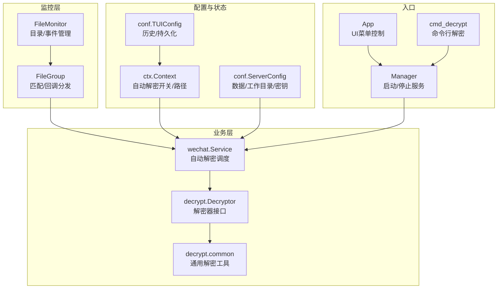
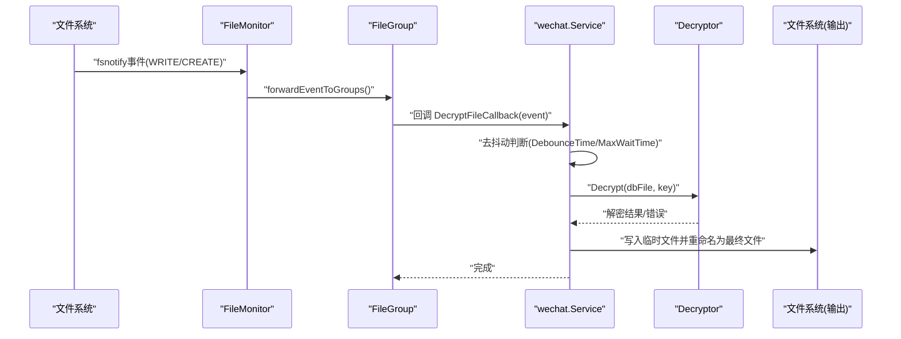
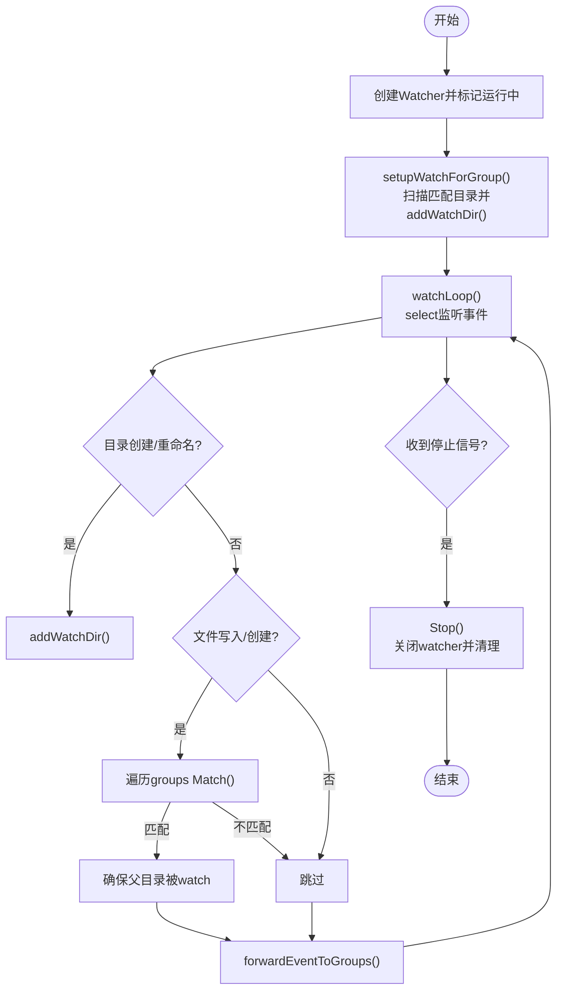
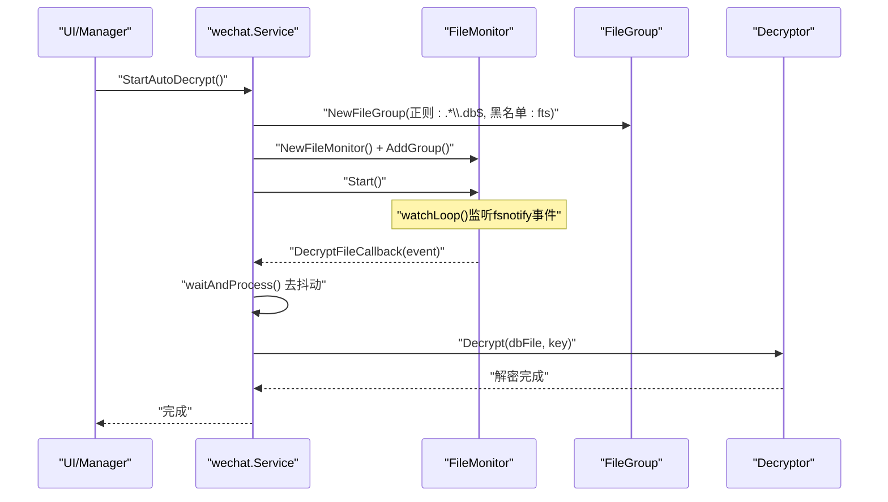
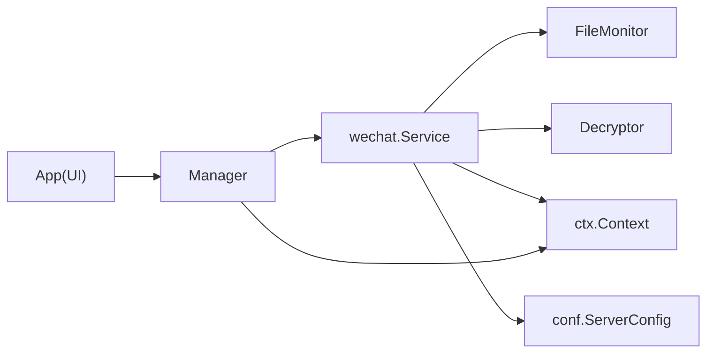

# 文件监控与自动解密

<cite>
**本文档引用的文件**
- [filemonitor.go](file://pkg/filemonitor/filemonitor.go)
- [filegroup.go](file://pkg/filemonitor/filegroup.go)
- [service.go](file://internal/chatlog/wechat/service.go)
- [manager.go](file://internal/chatlog/manager.go)
- [context.go](file://internal/chatlog/ctx/context.go)
- [server.go](file://internal/chatlog/conf/server.go)
- [tui.go](file://internal/chatlog/conf/tui.go)
- [decryptor.go](file://internal/wechat/decrypt/decryptor.go)
- [common.go](file://internal/wechat/decrypt/common/common.go)
- [cmd_decrypt.go](file://cmd/chatlog/cmd_decrypt.go)
- [app.go](file://internal/chatlog/app.go)
</cite>

## 目录
1. [简介](#简介)
2. [项目结构](#项目结构)
3. [核心组件](#核心组件)
4. [架构总览](#架构总览)
5. [详细组件分析](#详细组件分析)
6. [依赖关系分析](#依赖关系分析)
7. [性能考虑](#性能考虑)
8. [故障排查指南](#故障排查指南)
9. [结论](#结论)
10. [附录](#附录)

## 简介
本文件聚焦于“文件监控与自动解密”能力，系统性阐述以下内容：
- 文件监控机制：基于文件系统事件监听（fsnotify）的实时监控、增量检测与目录动态跟踪。
- 自动解密流程：在监控到数据库文件变更后，按去抖动策略触发解密，并将结果写入工作目录。
- 配置与状态：监控范围、黑名单、全局状态管理与持久化。
- 性能优化：并发控制、事件去抖动、最小化锁持有时间、目录watch复用。
- 运维实践：启用/禁用自动解密、日志分析、故障恢复与常见问题定位。

## 项目结构
围绕文件监控与自动解密的关键模块如下：
- pkg/filemonitor：文件监控核心（FileMonitor、FileGroup）
- internal/chatlog/wechat：自动解密服务（Service），封装监控与解密逻辑
- internal/chatlog/ctx：运行时上下文（含自动解密开关等状态）
- internal/chatlog/conf：配置模型（TUI/Server）
- internal/wechat/decrypt：解密器接口与通用实现
- internal/chatlog/manager：应用编排入口，负责启动/停止服务与状态同步
- cmd/chatlog：命令行解密入口

图表来源
- [filemonitor.go](file://pkg/filemonitor/filemonitor.go#L15-L431)
- [filegroup.go](file://pkg/filemonitor/filegroup.go#L20-L183)
- [service.go](file://internal/chatlog/wechat/service.go#L26-L200)
- [context.go](file://internal/chatlog/ctx/context.go#L23-L304)
- [server.go](file://internal/chatlog/conf/server.go#L7-L60)
- [tui.go](file://internal/chatlog/conf/tui.go#L3-L41)
- [manager.go](file://internal/chatlog/manager.go#L21-L224)
- [app.go](file://internal/chatlog/app.go#L353-L429)
- [cmd_decrypt.go](file://cmd/chatlog/cmd_decrypt.go#L29-L64)

章节来源
- [filemonitor.go](file://pkg/filemonitor/filemonitor.go#L15-L431)
- [filegroup.go](file://pkg/filemonitor/filegroup.go#L20-L183)
- [service.go](file://internal/chatlog/wechat/service.go#L26-L200)
- [context.go](file://internal/chatlog/ctx/context.go#L23-L304)
- [server.go](file://internal/chatlog/conf/server.go#L7-L60)
- [tui.go](file://internal/chatlog/conf/tui.go#L3-L41)
- [manager.go](file://internal/chatlog/manager.go#L21-L224)
- [app.go](file://internal/chatlog/app.go#L353-L429)
- [cmd_decrypt.go](file://cmd/chatlog/cmd_decrypt.go#L29-L64)

## 核心组件
- FileMonitor：多组文件监控的统一管理器，负责目录watch生命周期、事件转发、并发安全与运行状态管理。
- FileGroup：文件匹配与回调分发单元，支持正则匹配、黑名单过滤、回调注册与异步执行。
- wechat.Service：自动解密服务，封装监控创建、事件回调、去抖动处理、解密执行与输出落盘。
- ctx.Context：运行时上下文，维护自动解密开关、数据目录、工作目录、密钥等状态，并支持持久化。
- conf.ServerConfig/TUIConfig：配置模型，提供数据目录、工作目录、平台版本、密钥、自动解密开关等读取接口。
- decrypt.Decryptor：解密器接口，按平台与版本选择具体实现；decrypt.common：通用解密工具（校验、分页解密等）。

章节来源
- [filemonitor.go](file://pkg/filemonitor/filemonitor.go#L15-L431)
- [filegroup.go](file://pkg/filemonitor/filegroup.go#L20-L183)
- [service.go](file://internal/chatlog/wechat/service.go#L26-L200)
- [context.go](file://internal/chatlog/ctx/context.go#L23-L304)
- [server.go](file://internal/chatlog/conf/server.go#L7-L60)
- [tui.go](file://internal/chatlog/conf/tui.go#L3-L41)
- [decryptor.go](file://internal/wechat/decrypt/decryptor.go#L12-L49)
- [common.go](file://internal/wechat/decrypt/common/common.go#L25-L139)

## 架构总览
自动解密的端到端流程如下：

图表来源
- [filemonitor.go](file://pkg/filemonitor/filemonitor.go#L416-L431)
- [filegroup.go](file://pkg/filemonitor/filegroup.go#L157-L183)
- [service.go](file://internal/chatlog/wechat/service.go#L97-L184)

章节来源
- [filemonitor.go](file://pkg/filemonitor/filemonitor.go#L349-L431)
- [filegroup.go](file://pkg/filemonitor/filegroup.go#L157-L183)
- [service.go](file://internal/chatlog/wechat/service.go#L97-L184)

## 详细组件分析

### 文件监控机制（FileMonitor/FileGroup）
- 监控对象
  - FileMonitor：管理多个FileGroup，维护watched目录集合、全局黑名单、运行状态与并发安全。
  - FileGroup：基于根目录+正则模式匹配目标文件，支持黑名单过滤，提供回调注册与异步执行。
- 事件监听与目录跟踪
  - 初始化时创建fsnotify.Watcher，启动watchLoop循环监听事件。
  - 对目录创建/重命名事件进行处理，动态添加新目录watch。
  - 对文件创建/写入事件，检查是否匹配任一FileGroup，若匹配则确保其父目录被watch。
- 增量检测
  - Match函数基于根目录相对路径与正则表达式判断文件归属。
  - ListMatchingDirectories用于预扫描已有匹配目录，避免遗漏初始状态。
- 并发与状态
  - 读写锁保护groups/watchDirs，避免竞态。
  - Start/Stop管理运行状态与goroutine生命周期，Stop会关闭watcher并等待退出。

图表来源
- [filemonitor.go](file://pkg/filemonitor/filemonitor.go#L141-L200)
- [filemonitor.go](file://pkg/filemonitor/filemonitor.go#L277-L347)
- [filemonitor.go](file://pkg/filemonitor/filemonitor.go#L349-L414)

章节来源
- [filemonitor.go](file://pkg/filemonitor/filemonitor.go#L15-L431)
- [filegroup.go](file://pkg/filemonitor/filegroup.go#L20-L183)

### 自动解密触发与处理（wechat.Service）
- 监控创建
  - StartAutoDecrypt创建FileGroup（匹配规则：以.db结尾且不在黑名单中），注册回调DecryptFileCallback，创建FileMonitor并启动。
- 事件回调
  - DecryptFileCallback仅处理写入/创建事件；记录最近事件时间并启动去抖动协程。
- 去抖动策略
  - waitAndProcess以固定间隔轮询，当连续事件间隔超过阈值或累计等待超过最大阈值时，判定稳定并执行解密。
- 解密执行
  - DecryptDBFile根据平台与版本创建Decryptor，计算输出路径（基于工作目录与数据目录相对路径），临时文件写入后重命名为最终文件。
  - 若文件已被解密，直接复制原始内容作为输出。
- 停止解密
  - StopAutoDecrypt关闭FileMonitor并释放资源。

图表来源
- [service.go](file://internal/chatlog/wechat/service.go#L70-L95)
- [service.go](file://internal/chatlog/wechat/service.go#L97-L144)
- [service.go](file://internal/chatlog/wechat/service.go#L146-L184)

章节来源
- [service.go](file://internal/chatlog/wechat/service.go#L26-L200)

### 配置与状态管理
- 配置模型
  - ServerConfig：提供GetDataDir/GetWorkDir/GetPlatform/GetVersion/GetDataKey等读取方法。
  - TUIConfig：维护历史账号、最后账号、Webhook等，支持持久化到配置文件。
- 上下文状态
  - Context：维护AutoDecrypt开关、DataDir/WorkDir/DataKey/ImgKey/HTTPEnabled等，支持SetAutoDecrypt/SetDataDir/SetWorkDir等写操作并持久化。
- 状态同步
  - Manager在切换账号、启动/停止服务时同步上下文状态，保证UI与后台服务一致。

章节来源
- [server.go](file://internal/chatlog/conf/server.go#L7-L60)
- [tui.go](file://internal/chatlog/conf/tui.go#L3-L41)
- [context.go](file://internal/chatlog/ctx/context.go#L23-L304)
- [manager.go](file://internal/chatlog/manager.go#L71-L96)

### 解密器与通用工具
- Decryptor接口：定义Decrypt/Validate/PageSize/HMACSize/版本等抽象，按平台与版本返回具体实现。
- common工具：打开数据库文件、校验密钥、分页解密、XOR辅助等。

章节来源
- [decryptor.go](file://internal/wechat/decrypt/decryptor.go#L12-L49)
- [common.go](file://internal/wechat/decrypt/common/common.go#L25-L139)

### 启用/禁用自动解密
- UI入口：App菜单项“开启自动解密/停止自动解密”，调用Manager.StartAutoDecrypt/StopAutoDecrypt。
- 状态更新：Manager在成功后调用Context.SetAutoDecrypt(true/false)，并在UI中即时反映状态。
- 命令行：Manager.CommandHTTPServer可直接解析配置并按配置开关自动解密。

章节来源
- [app.go](file://internal/chatlog/app.go#L353-L429)
- [manager.go](file://internal/chatlog/manager.go#L201-L224)
- [manager.go](file://internal/chatlog/manager.go#L335-L374)

## 依赖关系分析
- 组件耦合
  - wechat.Service依赖FileMonitor/FileGroup进行事件驱动，依赖Decryptor执行解密，依赖ctx/conf读取配置。
  - Manager协调Service与其他服务，负责状态同步与UI交互。
- 外部依赖
  - fsnotify：文件系统事件监听。
  - 平台/版本：按平台与版本选择解密器实现。
- 潜在风险
  - 目录watch数量过多可能影响性能，需合理设置黑名单与监控范围。
  - 去抖动参数需结合实际场景调整，避免过长延迟或频繁抖动。

图表来源
- [service.go](file://internal/chatlog/wechat/service.go#L26-L48)
- [manager.go](file://internal/chatlog/manager.go#L21-L34)
- [context.go](file://internal/chatlog/ctx/context.go#L23-L60)
- [app.go](file://internal/chatlog/app.go#L353-L429)

章节来源
- [service.go](file://internal/chatlog/wechat/service.go#L26-L48)
- [manager.go](file://internal/chatlog/manager.go#L21-L34)
- [context.go](file://internal/chatlog/ctx/context.go#L23-L60)
- [app.go](file://internal/chatlog/app.go#L353-L429)

## 性能考虑
- 并发与锁粒度
  - FileMonitor/FileGroup使用读写锁分离读写路径，减少锁竞争。
  - 事件转发时复制回调列表，避免在处理回调期间持有锁。
- 目录watch复用
  - addWatchDir对重复watch进行去重，避免重复注册导致的事件风暴。
- 去抖动策略
  - 固定间隔轮询与累计等待上限，平衡实时性与稳定性。
- I/O优化
  - 输出采用临时文件写入后重命名，降低部分覆盖风险。
- 建议
  - 合理设置黑名单，排除高频更新或无关目录。
  - 根据业务场景调整去抖动参数，兼顾延迟与吞吐。

章节来源
- [filemonitor.go](file://pkg/filemonitor/filemonitor.go#L246-L275)
- [filemonitor.go](file://pkg/filemonitor/filemonitor.go#L416-L431)
- [service.go](file://internal/chatlog/wechat/service.go#L21-L24)
- [service.go](file://internal/chatlog/wechat/service.go#L124-L144)

## 故障排查指南
- 无法启动监控
  - 检查监控根目录是否存在且可访问；查看FileMonitor.Start返回的错误。
  - 确认全局黑名单未误伤目标目录。
- 事件未触发
  - 确认FileMonitor.IsRunning为true；检查FileGroup正则与黑名单是否正确。
  - 验证文件是否满足“写入/创建”事件类型。
- 解密失败
  - 确认密钥有效（GetDataKey已获取）；检查平台与版本配置是否匹配。
  - 若提示“文件已解密”，确认源文件状态；必要时重新生成输出。
- 性能问题
  - 观察watch目录数量与事件频率；适当缩小监控范围或增加黑名单。
  - 调整去抖动参数以适配网络同步场景（如Syncthing）。

章节来源
- [filemonitor.go](file://pkg/filemonitor/filemonitor.go#L141-L200)
- [filemonitor.go](file://pkg/filemonitor/filemonitor.go#L277-L347)
- [service.go](file://internal/chatlog/wechat/service.go#L70-L95)
- [service.go](file://internal/chatlog/wechat/service.go#L146-L184)

## 结论
该方案通过“文件系统事件驱动 + 去抖动 + 解密器抽象”的组合，实现了对微信数据库文件的自动化监控与解密。其优势在于：
- 实时性强：基于fsnotify事件，几乎无延迟。
- 可扩展：FileGroup支持正则与黑名单，便于扩展其他文件类型。
- 稳健性：去抖动与错误处理保障在复杂IO环境下稳定运行。
建议在生产环境中结合实际部署场景，合理配置监控范围、黑名单与去抖动参数，并持续关注日志与性能指标。

## 附录

### 监控配置选项与范围设置
- 监控根目录：来自配置的DataDir，作为FileGroup.RootDir。
- 匹配规则：默认正则为“.*\.db$”，仅监控数据库文件。
- 黑名单：全局黑名单（FileMonitor.SetBlacklist）与FileGroup.Blacklist共同生效，排除无关目录（如fts）。
- 目录动态跟踪：新增目录（包括子目录）会被自动watch，确保新增文件也能被监控。

章节来源
- [service.go](file://internal/chatlog/wechat/service.go#L70-L84)
- [filemonitor.go](file://pkg/filemonitor/filemonitor.go#L42-L49)
- [filegroup.go](file://pkg/filemonitor/filegroup.go#L26-L49)

### 监控状态管理
- 运行状态：FileMonitor.IsRunning/Start/Stop控制生命周期。
- UI状态：App菜单项名称与描述随Context.AutoDecrypt动态变化。
- 配置持久化：Context.SetAutoDecrypt会更新配置文件，确保重启后状态一致。

章节来源
- [filemonitor.go](file://pkg/filemonitor/filemonitor.go#L239-L244)
- [app.go](file://internal/chatlog/app.go#L99-L124)
- [context.go](file://internal/chatlog/ctx/context.go#L240-L248)

### 自动解密启用/禁用方法
- UI启用：点击“开启自动解密”，Manager.StartAutoDecrypt内部调用Service.StartAutoDecrypt。
- UI禁用：点击“停止自动解密”，Manager.StopAutoDecrypt内部调用Service.StopAutoDecrypt。
- 命令行：Manager.CommandHTTPServer可直接按配置开关自动解密。

章节来源
- [app.go](file://internal/chatlog/app.go#L353-L429)
- [manager.go](file://internal/chatlog/manager.go#L201-L224)
- [manager.go](file://internal/chatlog/manager.go#L335-L374)

### 监控日志分析
- 关键日志点
  - 启动/停止监控：Service.StartAutoDecrypt/StopAutoDecrypt。
  - 事件接收与去抖动：DecryptFileCallback/waitAndProcess。
  - 解密过程：DecryptDBFile，包含输出路径与临时文件重命名。
- 日志建议
  - 将日志级别设为Debug以观察事件与去抖动细节。
  - 记录输出目录与源文件路径，便于回溯。

章节来源
- [service.go](file://internal/chatlog/wechat/service.go#L70-L95)
- [service.go](file://internal/chatlog/wechat/service.go#L97-L144)
- [service.go](file://internal/chatlog/wechat/service.go#L146-L184)

### 故障恢复机制
- 监控异常：Stop后重新Start，自动修复watcher失效问题。
- 解密异常：捕获错误并记录，不影响其他文件处理；必要时人工介入。
- 输出一致性：采用临时文件写入后重命名，避免部分覆盖导致的损坏。

章节来源
- [service.go](file://internal/chatlog/wechat/service.go#L87-L95)
- [service.go](file://internal/chatlog/wechat/service.go#L163-L168)

### 实际使用场景与配置示例
- 场景一：本地开发调试
  - 设置DataDir为微信数据目录，WorkDir为本地工作目录，启动自动解密后即可实时看到解密后的数据库文件。
- 场景二：跨设备同步（如Syncthing）
  - 由于同步过程中可能出现删除/创建临时文件的事件，去抖动策略能有效避免误触发；建议保持默认去抖动参数。
- 场景三：批量解密
  - 通过命令行decrypt子命令，传入data_dir、data_key、work_dir、platform、version等参数，一次性解密所有.db文件。

章节来源
- [cmd_decrypt.go](file://cmd/chatlog/cmd_decrypt.go#L29-L64)
- [manager.go](file://internal/chatlog/manager.go#L308-L333)