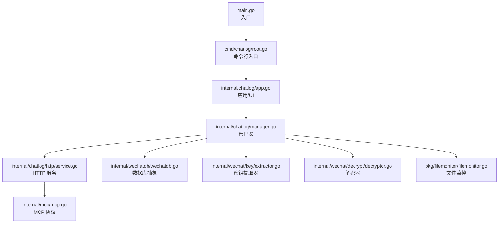
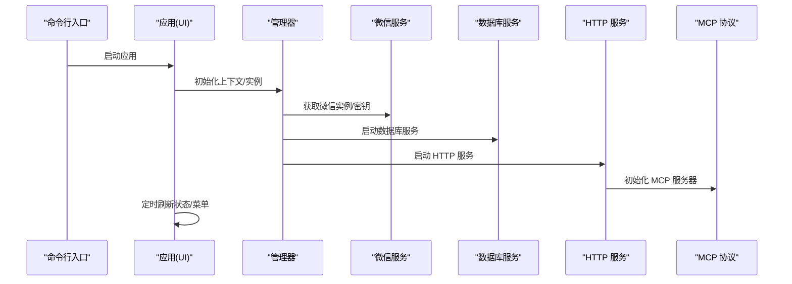
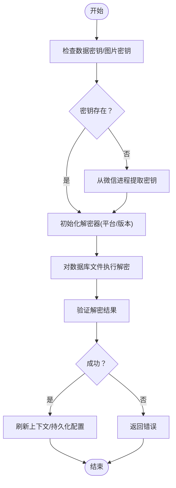
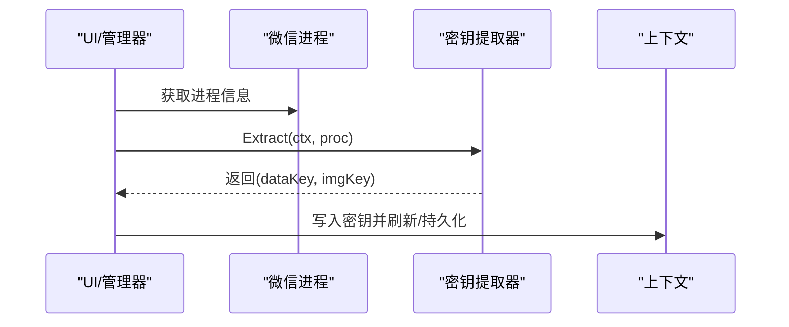
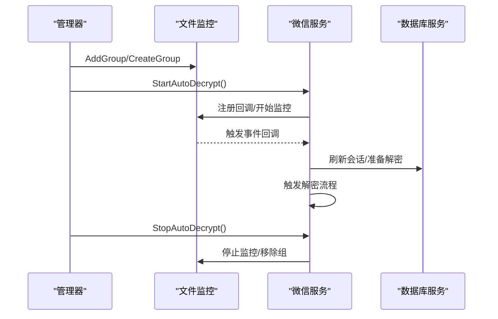
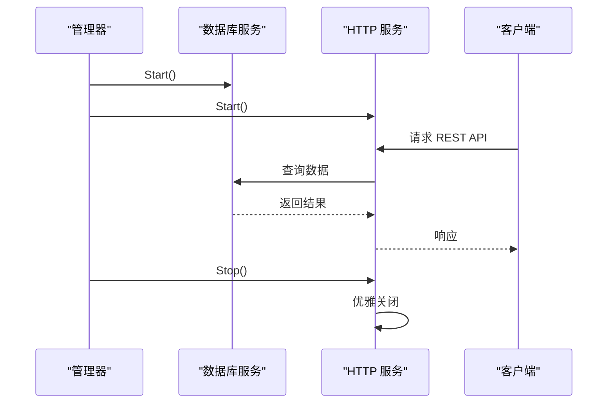
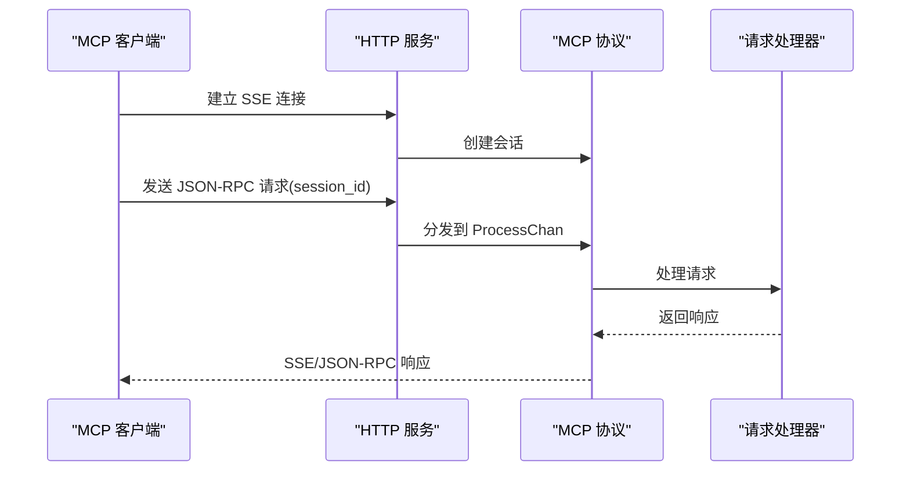
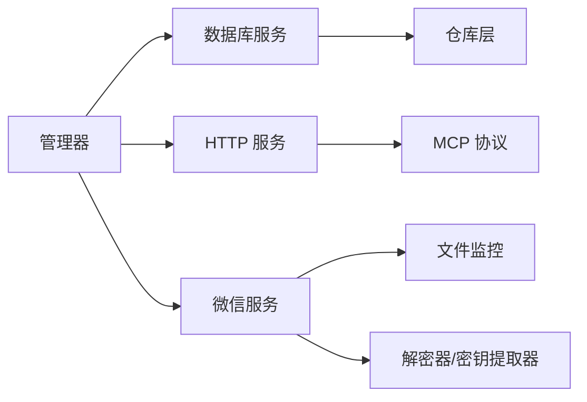

# 核心功能

<cite>
**本文引用的文件**
- [main.go](file://main.go)
- [root.go](file://cmd/chatlog/root.go)
- [app.go](file://internal/chatlog/app.go)
- [manager.go](file://internal/chatlog/manager.go)
- [conf.go](file://internal/chatlog/conf/conf.go)
- [extractor.go](file://internal/wechat/key/extractor.go)
- [decryptor.go](file://internal/wechat/decrypt/decryptor.go)
- [service.go](file://internal/chatlog/http/service.go)
- [mcp.go](file://internal/mcp/mcp.go)
- [filemonitor.go](file://pkg/filemonitor/filemonitor.go)
- [wechatdb.go](file://internal/wechatdb/wechatdb.go)
</cite>

## 目录
1. [简介](#简介)
2. [项目结构](#项目结构)
3. [核心组件](#核心组件)
4. [架构总览](#架构总览)
5. [详细组件分析](#详细组件分析)
6. [依赖分析](#依赖分析)
7. [性能考虑](#性能考虑)
8. [故障排查指南](#故障排查指南)
9. [结论](#结论)

## 简介
本文件面向 Chatlog 的核心功能，围绕以下主题进行系统化说明：数据解密、密钥管理、文件监控与自动解密、HTTP API 服务、MCP 协议集成、Webhook 通知系统。文档解释各模块的工作原理、实现机制与使用场景，并梳理模块间的协作关系与数据流转过程，最后给出最佳实践与注意事项。

## 项目结构
- 入口程序负责初始化日志与命令行入口，随后交由内部应用运行。
- 应用层负责 UI、菜单交互、状态更新与服务编排。
- 管理器负责服务生命周期（HTTP、数据库、微信相关）与跨模块协调。
- 配置模块负责 TUI 与服务配置加载与合并。
- 解密与密钥管理分别通过“解密器”和“密钥提取器”适配多平台/多版本。
- 文件监控基于 fsnotify 实现，支持动态增删监控组与目录白/黑名单。
- 数据库访问通过 wechatdb 抽象，屏蔽底层数据源差异。
- HTTP 服务集成 Gin 与 MCP 协议，提供 REST 与 SSE 接口。

图表来源
- [main.go](file://main.go#L1-L13)
- [root.go](file://cmd/chatlog/root.go#L18-L42)
- [app.go](file://internal/chatlog/app.go#L45-L63)
- [manager.go](file://internal/chatlog/manager.go#L36-L69)
- [service.go](file://internal/chatlog/http/service.go#L33-L59)
- [wechatdb.go](file://internal/wechatdb/wechatdb.go#L23-L59)
- [extractor.go](file://internal/wechat/key/extractor.go#L25-L39)
- [decryptor.go](file://internal/wechat/decrypt/decryptor.go#L33-L48)
- [filemonitor.go](file://pkg/filemonitor/filemonitor.go#L32-L40)
- [mcp.go](file://internal/mcp/mcp.go#L24-L29)

章节来源
- [main.go](file://main.go#L1-L13)
- [root.go](file://cmd/chatlog/root.go#L18-L42)

## 核心组件
- 应用与 UI：提供菜单、状态栏、标签页与定时刷新，驱动用户交互与状态展示。
- 管理器：统一编排数据库、HTTP 服务与微信相关能力；负责密钥获取、解密、自动解密开关与服务启停。
- 配置：支持 TUI 与服务配置加载，优先级与环境变量注入；支持从数据目录合并部分配置键。
- 密钥管理：按平台/版本选择合适的密钥提取器，从微信进程内存中提取数据密钥与图片密钥。
- 数据解密：按平台/版本选择解密器，对数据库文件进行解密；支持验证密钥有效性。
- 文件监控：基于 fsnotify 的文件监控框架，支持多组模式、目录黑/白名单、动态增删与事件转发。
- 数据库抽象：统一封装数据源与仓库层，提供消息、联系人、群聊、会话、媒体查询接口。
- HTTP 服务：基于 Gin 提供 REST API，集成 MCP 协议（SSE/JSON-RPC），支持 CORS、中间件与优雅关闭。
- Webhook：作为通知系统，可与外部系统对接（具体实现位于独立文件，此处以概念性说明为主）。

章节来源
- [app.go](file://internal/chatlog/app.go#L25-L63)
- [manager.go](file://internal/chatlog/manager.go#L21-L34)
- [conf.go](file://internal/chatlog/conf/conf.go#L19-L96)
- [extractor.go](file://internal/wechat/key/extractor.go#L13-L39)
- [decryptor.go](file://internal/wechat/decrypt/decryptor.go#L12-L48)
- [filemonitor.go](file://pkg/filemonitor/filemonitor.go#L15-L40)
- [wechatdb.go](file://internal/wechatdb/wechatdb.go#L15-L59)
- [service.go](file://internal/chatlog/http/service.go#L16-L59)
- [mcp.go](file://internal/mcp/mcp.go#L17-L29)

## 架构总览
下图展示了从命令行到服务启动、密钥获取、解密与 HTTP/MCP 提供的整体流程。

图表来源
- [root.go](file://cmd/chatlog/root.go#L37-L42)
- [app.go](file://internal/chatlog/app.go#L65-L89)
- [manager.go](file://internal/chatlog/manager.go#L40-L69)
- [service.go](file://internal/chatlog/http/service.go#L61-L78)
- [mcp.go](file://internal/mcp/mcp.go#L24-L29)

## 详细组件分析

### 数据解密功能
- 解密器接口：根据平台与版本选择具体实现，提供解密、校验、页面大小、保留字节、HMAC 大小与版本标识。
- 工作流程：
  - 管理器在需要时调用微信服务执行数据库文件解密。
  - 解密前确保密钥可用，必要时触发密钥获取。
  - 解密后刷新上下文并持久化配置。
- 复杂度与性能：
  - 解密复杂度取决于数据库规模与版本算法；建议在空闲时段批量解密。
  - 对于 v4 版本，配合图片密钥与 XOR 密钥扫描提升解密成功率。

图表来源
- [manager.go](file://internal/chatlog/manager.go#L180-L199)
- [decryptor.go](file://internal/wechat/decrypt/decryptor.go#L33-L48)

章节来源
- [decryptor.go](file://internal/wechat/decrypt/decryptor.go#L12-L48)
- [manager.go](file://internal/chatlog/manager.go#L180-L199)

### 密钥管理系统
- 密钥提取器接口：按平台与版本选择合适实现，支持从内存中搜索密钥并设置校验器。
- 工作流程：
  - 通过微信进程模型定位目标实例。
  - 调用提取器从内存中提取数据密钥与图片密钥。
  - 将密钥写入上下文并持久化配置。
- 平台/版本适配：Windows/Linux 与 v3/v4 版本均提供对应实现。

图表来源
- [extractor.go](file://internal/wechat/key/extractor.go#L25-L39)
- [manager.go](file://internal/chatlog/manager.go#L168-L178)

章节来源
- [extractor.go](file://internal/wechat/key/extractor.go#L13-L39)
- [manager.go](file://internal/chatlog/manager.go#L168-L178)

### 文件监控与自动解密
- 文件监控框架：
  - 支持多组监控、目录黑/白名单、动态增删组、目录自动跟踪新匹配文件。
  - 基于 fsnotify 的事件循环，将事件转发给匹配的监控组。
- 自动解密流程：
  - 管理器在开启自动解密后，由微信服务启动文件监控。
  - 当监控到匹配文件事件时，触发解密与数据库刷新。
  - 支持停止自动解密并清理监控。

图表来源
- [filemonitor.go](file://pkg/filemonitor/filemonitor.go#L51-L83)
- [filemonitor.go](file://pkg/filemonitor/filemonitor.go#L141-L200)
- [filemonitor.go](file://pkg/filemonitor/filemonitor.go#L349-L414)
- [manager.go](file://internal/chatlog/manager.go#L201-L224)

章节来源
- [filemonitor.go](file://pkg/filemonitor/filemonitor.go#L15-L40)
- [filemonitor.go](file://pkg/filemonitor/filemonitor.go#L51-L83)
- [filemonitor.go](file://pkg/filemonitor/filemonitor.go#L141-L200)
- [filemonitor.go](file://pkg/filemonitor/filemonitor.go#L349-L414)
- [manager.go](file://internal/chatlog/manager.go#L201-L224)

### HTTP API 服务
- 服务职责：
  - 基于 Gin 提供 REST API，集成中间件（恢复、错误处理、日志、CORS）。
  - 支持优雅关闭与健康检查。
- 生命周期：
  - 管理器按依赖顺序启动数据库与 HTTP 服务；停止时按相反顺序关闭。
- 集成点：
  - 与数据库服务协同提供消息、联系人、群聊、会话、媒体查询。
  - 与 MCP 协议集成，提供 SSE 与 JSON-RPC 接口。

图表来源
- [manager.go](file://internal/chatlog/manager.go#L98-L120)
- [manager.go](file://internal/chatlog/manager.go#L133-L151)
- [service.go](file://internal/chatlog/http/service.go#L61-L78)
- [service.go](file://internal/chatlog/http/service.go#L91-L108)

章节来源
- [service.go](file://internal/chatlog/http/service.go#L16-L59)
- [service.go](file://internal/chatlog/http/service.go#L61-L78)
- [service.go](file://internal/chatlog/http/service.go#L91-L108)
- [manager.go](file://internal/chatlog/manager.go#L98-L120)
- [manager.go](file://internal/chatlog/manager.go#L133-L151)

### MCP 协议集成
- 协议能力：
  - SSE 流式推送与 JSON-RPC 请求处理。
  - 会话管理与请求分发，内置并发安全与容量控制。
- 集成方式：
  - HTTP 服务内初始化 MCP 服务器，注册路由与处理器。
  - 通过会话 ID 关联请求与会话，处理并发请求队列。

图表来源
- [mcp.go](file://internal/mcp/mcp.go#L31-L45)
- [mcp.go](file://internal/mcp/mcp.go#L53-L98)
- [service.go](file://internal/chatlog/http/service.go#L56-L57)

章节来源
- [mcp.go](file://internal/mcp/mcp.go#L17-L29)
- [mcp.go](file://internal/mcp/mcp.go#L31-L45)
- [mcp.go](file://internal/mcp/mcp.go#L53-L98)
- [service.go](file://internal/chatlog/http/service.go#L56-L57)

### Webhook 通知系统（概念性说明）
- 功能定位：作为外部系统通知通道，可在特定事件发生时向指定端点发送通知。
- 集成建议：与文件监控事件或数据库变更事件结合，实现自动化通知链路。
- 注意事项：需考虑重试、幂等与安全（如签名验证）。

[本节为概念性说明，不直接分析具体文件，故无章节来源]

## 依赖分析
- 组件耦合：
  - 管理器聚合数据库、HTTP、微信服务，承担编排职责。
  - HTTP 服务依赖数据库服务与 MCP 协议实现。
  - 文件监控与微信服务耦合，共同完成自动解密闭环。
- 外部依赖：
  - Gin：HTTP 框架。
  - fsnotify：文件系统事件。
  - mark3labs/mcp-go：MCP 协议实现。
- 循环依赖：未见明显循环依赖，模块边界清晰。

图表来源
- [manager.go](file://internal/chatlog/manager.go#L21-L34)
- [service.go](file://internal/chatlog/http/service.go#L16-L26)
- [filemonitor.go](file://pkg/filemonitor/filemonitor.go#L15-L26)
- [wechatdb.go](file://internal/wechatdb/wechatdb.go#L15-L21)

章节来源
- [manager.go](file://internal/chatlog/manager.go#L21-L34)
- [service.go](file://internal/chatlog/http/service.go#L16-L26)
- [filemonitor.go](file://pkg/filemonitor/filemonitor.go#L15-L26)
- [wechatdb.go](file://internal/wechatdb/wechatdb.go#L15-L21)

## 性能考虑
- 解密性能：v4 版本配合图片密钥与 XOR 密钥扫描可提升成功率；建议在低峰期批量解密。
- 监控开销：文件监控会持续监听文件系统事件，建议合理设置黑名单与监控组范围，避免过度扫描。
- HTTP/MCP：启用中间件与日志会带来额外开销，生产环境建议调整日志级别与中间件策略。
- 数据库查询：分页与索引优化对消息/联系人/群聊查询至关重要，建议在业务侧限制查询范围与时间窗口。

[本节为通用指导，不直接分析具体文件，故无章节来源]

## 故障排查指南
- HTTP 服务无法启动：
  - 检查监听地址是否被占用；尝试更换端口或使用完整地址格式。
  - 查看中间件日志与错误处理输出，定位异常。
- 自动解密无效：
  - 确认已正确获取密钥且工作目录已设置。
  - 检查文件监控是否在运行，目录黑名单是否误拦截。
- 解密失败：
  - 校验密钥是否与数据版本匹配；必要时重新提取密钥。
  - 检查数据库文件完整性与权限。
- MCP 连接问题：
  - 确认会话 ID 参数传递正确（支持多种命名风格）。
  - 检查并发队列容量与请求频率，避免过载。

章节来源
- [service.go](file://internal/chatlog/http/service.go#L61-L78)
- [manager.go](file://internal/chatlog/manager.go#L201-L224)
- [filemonitor.go](file://pkg/filemonitor/filemonitor.go#L141-L200)
- [mcp.go](file://internal/mcp/mcp.go#L53-L98)

## 结论
Chatlog 的核心围绕“密钥管理—数据解密—文件监控—HTTP/MCP—数据库抽象—Webhook”形成闭环。通过模块化设计与清晰的生命周期管理，系统在多平台/多版本微信数据处理上具备良好扩展性与稳定性。建议在生产环境中结合性能与安全策略，合理配置监控范围、日志级别与通知链路，以获得更佳体验。