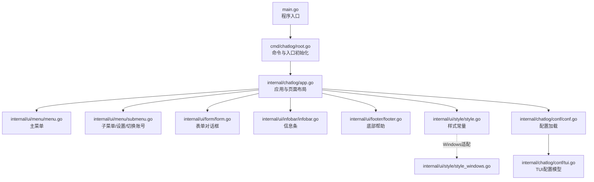
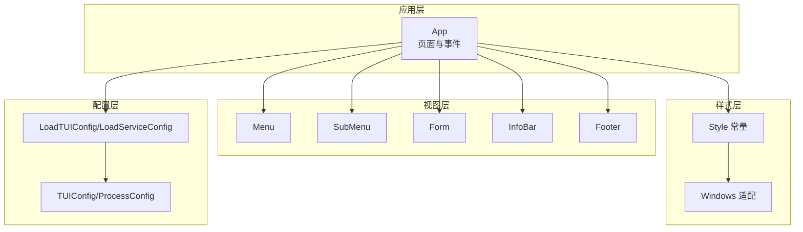
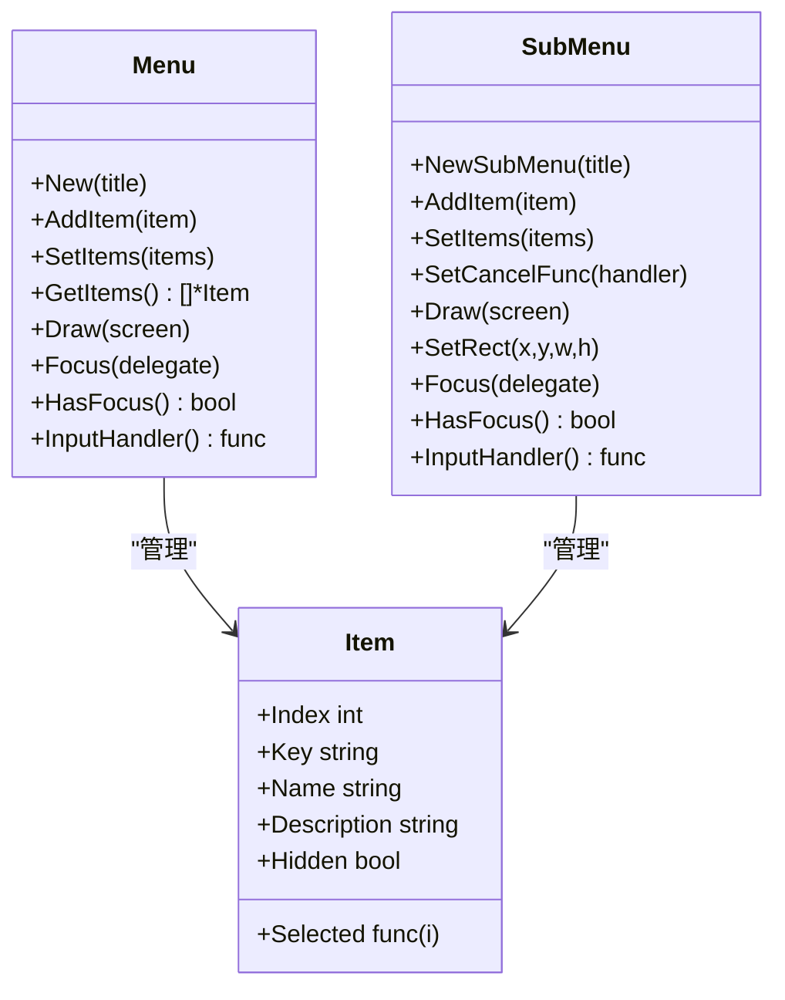
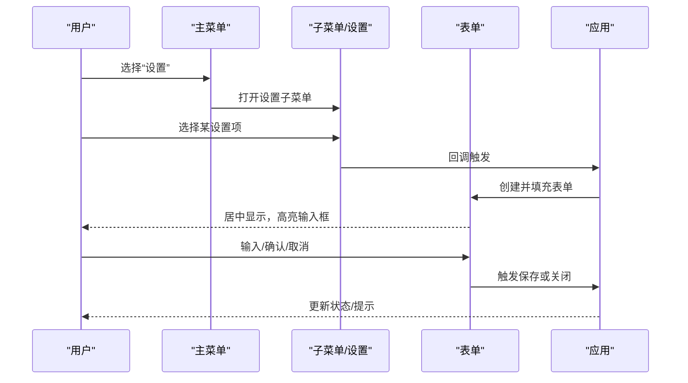
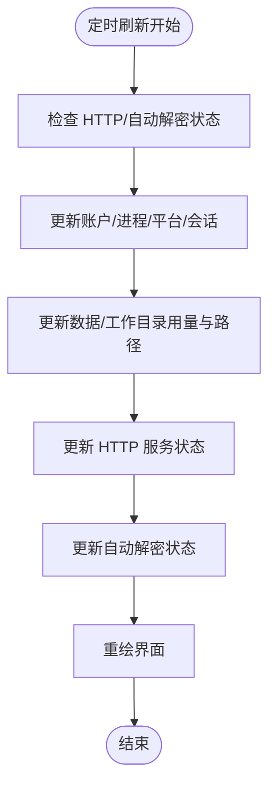
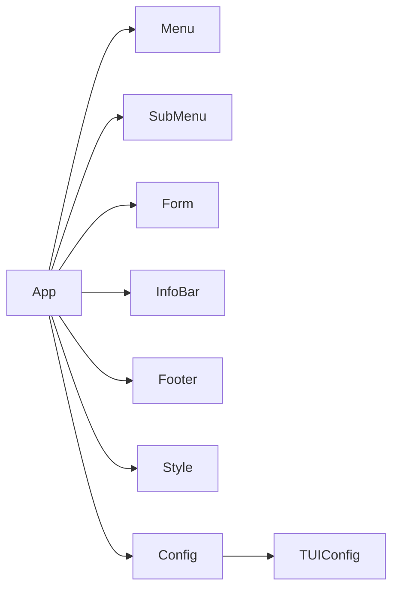

# 用户界面

<cite>
**本文引用的文件**
- [internal/ui/menu/menu.go](file://internal/ui/menu/menu.go)
- [internal/ui/menu/submenu.go](file://internal/ui/menu/submenu.go)
- [internal/ui/form/form.go](file://internal/ui/form/form.go)
- [internal/ui/footer/footer.go](file://internal/ui/footer/footer.go)
- [internal/ui/infobar/infobar.go](file://internal/ui/infobar/infobar.go)
- [internal/ui/style/style.go](file://internal/ui/style/style.go)
- [internal/ui/style/style_windows.go](file://internal/ui/style/style_windows.go)
- [internal/chatlog/app.go](file://internal/chatlog/app.go)
- [internal/chatlog/conf/conf.go](file://internal/chatlog/conf/conf.go)
- [internal/chatlog/conf/tui.go](file://internal/chatlog/conf/tui.go)
- [cmd/chatlog/root.go](file://cmd/chatlog/root.go)
- [main.go](file://main.go)
</cite>

## 目录
1. [简介](#简介)
2. [项目结构](#项目结构)
3. [核心组件](#核心组件)
4. [架构总览](#架构总览)
5. [组件详解](#组件详解)
6. [依赖关系分析](#依赖关系分析)
7. [性能与可用性](#性能与可用性)
8. [故障排查指南](#故障排查指南)
9. [结论](#结论)
10. [附录：界面定制与配置](#附录界面定制与配置)

## 简介
本文件面向 Chatlog 的终端用户界面（TUI）系统，系统基于 tview/tcell 构建，提供菜单导航、表单输入、状态栏与帮助提示等交互能力。本文档从设计理念、导航与交互、组件功能与使用方法、布局与快捷键、状态指示、定制与配置等方面进行系统化说明，并给出使用技巧与效率建议。

## 项目结构
Chatlog 的 TUI 采用模块化组织：
- 菜单与子菜单：负责主菜单与二级设置/切换菜单的展示与交互
- 表单：提供模态输入与确认流程
- 状态栏与信息条：显示账户、进程、平台、HTTP 服务、自动解密等运行状态
- 样式：统一颜色与主题，跨平台适配
- 应用入口与配置：应用生命周期管理、页面布局、键盘事件捕获、配置加载

**图示来源**
- [main.go](file://main.go#L1-L13)
- [cmd/chatlog/root.go](file://cmd/chatlog/root.go#L1-L43)
- [internal/chatlog/app.go](file://internal/chatlog/app.go#L1-L120)
- [internal/ui/menu/menu.go](file://internal/ui/menu/menu.go#L1-L60)
- [internal/ui/menu/submenu.go](file://internal/ui/menu/submenu.go#L1-L60)
- [internal/ui/form/form.go](file://internal/ui/form/form.go#L1-L60)
- [internal/ui/infobar/infobar.go](file://internal/ui/infobar/infobar.go#L1-L45)
- [internal/ui/footer/footer.go](file://internal/ui/footer/footer.go#L1-L40)
- [internal/ui/style/style.go](file://internal/ui/style/style.go#L1-L40)
- [internal/ui/style/style_windows.go](file://internal/ui/style/style_windows.go#L40-L81)
- [internal/chatlog/conf/conf.go](file://internal/chatlog/conf/conf.go#L1-L45)
- [internal/chatlog/conf/tui.go](file://internal/chatlog/conf/tui.go#L1-L41)

**章节来源**
- [main.go](file://main.go#L1-L13)
- [cmd/chatlog/root.go](file://cmd/chatlog/root.go#L1-L43)
- [internal/chatlog/app.go](file://internal/chatlog/app.go#L1-L120)

## 核心组件
- 主菜单：提供“获取密钥”“解密数据”“启动/停止 HTTP 服务”“开启/停止自动解密”“设置”“切换账号”“退出”等命令入口
- 子菜单/设置：二级菜单，包含“设置 HTTP 地址”“设置工作目录”“设置数据密钥/图片密钥/数据目录”等
- 表单：模态表单，支持输入、确认与取消，用于安全地变更配置
- 信息条：显示账户、进程 ID、可执行路径、平台版本、会话时间、数据/工作目录用量、HTTP 服务状态、自动解密状态等
- 底部帮助：显示通用快捷键提示
- 样式：统一前景/背景色、边框色、表头色、进度条色等；Windows 平台适配不同配色方案

**章节来源**
- [internal/ui/menu/menu.go](file://internal/ui/menu/menu.go#L1-L163)
- [internal/ui/menu/submenu.go](file://internal/ui/menu/submenu.go#L1-L233)
- [internal/ui/form/form.go](file://internal/ui/form/form.go#L1-L259)
- [internal/ui/infobar/infobar.go](file://internal/ui/infobar/infobar.go#L1-L231)
- [internal/ui/footer/footer.go](file://internal/ui/footer/footer.go#L1-L69)
- [internal/ui/style/style.go](file://internal/ui/style/style.go#L1-L79)
- [internal/ui/style/style_windows.go](file://internal/ui/style/style_windows.go#L40-L81)

## 架构总览
TUI 采用分层设计：
- 应用层：构建页面容器、注册键盘事件、驱动定时刷新
- 视图层：菜单、子菜单、表单、信息条、底部帮助
- 样式层：颜色与主题常量，跨平台差异
- 配置层：TUI 配置与服务配置加载

**图示来源**
- [internal/chatlog/app.go](file://internal/chatlog/app.go#L1-L120)
- [internal/ui/menu/menu.go](file://internal/ui/menu/menu.go#L1-L60)
- [internal/ui/menu/submenu.go](file://internal/ui/menu/submenu.go#L1-L60)
- [internal/ui/form/form.go](file://internal/ui/form/form.go#L1-L60)
- [internal/ui/infobar/infobar.go](file://internal/ui/infobar/infobar.go#L1-L45)
- [internal/ui/footer/footer.go](file://internal/ui/footer/footer.go#L1-L40)
- [internal/ui/style/style.go](file://internal/ui/style/style.go#L1-L40)
- [internal/ui/style/style_windows.go](file://internal/ui/style/style_windows.go#L40-L81)
- [internal/chatlog/conf/conf.go](file://internal/chatlog/conf/conf.go#L1-L45)
- [internal/chatlog/conf/tui.go](file://internal/chatlog/conf/tui.go#L1-L41)

## 组件详解

### 菜单系统
- 设计理念：以“命令-说明”两列表格呈现，支持上下导航、回车选择、ESC 返回
- 交互模式：主菜单通过表格选择触发对应动作；子菜单用于设置与账号切换
- 关键行为：
  - 主菜单项包含“获取密钥”“解密数据”“启动/停止 HTTP 服务”“开启/停止自动解密”“设置”“切换账号”“退出”
  - 子菜单项包含“设置 HTTP 地址”“设置工作目录”“设置数据密钥/图片密钥/数据目录”
  - 支持动态状态更新（如“启动/停止 HTTP 服务”“开启/停止自动解密”的名称随状态变化）

**图示来源**
- [internal/ui/menu/menu.go](file://internal/ui/menu/menu.go#L13-L163)
- [internal/ui/menu/submenu.go](file://internal/ui/menu/submenu.go#L29-L233)

**章节来源**
- [internal/ui/menu/menu.go](file://internal/ui/menu/menu.go#L1-L163)
- [internal/ui/menu/submenu.go](file://internal/ui/menu/submenu.go#L1-L233)
- [internal/chatlog/app.go](file://internal/chatlog/app.go#L202-L460)

### 表单输入
- 设计理念：模态表单，居中显示，包含标题、表单项、帮助提示与确认按钮
- 交互模式：Tab 导航、Enter 选择、ESC 取消；输入变更后自动重算尺寸，保证布局合理
- 关键行为：
  - 支持输入框、复选框、按钮
  - 提供“保存/取消”确认流程，避免误操作
  - 帮助文本提示 Tab/Enter/ESC 快捷键

**图示来源**
- [internal/chatlog/app.go](file://internal/chatlog/app.go#L469-L652)
- [internal/ui/form/form.go](file://internal/ui/form/form.go#L48-L102)
- [internal/ui/menu/submenu.go](file://internal/ui/menu/submenu.go#L40-L99)

**章节来源**
- [internal/ui/form/form.go](file://internal/ui/form/form.go#L1-L259)
- [internal/chatlog/app.go](file://internal/chatlog/app.go#L469-L652)

### 状态栏与信息条
- 信息条：固定高度，按两列布局显示多组键值对，包括账户、进程、平台、会话、数据/工作目录用量、HTTP 服务、自动解密等
- 底部帮助：显示常用快捷键提示（上下/左右导航、回车选择、ESC 返回、Ctrl+C 退出）
- 定时刷新：每秒刷新一次，实时反映运行状态

**图示来源**
- [internal/chatlog/app.go](file://internal/chatlog/app.go#L135-L172)
- [internal/ui/infobar/infobar.go](file://internal/ui/infobar/infobar.go#L44-L168)
- [internal/ui/footer/footer.go](file://internal/ui/footer/footer.go#L23-L60)

**章节来源**
- [internal/ui/infobar/infobar.go](file://internal/ui/infobar/infobar.go#L1-L231)
- [internal/ui/footer/footer.go](file://internal/ui/footer/footer.go#L1-L69)
- [internal/chatlog/app.go](file://internal/chatlog/app.go#L135-L172)

### 样式与主题
- 统一颜色：前景/背景、边框、表头、对话框、终端、进度条、下拉等
- 跨平台适配：非 Windows 平台与 Windows 平台的颜色常量存在差异，保证在不同终端下的可读性与一致性

**章节来源**
- [internal/ui/style/style.go](file://internal/ui/style/style.go#L1-L79)
- [internal/ui/style/style_windows.go](file://internal/ui/style/style_windows.go#L40-L81)

### 键盘快捷键与交互
- 标签页切换：左右方向键在菜单与帮助页之间切换
- 菜单导航：上下方向键在菜单项间移动，回车选择，ESC 返回上一级
- 表单交互：Tab 导航、Enter 选择、ESC 取消
- 全局退出：Ctrl+C 退出应用

**章节来源**
- [internal/chatlog/app.go](file://internal/chatlog/app.go#L174-L200)
- [internal/ui/footer/footer.go](file://internal/ui/footer/footer.go#L46-L53)
- [internal/ui/menu/menu.go](file://internal/ui/menu/menu.go#L141-L148)
- [internal/ui/menu/submenu.go](file://internal/ui/menu/submenu.go#L211-L224)
- [internal/ui/form/form.go](file://internal/ui/form/form.go#L236-L250)

## 依赖关系分析
- 应用层依赖视图层与样式层，负责页面组合、事件捕获与定时刷新
- 视图层相互独立，通过应用层进行聚焦与事件转发
- 配置层为应用层提供初始状态与默认值，影响菜单项与信息条内容

**图示来源**
- [internal/chatlog/app.go](file://internal/chatlog/app.go#L1-L120)
- [internal/chatlog/conf/conf.go](file://internal/chatlog/conf/conf.go#L1-L45)
- [internal/chatlog/conf/tui.go](file://internal/chatlog/conf/tui.go#L1-L41)

**章节来源**
- [internal/chatlog/app.go](file://internal/chatlog/app.go#L1-L120)
- [internal/chatlog/conf/conf.go](file://internal/chatlog/conf/conf.go#L1-L45)
- [internal/chatlog/conf/tui.go](file://internal/chatlog/conf/tui.go#L1-L41)

## 性能与可用性
- 定时刷新：每秒一次的状态刷新，兼顾实时性与资源占用
- 异步操作：菜单项中的“获取密钥”“解密数据”“启动/停止服务”“开启/停止自动解密”均在后台协程执行，避免阻塞 UI
- 模态提示：关键操作通过模态框反馈结果，减少误操作风险
- 自适应布局：表单与子菜单根据内容动态计算尺寸，保证在小窗口下的可读性

**章节来源**
- [internal/chatlog/app.go](file://internal/chatlog/app.go#L135-L172)
- [internal/ui/form/form.go](file://internal/ui/form/form.go#L144-L180)
- [internal/ui/menu/submenu.go](file://internal/ui/menu/submenu.go#L133-L167)

## 故障排查指南
- 无法启动 HTTP 服务
  - 检查“HTTP 服务”状态是否已启动，若失败查看模态框错误提示
  - 通过“设置 HTTP 地址”调整监听地址
- 自动解密未生效
  - 确认“自动解密”状态为“已开启”，并检查数据目录是否正确
- 获取密钥失败
  - 某些平台提示等待时间较长，耐心等待；失败时查看模态框具体错误
- 切换账号无效
  - 确认目标账号与当前账号不同；查看提示信息确认切换结果

**章节来源**
- [internal/chatlog/app.go](file://internal/chatlog/app.go#L279-L429)
- [internal/chatlog/app.go](file://internal/chatlog/app.go#L518-L652)

## 结论
Chatlog 的 TUI 以清晰的菜单结构、直观的表单输入与稳定的定时刷新机制为核心，辅以统一的样式体系与跨平台适配，提供了高效且易用的终端交互体验。通过合理的异步处理与模态反馈，用户可在命令行环境中完成复杂的数据解密与服务管理任务。

## 附录：界面定制与配置
- 配置加载
  - TUI 配置：通过环境变量或指定目录加载，包含最后账号、历史账号、Webhook 等
  - 服务配置：加载服务相关参数，必要时从数据目录内嵌 JSON 合并关键字段
- 可配置项（通过设置菜单）
  - HTTP 服务地址
  - 工作目录
  - 数据密钥
  - 图片密钥
  - 数据目录
- 使用技巧与效率建议
  - 使用左右方向键快速在“主菜单/帮助”页间切换
  - 在菜单中使用上下方向键快速定位命令，回车一键执行
  - 设置类操作建议先预览默认值，再通过表单“保存”确认
  - 若窗口较小，优先使用“设置”菜单微调参数，避免布局拥挤

**章节来源**
- [internal/chatlog/conf/conf.go](file://internal/chatlog/conf/conf.go#L19-L96)
- [internal/chatlog/conf/tui.go](file://internal/chatlog/conf/tui.go#L1-L41)
- [internal/chatlog/app.go](file://internal/chatlog/app.go#L469-L652)