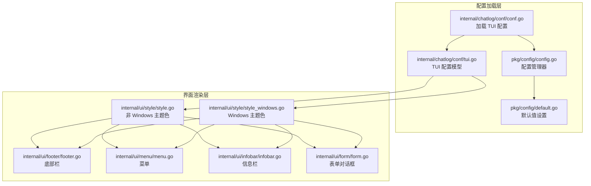
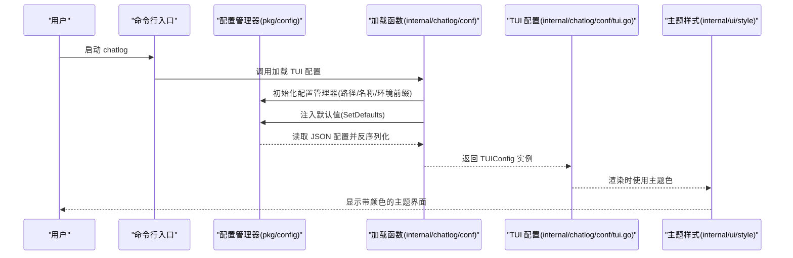
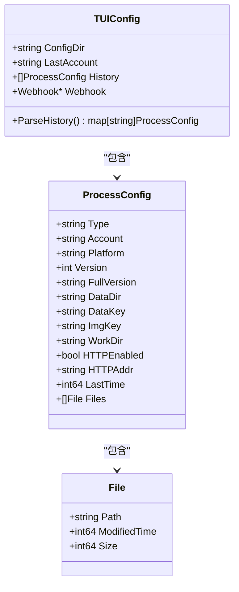
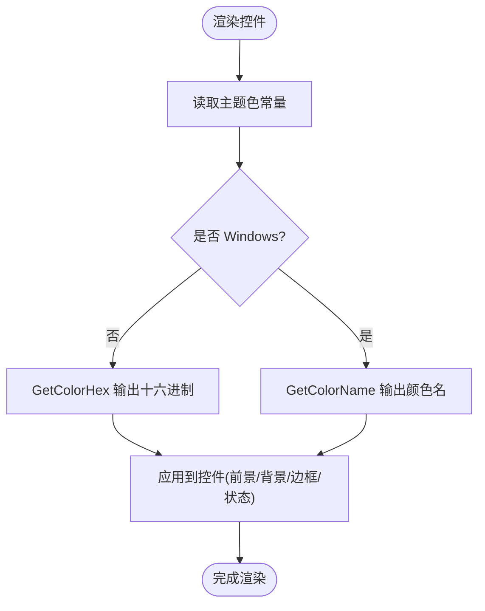
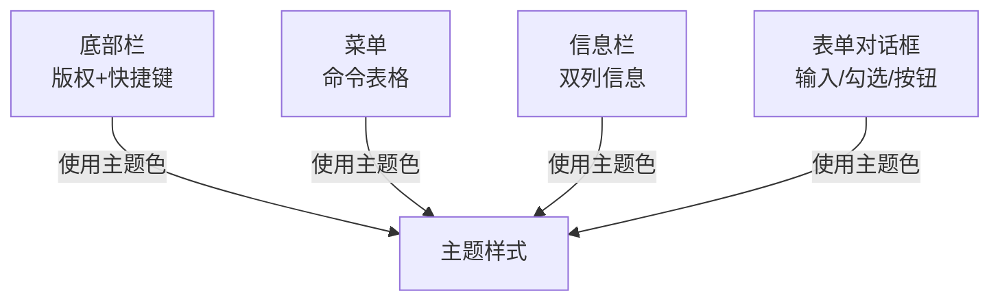
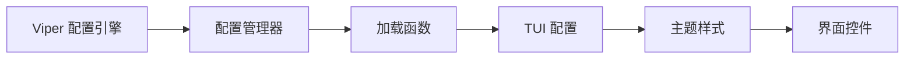

# TUI 界面配置

<cite>
**本文引用的文件**
- [internal/chatlog/conf/tui.go](file://internal/chatlog/conf/tui.go)
- [internal/chatlog/conf/conf.go](file://internal/chatlog/conf/conf.go)
- [pkg/config/config.go](file://pkg/config/config.go)
- [pkg/config/default.go](file://pkg/config/default.go)
- [internal/ui/style/style.go](file://internal/ui/style/style.go)
- [internal/ui/style/style_windows.go](file://internal/ui/style/style_windows.go)
- [internal/ui/footer/footer.go](file://internal/ui/footer/footer.go)
- [internal/ui/menu/menu.go](file://internal/ui/menu/menu.go)
- [internal/ui/infobar/infobar.go](file://internal/ui/infobar/infobar.go)
- [internal/ui/form/form.go](file://internal/ui/form/form.go)
- [internal/chatlog/conf/server.go](file://internal/chatlog/conf/server.go)
- [README.md](file://README.md)
</cite>

## 目录
1. [简介](#简介)
2. [项目结构](#项目结构)
3. [核心组件](#核心组件)
4. [架构总览](#架构总览)
5. [详细组件分析](#详细组件分析)
6. [依赖关系分析](#依赖关系分析)
7. [性能考虑](#性能考虑)
8. [故障排除指南](#故障排除指南)
9. [结论](#结论)
10. [附录](#附录)

## 简介
本文件面向终端用户与运维人员，系统化说明 Chatlog 的 TUI（文本用户界面）配置与定制方法。内容覆盖颜色主题、字体与渲染差异、布局与交互行为、跨平台兼容性、配置加载流程、以及性能优化与常见问题排查建议。读者无需深入源码即可完成界面配置与优化。

## 项目结构
TUI 界面配置涉及“配置加载层”和“界面渲染层”两大块：
- 配置加载层：负责读取 JSON 配置、设置默认值、环境变量注入与写回。
- 界面渲染层：负责颜色主题、控件样式、布局与交互。

**图表来源**
- [pkg/config/config.go](file://pkg/config/config.go#L38-L160)
- [pkg/config/default.go](file://pkg/config/default.go#L25-L33)
- [internal/chatlog/conf/conf.go](file://internal/chatlog/conf/conf.go#L19-L45)
- [internal/chatlog/conf/tui.go](file://internal/chatlog/conf/tui.go#L3-L41)
- [internal/ui/style/style.go](file://internal/ui/style/style.go#L13-L78)
- [internal/ui/style/style_windows.go](file://internal/ui/style/style_windows.go#L10-L81)
- [internal/ui/footer/footer.go](file://internal/ui/footer/footer.go#L16-L69)
- [internal/ui/menu/menu.go](file://internal/ui/menu/menu.go#L22-L163)
- [internal/ui/infobar/infobar.go](file://internal/ui/infobar/infobar.go#L36-L231)
- [internal/ui/form/form.go](file://internal/ui/form/form.go#L28-L259)

**章节来源**
- [internal/chatlog/conf/conf.go](file://internal/chatlog/conf/conf.go#L19-L45)
- [pkg/config/config.go](file://pkg/config/config.go#L38-L160)
- [pkg/config/default.go](file://pkg/config/default.go#L25-L33)
- [internal/chatlog/conf/tui.go](file://internal/chatlog/conf/tui.go#L3-L41)

## 核心组件
- TUI 配置模型：描述账户历史、最后账户、Webhook、进程配置与文件清单等。
- 配置管理器：负责 JSON 文件读取、默认值注入、环境变量映射与写回。
- 主题样式：按平台区分颜色常量与字符单元，统一控制控件前景/背景/边框/状态色。
- 界面控件：底部栏、菜单、信息栏、表单对话框，均使用统一主题色与布局策略。

**章节来源**
- [internal/chatlog/conf/tui.go](file://internal/chatlog/conf/tui.go#L3-L41)
- [pkg/config/config.go](file://pkg/config/config.go#L38-L160)
- [internal/ui/style/style.go](file://internal/ui/style/style.go#L13-L78)
- [internal/ui/style/style_windows.go](file://internal/ui/style/style_windows.go#L10-L81)
- [internal/ui/footer/footer.go](file://internal/ui/footer/footer.go#L16-L69)
- [internal/ui/menu/menu.go](file://internal/ui/menu/menu.go#L22-L163)
- [internal/ui/infobar/infobar.go](file://internal/ui/infobar/infobar.go#L36-L231)
- [internal/ui/form/form.go](file://internal/ui/form/form.go#L28-L259)

## 架构总览
TUI 配置的加载与应用流程如下：

**图表来源**
- [internal/chatlog/conf/conf.go](file://internal/chatlog/conf/conf.go#L19-L45)
- [pkg/config/config.go](file://pkg/config/config.go#L48-L110)
- [pkg/config/default.go](file://pkg/config/default.go#L25-L33)
- [internal/chatlog/conf/tui.go](file://internal/chatlog/conf/tui.go#L3-L41)
- [internal/ui/style/style.go](file://internal/ui/style/style.go#L13-L78)
- [internal/ui/style/style_windows.go](file://internal/ui/style/style_windows.go#L10-L81)

## 详细组件分析

### 配置模型与加载
- TUIConfig：包含配置目录、最后账户、历史进程、Webhook 等。
- ProcessConfig：描述每个账户的类型、平台、版本、数据目录/密钥、工作目录、HTTP 开关与地址、文件清单等。
- 默认值：通过 SetDefaults 注入结构字段默认值，避免空值导致的渲染异常。
- 环境变量：配置管理器支持环境变量注入，键名经替换为大写并点号转下划线。

**图表来源**
- [internal/chatlog/conf/tui.go](file://internal/chatlog/conf/tui.go#L3-L41)

**章节来源**
- [internal/chatlog/conf/tui.go](file://internal/chatlog/conf/tui.go#L3-L41)
- [internal/chatlog/conf/conf.go](file://internal/chatlog/conf/conf.go#L19-L45)
- [pkg/config/default.go](file://pkg/config/default.go#L25-L33)
- [pkg/config/config.go](file://pkg/config/config.go#L48-L110)

### 主题与颜色配置
- 非 Windows 平台：定义丰富的颜色常量（前景/背景/边框/状态/对话框/终端/表格/进度条/下拉等），并提供颜色名与十六进制转换辅助函数。
- Windows 平台：采用 tview 风格默认色与平台特定字符单元，颜色命名优先于十六进制输出。
- 控件使用：底部栏、菜单、信息栏、表单对话框均通过统一的颜色常量与 GetColorHex/GetColorName 输出适配不同平台。

**图表来源**
- [internal/ui/style/style.go](file://internal/ui/style/style.go#L13-L78)
- [internal/ui/style/style_windows.go](file://internal/ui/style/style_windows.go#L10-L81)
- [internal/ui/footer/footer.go](file://internal/ui/footer/footer.go#L31-L53)
- [internal/ui/menu/menu.go](file://internal/ui/menu/menu.go#L37-L43)
- [internal/ui/infobar/infobar.go](file://internal/ui/infobar/infobar.go#L46-L76)
- [internal/ui/form/form.go](file://internal/ui/form/form.go#L58-L66)

**章节来源**
- [internal/ui/style/style.go](file://internal/ui/style/style.go#L13-L78)
- [internal/ui/style/style_windows.go](file://internal/ui/style/style_windows.go#L10-L81)
- [internal/ui/footer/footer.go](file://internal/ui/footer/footer.go#L31-L53)
- [internal/ui/menu/menu.go](file://internal/ui/menu/menu.go#L37-L43)
- [internal/ui/infobar/infobar.go](file://internal/ui/infobar/infobar.go#L46-L76)
- [internal/ui/form/form.go](file://internal/ui/form/form.go#L58-L66)

### 布局与交互配置
- 底部栏：包含版权与快捷键提示，动态颜色与右对齐帮助文本。
- 菜单：表格驱动的命令列表，支持选择、排序与键盘导航。
- 信息栏：两列信息展示（账户/PID、状态/可执行路径、平台/版本、会话/数据密钥、数据用量/数据目录、工作用量/工作目录、HTTP 服务/图片密钥、自动解密），固定高度便于布局。
- 表单对话框：居中布局、动态尺寸计算、帮助文本与按钮对齐，支持取消回调。

**图表来源**
- [internal/ui/footer/footer.go](file://internal/ui/footer/footer.go#L16-L69)
- [internal/ui/menu/menu.go](file://internal/ui/menu/menu.go#L22-L163)
- [internal/ui/infobar/infobar.go](file://internal/ui/infobar/infobar.go#L36-L231)
- [internal/ui/form/form.go](file://internal/ui/form/form.go#L28-L259)
- [internal/ui/style/style.go](file://internal/ui/style/style.go#L13-L78)
- [internal/ui/style/style_windows.go](file://internal/ui/style/style_windows.go#L10-L81)

**章节来源**
- [internal/ui/footer/footer.go](file://internal/ui/footer/footer.go#L16-L69)
- [internal/ui/menu/menu.go](file://internal/ui/menu/menu.go#L22-L163)
- [internal/ui/infobar/infobar.go](file://internal/ui/infobar/infobar.go#L36-L231)
- [internal/ui/form/form.go](file://internal/ui/form/form.go#L28-L259)

### 跨平台兼容性与字体/渲染
- Windows 终端：推荐使用 Windows Terminal 以避免显示异常；主题采用 tview 默认风格与平台字符单元。
- 非 Windows：使用 RGB 颜色与 Unicode 字符，提供更丰富的视觉层次。
- 字体与字符：主题中包含进度条单元与复选/叉号单元，不同平台采用不同字符集以保证可读性。

**章节来源**
- [README.md](file://README.md#L148-L151)
- [internal/ui/style/style.go](file://internal/ui/style/style.go#L13-L20)
- [internal/ui/style/style_windows.go](file://internal/ui/style/style_windows.go#L10-L17)

### 配置示例与环境变量
- 配置文件位置：TUI 配置位于用户配置目录下的 chatlog.json（Windows 为用户目录下的 .chatlog/chatlog.json）。
- Webhook 配置：可在 TUI 配置中嵌套 webhook 字段，包含 host 与 items 列表。
- 环境变量：服务模式可通过 CHATLOG_WEBHOOK 等环境变量注入 webhook 配置。

**章节来源**
- [README.md](file://README.md#L221-L253)
- [internal/chatlog/conf/conf.go](file://internal/chatlog/conf/conf.go#L19-L45)
- [internal/chatlog/conf/server.go](file://internal/chatlog/conf/server.go#L3-L21)

## 依赖关系分析
- 配置加载依赖 Viper 进行 JSON 读取与环境变量映射，支持默认值注入与写回。
- 界面控件依赖统一主题样式常量，实现跨平台一致的外观。
- TUIConfig 与 ServerConfig 分别服务于 TUI 与服务模式，但共享部分字段（如数据目录、密钥、HTTP 地址等）。

**图表来源**
- [pkg/config/config.go](file://pkg/config/config.go#L48-L110)
- [internal/chatlog/conf/conf.go](file://internal/chatlog/conf/conf.go#L19-L45)
- [internal/chatlog/conf/tui.go](file://internal/chatlog/conf/tui.go#L3-L41)
- [internal/ui/style/style.go](file://internal/ui/style/style.go#L13-L78)

**章节来源**
- [pkg/config/config.go](file://pkg/config/config.go#L48-L110)
- [internal/chatlog/conf/conf.go](file://internal/chatlog/conf/conf.go#L19-L45)
- [internal/chatlog/conf/tui.go](file://internal/chatlog/conf/tui.go#L3-L41)

## 性能考虑
- 减少频繁重绘：信息栏与菜单使用固定布局与尺寸，避免每次输入都触发大规模重排。
- 主题色缓存：颜色常量一次性定义，渲染时直接使用，降低查找成本。
- 动态尺寸计算：表单对话框在绘制前重新计算尺寸，确保在小窗口下仍可完整显示。
- HTTP 服务与自动解密：合理设置 HTTP 地址与密钥，避免不必要的网络与磁盘 IO。

[本节为通用建议，无需具体文件分析]

## 故障排除指南
- Windows 显示异常（花屏/乱码）
  - 使用 Windows Terminal 运行程序。
  - 若仍异常，检查终端字体与编码设置。
  
  **章节来源**
  - [README.md](file://README.md#L148-L151)

- 配置未生效或缺失
  - 确认配置文件路径与权限（用户目录下的 .chatlog/chatlog.json）。
  - 检查环境变量前缀与键名（点号转下划线）。
  - 使用配置管理器的写回能力验证配置持久化。

  **章节来源**
  - [pkg/config/config.go](file://pkg/config/config.go#L48-L110)
  - [internal/chatlog/conf/conf.go](file://internal/chatlog/conf/conf.go#L19-L45)

- 菜单/信息栏显示错位
  - 检查终端字符宽度与缩放比例。
  - 确认主题色常量未被外部样式覆盖。

  **章节来源**
  - [internal/ui/menu/menu.go](file://internal/ui/menu/menu.go#L93-L115)
  - [internal/ui/infobar/infobar.go](file://internal/ui/infobar/infobar.go#L220-L231)

- 表单对话框过小或溢出
  - 调整输入字段宽度与标签长度，确保满足最小宽度。
  - 在小窗口下优先使用默认布局策略。

  **章节来源**
  - [internal/ui/form/form.go](file://internal/ui/form/form.go#L144-L180)

## 结论
通过统一的配置加载与主题样式体系，Chatlog 的 TUI 界面实现了跨平台的一致体验。用户可通过 JSON 配置与环境变量灵活定制界面外观与行为，结合合理的布局与性能策略，获得稳定高效的终端交互体验。

## 附录
- 配置文件位置与示例：参见 README 中的 Webhook 配置示例与路径说明。
- 服务模式配置：通过环境变量注入 webhook 等参数，适用于容器与自动化场景。

**章节来源**
- [README.md](file://README.md#L221-L253)
- [internal/chatlog/conf/server.go](file://internal/chatlog/conf/server.go#L3-L21)