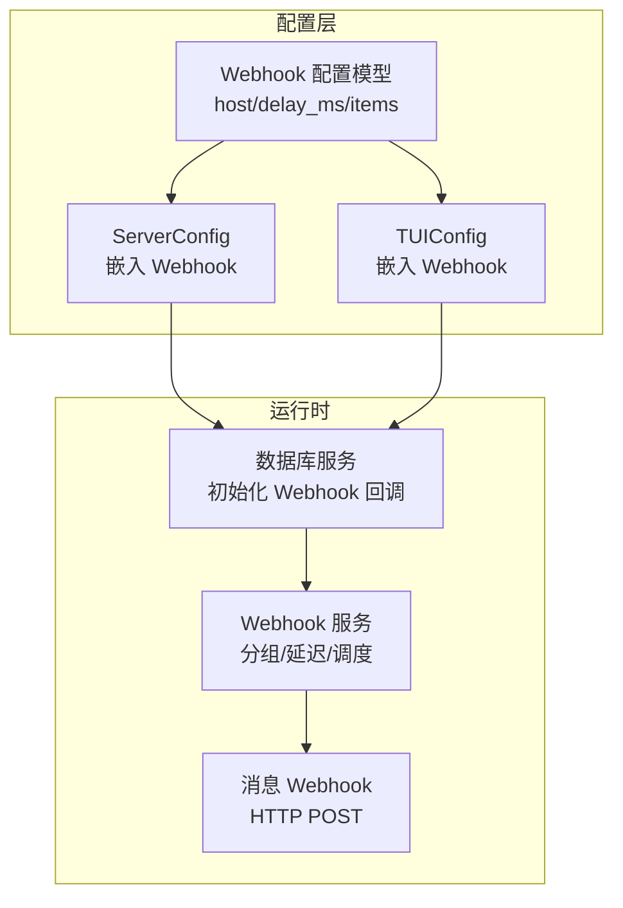
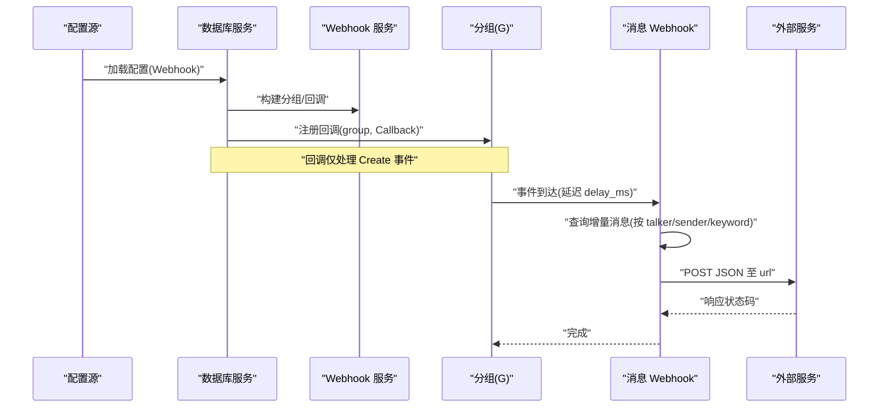
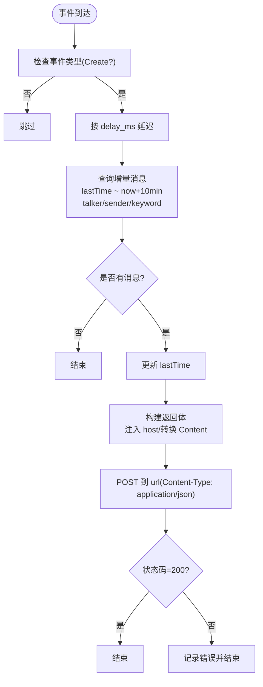
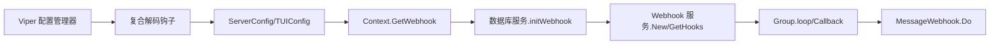

# Webhook 配置

<cite>
**本文引用的文件**
- [internal/chatlog/conf/webhook.go](file://internal/chatlog/conf/webhook.go)
- [internal/chatlog/conf/server.go](file://internal/chatlog/conf/server.go)
- [internal/chatlog/conf/tui.go](file://internal/chatlog/conf/tui.go)
- [internal/chatlog/ctx/context.go](file://internal/chatlog/ctx/context.go)
- [internal/chatlog/webhook/webhook.go](file://internal/chatlog/webhook/webhook.go)
- [internal/chatlog/database/service.go](file://internal/chatlog/database/service.go)
- [pkg/config/config.go](file://pkg/config/config.go)
- [pkg/config/types.go](file://pkg/config/types.go)
- [README.md](file://README.md)
</cite>

## 目录
1. [简介](#简介)
2. [项目结构](#项目结构)
3. [核心组件](#核心组件)
4. [架构总览](#架构总览)
5. [详细组件分析](#详细组件分析)
6. [依赖关系分析](#依赖关系分析)
7. [性能与可靠性](#性能与可靠性)
8. [故障排查指南](#故障排查指南)
9. [结论](#结论)
10. [附录：配置示例与最佳实践](#附录配置示例与最佳实践)

## 简介
本文件面向 Chatlog 的 Webhook 功能，系统性说明其配置参数、触发条件、过滤规则、安全注意事项与错误处理机制，并提供可直接落地的配置示例与调试方法。当前实现支持基于文件系统事件的消息类 Webhook，通过回调 URL 将增量消息推送至外部系统；同时具备延迟发送、禁用项、按会话/关键词过滤等能力。

## 项目结构
Webhook 配置位于配置模型层，运行时由数据库服务在启动阶段初始化并注册回调，最终在文件系统事件到来时触发 HTTP POST 请求。

图表来源
- [internal/chatlog/conf/webhook.go](file://internal/chatlog/conf/webhook.go#L1-L16)
- [internal/chatlog/conf/server.go](file://internal/chatlog/conf/server.go#L7-L18)
- [internal/chatlog/conf/tui.go](file://internal/chatlog/conf/tui.go#L3-L7)
- [internal/chatlog/database/service.go](file://internal/chatlog/database/service.go#L111-L126)
- [internal/chatlog/webhook/webhook.go](file://internal/chatlog/webhook/webhook.go#L30-L78)

章节来源
- [internal/chatlog/conf/webhook.go](file://internal/chatlog/conf/webhook.go#L1-L16)
- [internal/chatlog/conf/server.go](file://internal/chatlog/conf/server.go#L7-L18)
- [internal/chatlog/conf/tui.go](file://internal/chatlog/conf/tui.go#L3-L7)
- [internal/chatlog/database/service.go](file://internal/chatlog/database/service.go#L111-L126)

## 核心组件
- 配置模型
  - Webhook：包含 host、delay_ms、items 列表
  - WebhookItem：包含 type、url、talker、sender、keyword、disabled
- 运行时服务
  - Webhook 服务：按类型分组、建立回调通道、支持延迟执行
  - 消息 Webhook：从数据库查询增量消息、构造请求体、发起 HTTP POST
- 集成点
  - 数据库服务在启动时读取配置并注册回调
  - 上下文提供配置访问接口（TUI 场景）

章节来源
- [internal/chatlog/conf/webhook.go](file://internal/chatlog/conf/webhook.go#L3-L16)
- [internal/chatlog/webhook/webhook.go](file://internal/chatlog/webhook/webhook.go#L25-L78)
- [internal/chatlog/ctx/context.go](file://internal/chatlog/ctx/context.go#L184-L186)

## 架构总览
Webhook 的工作流如下：配置加载后，数据库服务初始化 Webhook 分组，注册回调到文件系统事件；当事件到达且满足过滤条件时，按延迟策略并发触发消息 Webhook，向指定 URL 发送 JSON 内容。

图表来源
- [internal/chatlog/database/service.go](file://internal/chatlog/database/service.go#L111-L126)
- [internal/chatlog/webhook/webhook.go](file://internal/chatlog/webhook/webhook.go#L62-L78)
- [internal/chatlog/webhook/webhook.go](file://internal/chatlog/webhook/webhook.go#L100-L137)
- [internal/chatlog/webhook/webhook.go](file://internal/chatlog/webhook/webhook.go#L159-L199)

## 详细组件分析

### 配置模型与字段说明
- Webhook
  - host：用于在消息内容中注入 host 字段，便于下游识别来源
  - delay_ms：事件触发后的延迟毫秒数，避免瞬时高并发
  - items：Webhook 条目列表
- WebhookItem
  - type：类型，默认 message；当前仅支持消息类型
  - url：回调地址，POST 目标
  - talker：会话过滤（如群聊或联系人）
  - sender：发送者过滤（如特定微信号）
  - keyword：关键词过滤（消息文本包含该词才触发）
  - disabled：是否禁用该条目

章节来源
- [internal/chatlog/conf/webhook.go](file://internal/chatlog/conf/webhook.go#L3-L16)
- [internal/chatlog/conf/server.go](file://internal/chatlog/conf/server.go#L17-L18)
- [internal/chatlog/conf/tui.go](file://internal/chatlog/conf/tui.go#L6-L7)

### Webhook 初始化与回调注册
- 数据库服务在启动时读取配置，构建 Webhook 分组并注册回调
- 回调仅对 Create 事件生效，其他事件被忽略
- 支持多条目聚合到同一分组，统一延迟与并发执行

章节来源
- [internal/chatlog/database/service.go](file://internal/chatlog/database/service.go#L111-L126)
- [internal/chatlog/webhook/webhook.go](file://internal/chatlog/webhook/webhook.go#L62-L78)
- [internal/chatlog/webhook/webhook.go](file://internal/chatlog/webhook/webhook.go#L100-L111)

### 消息 Webhook 触发与过滤
- 查询逻辑：基于 lastTime 起止时间窗口、talker、sender、keyword 获取增量消息
- 内容处理：为每条消息注入 host 字段，并将 Content 转换为纯文本
- 请求发送：POST JSON，Content-Type: application/json
- 延迟与并发：分组内事件按 delay_ms 延迟后并发触发各条目

图表来源
- [internal/chatlog/webhook/webhook.go](file://internal/chatlog/webhook/webhook.go#L159-L199)

章节来源
- [internal/chatlog/webhook/webhook.go](file://internal/chatlog/webhook/webhook.go#L159-L199)

### 安全与鉴权
- 当前实现未内置鉴权头或签名机制，建议通过以下方式保障安全：
  - 仅在受信任网络内暴露回调地址
  - 在反向代理层增加鉴权（如 Basic Auth、Token 校验）
  - 对外网回调使用 HTTPS 并校验证书
  - 限制回调地址白名单
  - 结合业务侧对 payload 进行签名校验（如需）

章节来源
- [internal/chatlog/webhook/webhook.go](file://internal/chatlog/webhook/webhook.go#L186-L198)

### 错误处理与日志
- 查询失败、HTTP 请求失败、非 200 状态均记录错误日志
- 无重试与退避策略，建议在外部系统实现幂等与重试

章节来源
- [internal/chatlog/webhook/webhook.go](file://internal/chatlog/webhook/webhook.go#L161-L164)
- [internal/chatlog/webhook/webhook.go](file://internal/chatlog/webhook/webhook.go#L191-L198)

## 依赖关系分析
- 配置来源
  - ServerConfig 与 TUIConfig 均嵌入 Webhook 配置，分别服务于服务端与 TUI 场景
  - Context 提供 GetWebhook 接口，便于运行时读取
- 解析与加载
  - 配置管理器负责读取、解码与合并环境变量/文件
  - 复合解码钩子支持字符串到结构体/切片/映射的转换
- 运行时集成
  - 数据库服务在启动时初始化 Webhook 并注册回调
  - Webhook 服务按类型分组，支持延迟与并发

图表来源
- [pkg/config/config.go](file://pkg/config/config.go#L97-L123)
- [pkg/config/types.go](file://pkg/config/types.go#L109-L121)
- [internal/chatlog/conf/server.go](file://internal/chatlog/conf/server.go#L57-L60)
- [internal/chatlog/conf/tui.go](file://internal/chatlog/conf/tui.go#L6-L7)
- [internal/chatlog/ctx/context.go](file://internal/chatlog/ctx/context.go#L184-L186)
- [internal/chatlog/database/service.go](file://internal/chatlog/database/service.go#L111-L126)
- [internal/chatlog/webhook/webhook.go](file://internal/chatlog/webhook/webhook.go#L30-L78)

章节来源
- [pkg/config/config.go](file://pkg/config/config.go#L97-L123)
- [pkg/config/types.go](file://pkg/config/types.go#L109-L121)
- [internal/chatlog/conf/server.go](file://internal/chatlog/conf/server.go#L57-L60)
- [internal/chatlog/conf/tui.go](file://internal/chatlog/conf/tui.go#L6-L7)
- [internal/chatlog/ctx/context.go](file://internal/chatlog/ctx/context.go#L184-L186)
- [internal/chatlog/database/service.go](file://internal/chatlog/database/service.go#L111-L126)
- [internal/chatlog/webhook/webhook.go](file://internal/chatlog/webhook/webhook.go#L30-L78)

## 性能与可靠性
- 延迟策略：通过 delay_ms 平滑突发，降低下游压力
- 并发模型：分组内事件并发触发，单条目内部串行（消息查询与请求）
- 查询范围：以时间窗口与过滤条件限定数据量，避免全量扫描
- 建议
  - 合理设置 delay_ms 与并发度，结合下游吞吐能力
  - 对高频群聊建议启用 talker/sender/keyword 过滤，减少无效请求
  - 下游实现幂等与去重，避免重复消息

章节来源
- [internal/chatlog/webhook/webhook.go](file://internal/chatlog/webhook/webhook.go#L124-L137)
- [internal/chatlog/webhook/webhook.go](file://internal/chatlog/webhook/webhook.go#L160-L168)

## 故障排查指南
- 无法收到回调
  - 确认事件类型为 Create，其他事件会被忽略
  - 检查 talker/sender/keyword 是否导致消息为空
  - 核对 url 是否可达、是否需要鉴权
- 回调频繁或延迟过大
  - 调整 delay_ms 或减少 items 数量
  - 检查是否存在大量 Create 事件
- HTTP 失败
  - 查看状态码与响应体
  - 确认网络连通性与证书有效性
- 日志定位
  - 关注查询失败、HTTP 请求失败、状态码异常等日志

章节来源
- [internal/chatlog/webhook/webhook.go](file://internal/chatlog/webhook/webhook.go#L100-L111)
- [internal/chatlog/webhook/webhook.go](file://internal/chatlog/webhook/webhook.go#L161-L164)
- [internal/chatlog/webhook/webhook.go](file://internal/chatlog/webhook/webhook.go#L191-L198)

## 结论
Chatlog 的 Webhook 当前聚焦“消息通知”场景，通过简单而稳健的配置模型与事件驱动机制，实现了低耦合、可扩展的消息推送能力。建议在生产环境中配合网络与鉴权策略，确保安全与稳定性。

## 附录：配置示例与最佳实践

### 配置示例
- 示例一：基础消息通知
  - 类型：message
  - 回调地址：https://your.domain/webhook
  - 过滤：不限制 talker/sender/keyword
  - 延迟：根据下游吞吐设置 delay_ms
- 示例二：按群过滤
  - 设置 talker 为特定群名称或 ID
  - 仅该群消息触发回调
- 示例三：按关键词过滤
  - 设置 keyword 为敏感词或指令关键字
  - 仅命中关键词的消息触发回调
- 示例四：禁用某条目
  - disabled=true 可临时关闭某条回调

章节来源
- [internal/chatlog/conf/webhook.go](file://internal/chatlog/conf/webhook.go#L9-L16)
- [internal/chatlog/webhook/webhook.go](file://internal/chatlog/webhook/webhook.go#L159-L199)

### 最佳实践
- 安全
  - 仅在内网或受控网络暴露回调地址
  - 在反向代理层增加鉴权与限流
  - 使用 HTTPS 并校验证书
- 可靠性
  - 下游实现幂等与重试
  - 控制并发与延迟，避免雪崩
- 可维护性
  - 明确 talker/sender/keyword 的含义与边界
  - 记录 lastTime 与 length 等元信息，便于排障
- 配置管理
  - 使用环境变量或配置文件集中管理
  - 通过上下文或服务配置统一加载

章节来源
- [internal/chatlog/webhook/webhook.go](file://internal/chatlog/webhook/webhook.go#L177-L184)
- [pkg/config/config.go](file://pkg/config/config.go#L97-L123)
- [pkg/config/types.go](file://pkg/config/types.go#L109-L121)
- [README.md](file://README.md#L222-L222)