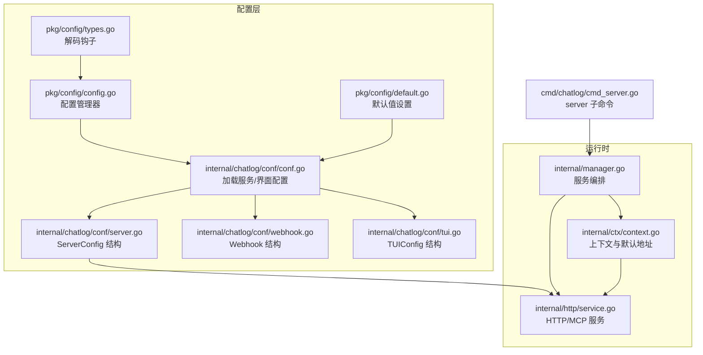
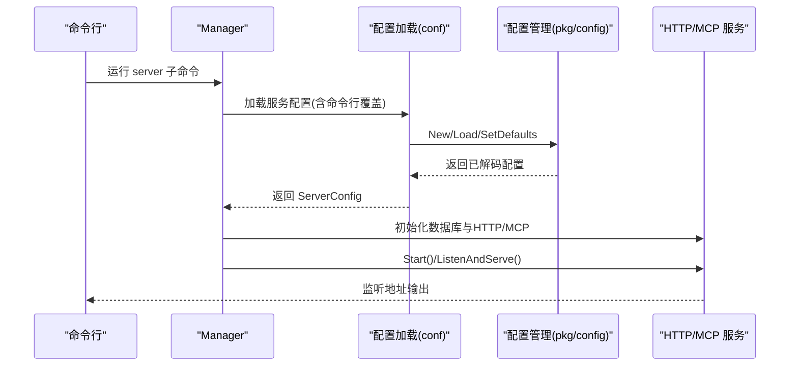
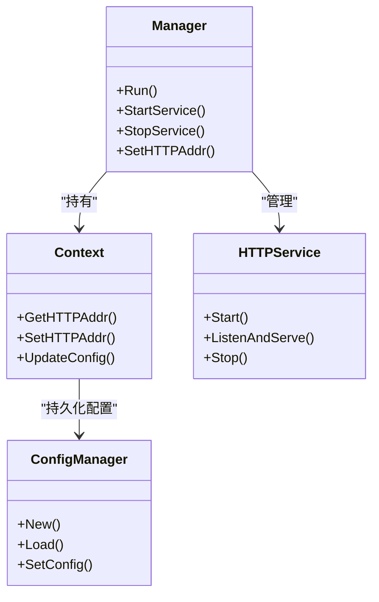

# 服务配置

<cite>
**本文引用的文件**
- [internal/chatlog/conf/conf.go](file://internal/chatlog/conf/conf.go)
- [internal/chatlog/conf/server.go](file://internal/chatlog/conf/server.go)
- [internal/chatlog/conf/webhook.go](file://internal/chatlog/conf/webhook.go)
- [internal/chatlog/conf/tui.go](file://internal/chatlog/conf/tui.go)
- [pkg/config/config.go](file://pkg/config/config.go)
- [pkg/config/default.go](file://pkg/config/default.go)
- [pkg/config/types.go](file://pkg/config/types.go)
- [cmd/chatlog/cmd_server.go](file://cmd/chatlog/cmd_server.go)
- [internal/manager.go](file://internal/manager.go)
- [internal/ctx/context.go](file://internal/ctx/context.go)
- [internal/http/service.go](file://internal/http/service.go)
- [internal/http/mcp.go](file://internal/http/mcp.go)
- [README.md](file://README.md)
</cite>

## 目录
1. [简介](#简介)
2. [项目结构](#项目结构)
3. [核心组件](#核心组件)
4. [架构总览](#架构总览)
5. [详细组件分析](#详细组件分析)
6. [依赖关系分析](#依赖关系分析)
7. [性能考量](#性能考量)
8. [故障排查指南](#故障排查指南)
9. [结论](#结论)
10. [附录](#附录)

## 简介
本文件面向 Chatlog 的服务配置，系统性说明服务器配置参数、加载机制、验证规则与默认值，并覆盖 HTTP 服务、MCP 服务与 Webhook 服务的配置要点。同时提供开发、测试、生产等不同部署场景的配置差异建议，以及配置热更新与重启策略说明。

## 项目结构
围绕服务配置的关键模块如下：
- 配置加载与管理：pkg/config 提供通用配置加载、环境变量映射与默认值设置；internal/chatlog/conf 负责应用层配置结构体与加载逻辑。
- 应用配置模型：ServerConfig、Webhook、TUIConfig 等。
- 服务实现：HTTP 服务与 MCP 服务由 internal/http 实现，配置通过 Config 接口注入。
- 命令入口：cmd/chatlog 提供 server 子命令，将 CLI 参数合并到配置中。

图表来源
- [pkg/config/config.go](file://pkg/config/config.go#L48-L93)
- [pkg/config/default.go](file://pkg/config/default.go#L25-L33)
- [pkg/config/types.go](file://pkg/config/types.go#L119-L121)
- [internal/chatlog/conf/conf.go](file://internal/chatlog/conf/conf.go#L47-L96)
- [internal/chatlog/conf/server.go](file://internal/chatlog/conf/server.go#L7-L19)
- [internal/chatlog/conf/webhook.go](file://internal/chatlog/conf/webhook.go#L3-L16)
- [internal/chatlog/conf/tui.go](file://internal/chatlog/conf/tui.go#L3-L8)
- [cmd/chatlog/cmd_server.go](file://cmd/chatlog/cmd_server.go#L35-L49)
- [internal/manager.go](file://internal/manager.go#L335-L407)
- [internal/ctx/context.go](file://internal/ctx/context.go#L17-L19)
- [internal/http/service.go](file://internal/http/service.go#L33-L59)

章节来源
- [pkg/config/config.go](file://pkg/config/config.go#L48-L93)
- [pkg/config/default.go](file://pkg/config/default.go#L25-L33)
- [pkg/config/types.go](file://pkg/config/types.go#L119-L121)
- [internal/chatlog/conf/conf.go](file://internal/chatlog/conf/conf.go#L47-L96)
- [internal/chatlog/conf/server.go](file://internal/chatlog/conf/server.go#L7-L19)
- [internal/chatlog/conf/webhook.go](file://internal/chatlog/conf/webhook.go#L3-L16)
- [internal/chatlog/conf/tui.go](file://internal/chatlog/conf/tui.go#L3-L8)
- [cmd/chatlog/cmd_server.go](file://cmd/chatlog/cmd_server.go#L35-L49)
- [internal/manager.go](file://internal/manager.go#L335-L407)
- [internal/ctx/context.go](file://internal/ctx/context.go#L17-L19)
- [internal/http/service.go](file://internal/http/service.go#L33-L59)

## 核心组件
- 配置管理器 Manager：负责配置文件路径、名称、类型、环境变量前缀、读取与写回等。
- 默认值设置：基于结构体反射生成默认键，并结合显式默认值进行初始化。
- 解码钩子：支持字符串到 map、slice、struct 的复合解码，提升配置灵活性。
- 服务配置 ServerConfig：承载数据目录、密钥、工作目录、HTTP 监听地址、自动解密、Webhook 等。
- 上下文 Context：提供 HTTP 默认地址常量与读取器，支持运行时更新并持久化。
- HTTP/MCP 服务：通过 Config 接口读取监听地址，启动 HTTP 服务并注册 MCP 工具。

章节来源
- [pkg/config/config.go](file://pkg/config/config.go#L38-L93)
- [pkg/config/default.go](file://pkg/config/default.go#L25-L33)
- [pkg/config/types.go](file://pkg/config/types.go#L119-L121)
- [internal/chatlog/conf/server.go](file://internal/chatlog/conf/server.go#L7-L19)
- [internal/ctx/context.go](file://internal/ctx/context.go#L17-L19)
- [internal/http/service.go](file://internal/http/service.go#L28-L31)

## 架构总览
服务启动流程概览：CLI 子命令收集参数 → 合并到配置 → 加载服务配置 → 初始化数据库与 HTTP/MCP 服务 → 启动监听。

图表来源
- [cmd/chatlog/cmd_server.go](file://cmd/chatlog/cmd_server.go#L35-L49)
- [internal/manager.go](file://internal/manager.go#L335-L407)
- [internal/chatlog/conf/conf.go](file://internal/chatlog/conf/conf.go#L47-L96)
- [pkg/config/config.go](file://pkg/config/config.go#L95-L110)
- [internal/http/service.go](file://internal/http/service.go#L61-L89)

## 详细组件分析

### 服务配置参数与默认值
- ServerConfig 字段
  - 类型与平台：type、platform
  - 版本：version（整数）、full_version（完整版本）
  - 数据与密钥：data_dir、data_key、img_key
  - 工作目录：work_dir
  - HTTP 监听：http_addr
  - 自动解密：auto_decrypt
  - Webhook：webhook（包含 host、delay_ms、items）
- 默认值与回退
  - http_addr 若未设置，默认回退至 0.0.0.0:5030（服务端）或 127.0.0.1:5030（TUI 上下文）
  - 其他字段无全局默认值，按需提供
- 加载流程
  - 优先从配置文件加载；若存在 data_dir，且 data_key 为空，会尝试读取 data_dir/chatlog.json 中受控字段并回填配置，随后重新加载
  - 支持命令行参数覆盖配置文件

章节来源
- [internal/chatlog/conf/server.go](file://internal/chatlog/conf/server.go#L7-L19)
- [internal/chatlog/conf/server.go](file://internal/chatlog/conf/server.go#L51-L56)
- [internal/ctx/context.go](file://internal/ctx/context.go#L17-L19)
- [internal/chatlog/conf/conf.go](file://internal/chatlog/conf/conf.go#L47-L96)
- [internal/chatlog/conf/webhook.go](file://internal/chatlog/conf/webhook.go#L3-L16)

### HTTP 服务配置
- 监听地址
  - 通过 http_addr 获取；若为空，按上述默认值回退
  - 启动时打印监听地址
- CORS 与中间件
  - 注册统一错误恢复、错误处理、日志与 CORS 中间件
- MCP 集成
  - 内置 Contact、ChatRoom、RecentChat、ChatLog、CurrentTime 等工具
  - 提供 SSE 与 Streamable HTTP 两种 MCP 访问方式
- 优雅关闭
  - 提供 Shutdown，带超时控制

章节来源
- [internal/http/service.go](file://internal/http/service.go#L33-L59)
- [internal/http/service.go](file://internal/http/service.go#L61-L89)
- [internal/http/service.go](file://internal/http/service.go#L91-L108)
- [internal/http/mcp.go](file://internal/http/mcp.go#L20-L29)
- [internal/http/mcp.go](file://internal/http/mcp.go#L31-L155)

### MCP 服务配置
- 工具清单
  - query_contact、query_chat_room、query_recent_chat、query_chat_log、current_time
- ChatLog 查询规则
  - 强制多步流程：先粗查，再对每个关键时间点单独窄窗查询上下文，最后汇总
  - 时间格式要求严格，小时分钟必须使用斜杠与冒号
- 访问入口
  - GET /mcp（SSE/Streamable HTTP）

章节来源
- [internal/http/mcp.go](file://internal/http/mcp.go#L31-L155)
- [internal/http/mcp.go](file://internal/http/mcp.go#L271-L317)
- [README.md](file://README.md#L295-L309)

### Webhook 服务配置
- 结构
  - host：回调主机与端口
  - delay_ms：延迟毫秒
  - items：回调条目数组
- 条目字段
  - type、url、talker、sender、keyword、disabled
- 环境变量设置
  - 支持通过 CHATLOG_WEBHOOK 或 CHATLOG_WEBHOOK_HOST、CHATLOG_WEBHOOK_ITEMS 等环境变量注入
- 使用场景
  - 配合自动解密启用后，将新消息推送到目标 URL

章节来源
- [internal/chatlog/conf/webhook.go](file://internal/chatlog/conf/webhook.go#L3-L16)
- [internal/chatlog/conf/conf.go](file://internal/chatlog/conf/conf.go#L98-L105)
- [README.md](file://README.md#L244-L253)

### 配置加载与验证
- 配置来源优先级
  - 配置文件（JSON）→ 环境变量（自动映射）→ 命令行参数（最终覆盖）
- 验证规则
  - 服务模式下：data_dir 或 work_dir 至少其一；data_key 必填
  - TUI 模式下：data_dir 为空时，data_key 也必须提供
- 默认值设置
  - 基于结构体反射设置默认键，再叠加显式默认值
- 解码钩子
  - 字符串到 map、slice、struct 的复合解码，便于从字符串形式提供复杂配置

章节来源
- [internal/manager.go](file://internal/manager.go#L335-L352)
- [internal/manager.go](file://internal/manager.go#L308-L333)
- [pkg/config/default.go](file://pkg/config/default.go#L25-L33)
- [pkg/config/types.go](file://pkg/config/types.go#L119-L121)
- [pkg/config/config.go](file://pkg/config/config.go#L95-L110)

### 配置热更新与重启策略
- 运行时热更新
  - Context 提供 SetHTTPAddr、SetWorkDir、SetDataDir、SetImgKey、SetAutoDecrypt 等方法，内部加锁并调用 UpdateConfig 持久化
  - UpdateConfig 将当前状态写入 TUI 配置文件与 data_dir/chatlog.json
- 重启策略
  - HTTP 服务启动/停止按依赖顺序执行：先数据库，后 HTTP
  - 停止时按相反顺序优雅关闭
  - TUI 与服务编排在 Manager.Run/StopService 中协调

章节来源
- [internal/ctx/context.go](file://internal/ctx/context.go#L198-L206)
- [internal/ctx/context.go](file://internal/ctx/context.go#L208-L217)
- [internal/ctx/context.go](file://internal/ctx/context.go#L219-L228)
- [internal/ctx/context.go](file://internal/ctx/context.go#L230-L238)
- [internal/ctx/context.go](file://internal/ctx/context.go#L240-L248)
- [internal/ctx/context.go](file://internal/ctx/context.go#L251-L303)
- [internal/manager.go](file://internal/manager.go#L98-L131)
- [internal/manager.go](file://internal/manager.go#L133-L151)

## 依赖关系分析
- 配置层
  - pkg/config 提供通用能力（路径准备、Viper、解码钩子、默认值）
  - internal/chatlog/conf 基于 pkg/config 完成应用配置加载与回填
- 运行时
  - Manager 作为编排者，依赖 Context、HTTP/MCP 服务与数据库服务
  - HTTP 服务通过 Config 接口读取监听地址，注册路由与 MCP 工具

图表来源
- [internal/manager.go](file://internal/manager.go#L22-L34)
- [internal/ctx/context.go](file://internal/ctx/context.go#L23-L60)
- [internal/http/service.go](file://internal/http/service.go#L16-L26)
- [pkg/config/config.go](file://pkg/config/config.go#L38-L46)

章节来源
- [internal/manager.go](file://internal/manager.go#L22-L34)
- [internal/ctx/context.go](file://internal/ctx/context.go#L23-L60)
- [internal/http/service.go](file://internal/http/service.go#L16-L26)
- [pkg/config/config.go](file://pkg/config/config.go#L38-L46)

## 性能考量
- HTTP 服务采用 Gin Release 模式，减少开销
- MCP 工具查询严格限制时间范围与参数组合，避免全量扫描
- 自动解密与数据库初始化在后台异步进行，避免阻塞 HTTP 服务启动

## 故障排查指南
- 无法启动 HTTP 服务
  - 检查 http_addr 是否被占用；确认默认地址回退逻辑是否符合预期
  - 查看中间件日志与错误响应
- 配置未生效
  - 确认配置文件路径与名称；检查环境变量前缀是否正确
  - 确认命令行参数是否覆盖了配置文件
- Webhook 未触发
  - 检查 auto_decrypt 是否开启
  - 校验 items 中 talker/sender/keyword 匹配规则
- MCP 查询无结果
  - 检查时间格式是否符合斜杠与冒号要求
  - 遵循多步查询流程，先粗查再细查

章节来源
- [internal/http/service.go](file://internal/http/service.go#L61-L89)
- [pkg/config/config.go](file://pkg/config/config.go#L95-L110)
- [internal/http/mcp.go](file://internal/http/mcp.go#L271-L317)
- [README.md](file://README.md#L244-L253)

## 结论
本文件梳理了 Chatlog 的服务配置体系，明确了配置参数、加载与验证规则、默认值回退、HTTP/MCP/Webhook 的配置要点，并提供了热更新与重启策略。建议在不同环境中按“最小暴露面”原则配置监听地址与密钥，结合自动解密与 Webhook 实现消息流转，同时遵循 MCP 查询规范以获得最佳体验。

## 附录

### 不同部署场景的配置差异建议
- 开发环境
  - 监听地址：127.0.0.1:端口（避免外网暴露）
  - 自动解密：按需开启，便于快速验证
  - Webhook：指向本地或内网代理服务
- 测试环境
  - 监听地址：0.0.0.0:端口（允许容器/网络访问）
  - Webhook：指向测试平台回调地址
  - 密钥与数据目录：隔离到独立路径
- 生产环境
  - 监听地址：限定内网或通过反向代理暴露
  - Webhook：使用稳定回调地址，开启 HTTPS
  - 配置文件与密钥：最小权限读取，定期轮换

### 配置参数验证与默认值对照表
- http_addr
  - 默认：服务端 0.0.0.0:5030；TUI 上下文 127.0.0.1:5030
  - 验证：非空时优先使用
- data_dir/data_key/work_dir
  - 验证：服务模式下至少提供其一；TUI 模式下 data_dir 为空时需提供 data_key
- auto_decrypt
  - 验证：开启后需满足密钥与工作目录条件
- webhook.host/items
  - 验证：items 中 talker/sender/keyword 支持过滤；disabled 控制开关

章节来源
- [internal/chatlog/conf/server.go](file://internal/chatlog/conf/server.go#L51-L56)
- [internal/ctx/context.go](file://internal/ctx/context.go#L17-L19)
- [internal/manager.go](file://internal/manager.go#L335-L352)
- [internal/manager.go](file://internal/manager.go#L308-L333)
- [internal/chatlog/conf/webhook.go](file://internal/chatlog/conf/webhook.go#L3-L16)
- [README.md](file://README.md#L244-L253)