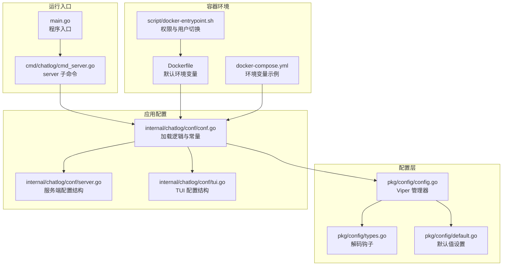
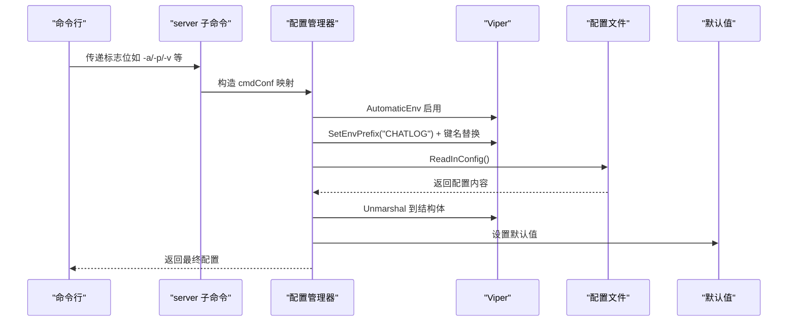
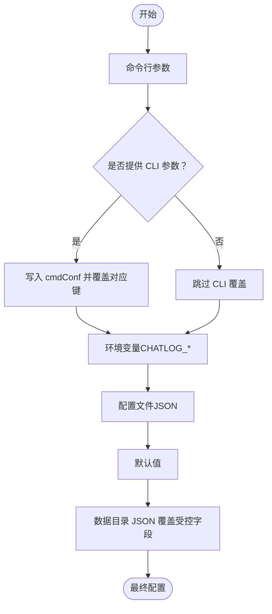

# 环境变量配置

<cite>
**本文引用的文件**
- [pkg/config/config.go](file://pkg/config/config.go)
- [pkg/config/types.go](file://pkg/config/types.go)
- [pkg/config/default.go](file://pkg/config/default.go)
- [internal/chatlog/conf/conf.go](file://internal/chatlog/conf/conf.go)
- [internal/chatlog/conf/server.go](file://internal/chatlog/conf/server.go)
- [internal/chatlog/conf/tui.go](file://internal/chatlog/conf/tui.go)
- [cmd/chatlog/cmd_server.go](file://cmd/chatlog/cmd_server.go)
- [Dockerfile](file://Dockerfile)
- [docker-compose.yml](file://docker-compose.yml)
- [script/docker-entrypoint.sh](file://script/docker-entrypoint.sh)
- [README.md](file://README.md)
</cite>

## 目录
1. [简介](#简介)
2. [项目结构](#项目结构)
3. [核心组件](#核心组件)
4. [架构总览](#架构总览)
5. [详细组件分析](#详细组件分析)
6. [依赖关系分析](#依赖关系分析)
7. [性能考虑](#性能考虑)
8. [故障排查指南](#故障排查指南)
9. [结论](#结论)
10. [附录](#附录)

## 简介
本文件系统性说明 Chatlog 的环境变量配置机制，涵盖：
- 环境变量命名规则与前缀设置
- 如何将环境变量映射到配置项
- 完整的环境变量清单及对应配置项
- 优先级与覆盖规则
- 不同操作系统下的设置示例
- Docker 环境下的配置指南

## 项目结构
围绕环境变量配置的关键模块如下：
- 配置管理器：负责初始化 Viper、设置环境变量前缀、键名替换、读取与反序列化配置
- 配置模型：定义服务端与 TUI 的配置结构体及其默认值
- 命令行参数：server 子命令提供部分配置项的 CLI 覆盖
- Docker 构建与编排：提供容器内默认环境变量与挂载卷建议
- 文档与示例：README 与 docker.md 提供环境变量使用示例



图表来源
- [pkg/config/config.go](file://pkg/config/config.go#L50-L93)
- [pkg/config/types.go](file://pkg/config/types.go#L119-L122)
- [pkg/config/default.go](file://pkg/config/default.go#L25-L33)
- [internal/chatlog/conf/conf.go](file://internal/chatlog/conf/conf.go#L12-L17)
- [internal/chatlog/conf/server.go](file://internal/chatlog/conf/server.go#L7-L19)
- [internal/chatlog/conf/tui.go](file://internal/chatlog/conf/tui.go#L3-L8)
- [cmd/chatlog/cmd_server.go](file://cmd/chatlog/cmd_server.go#L35-L49)
- [Dockerfile](file://Dockerfile#L35-L38)
- [docker-compose.yml](file://docker-compose.yml#L11-L28)
- [script/docker-entrypoint.sh](file://script/docker-entrypoint.sh#L6-L20)

章节来源
- [pkg/config/config.go](file://pkg/config/config.go#L50-L93)
- [internal/chatlog/conf/conf.go](file://internal/chatlog/conf/conf.go#L12-L17)

## 核心组件
- 配置管理器（Viper）：负责设置环境变量前缀、启用自动环境变量注入、键名替换（点号转下划线），并从文件与环境变量中读取配置
- 配置加载流程：先设置默认值，再加载配置文件，随后应用命令行覆盖，最后应用数据目录中的特定字段
- 解码钩子：支持字符串到 map、slice、struct 的转换，便于通过环境变量传入复杂结构

章节来源
- [pkg/config/config.go](file://pkg/config/config.go#L50-L93)
- [pkg/config/types.go](file://pkg/config/types.go#L119-L122)
- [pkg/config/default.go](file://pkg/config/default.go#L25-L33)
- [internal/chatlog/conf/conf.go](file://internal/chatlog/conf/conf.go#L47-L96)

## 架构总览
环境变量在 Chatlog 中的生效顺序（从高到低）：
1) 命令行参数（server 子命令标志位）
2) 环境变量（带前缀 CHATLOG_）
3) 配置文件（位于用户配置目录下的 JSON 文件）
4) 默认值（结构体字段或全局默认）



图表来源
- [cmd/chatlog/cmd_server.go](file://cmd/chatlog/cmd_server.go#L51-L78)
- [pkg/config/config.go](file://pkg/config/config.go#L78-L83)
- [pkg/config/types.go](file://pkg/config/types.go#L119-L122)
- [pkg/config/default.go](file://pkg/config/default.go#L25-L33)
- [internal/chatlog/conf/conf.go](file://internal/chatlog/conf/conf.go#L47-L96)

## 详细组件分析

### 环境变量前缀与键名替换
- 前缀：当传入非空环境变量前缀时，配置管理器会设置环境变量前缀为应用名的大写形式，并启用自动环境变量注入；同时将点号（.）替换为下划线（_），以便兼容不同平台的环境变量命名习惯
- 作用范围：仅对服务端配置有效（TUI 配置不启用环境变量前缀）

章节来源
- [pkg/config/config.go](file://pkg/config/config.go#L78-L83)
- [internal/chatlog/conf/conf.go](file://internal/chatlog/conf/conf.go#L54-L54)

### 配置项与环境变量映射
以下配置项可通过环境变量 CHATLOG_ 前缀设置（点号在键名中会被替换为下划线）。例如，配置项 data_dir 对应环境变量 CHATLOG_DATA_DIR。

- 通用字段
  - 类型：CHATLOG_TYPE → type
  - 平台：CHATLOG_PLATFORM → platform
  - 版本：CHATLOG_VERSION → version
  - 完整版本：CHATLOG_FULL_VERSION → full_version
  - 数据目录：CHATLOG_DATA_DIR → data_dir
  - 数据密钥：CHATLOG_DATA_KEY → data_key
  - 图片密钥：CHATLOG_IMG_KEY → img_key
  - 工作目录：CHATLOG_WORK_DIR → work_dir
  - HTTP 地址：CHATLOG_HTTP_ADDR → http_addr
  - 自动解密：CHATLOG_AUTO_DECRYPT → auto_decrypt
  - Webhook：CHATLOG_WEBHOOK → webhook（见“Webhook 复杂结构”）

- Webhook 复杂结构
  - 整体 JSON：CHATLOG_WEBHOOK='{"host":"...","items":[{"url":"...","talker":"...","sender":"","keyword":""}]}' → webhook
  - 分离键（任选其一）：
    - CHATLOG_WEBHOOK_HOST → webhook.host
    - CHATLOG_WEBHOOK_ITEMS → webhook.items（数组 JSON 字符串）

章节来源
- [internal/chatlog/conf/server.go](file://internal/chatlog/conf/server.go#L7-L19)
- [internal/chatlog/conf/conf.go](file://internal/chatlog/conf/conf.go#L47-L96)
- [pkg/config/types.go](file://pkg/config/types.go#L119-L122)
- [README.md](file://README.md#L243-L253)

### 优先级与覆盖规则
- 命令行优先级最高：server 子命令的标志位会直接写入 cmdConf，并在加载配置后覆盖相应键
- 环境变量次之：启用 AutomaticEnv 后，Viper 会读取匹配前缀的环境变量
- 配置文件再次之：从配置文件路径读取 JSON 并反序列化
- 默认值最低：未显式设置时采用结构体默认值或全局默认映射
- 数据目录覆盖：若配置中设置了数据目录且未提供数据密钥，则会从该目录下的 JSON 文件中读取若干受控字段并覆盖当前配置



图表来源
- [cmd/chatlog/cmd_server.go](file://cmd/chatlog/cmd_server.go#L51-L78)
- [pkg/config/config.go](file://pkg/config/config.go#L78-L83)
- [internal/chatlog/conf/conf.go](file://internal/chatlog/conf/conf.go#L74-L90)

章节来源
- [cmd/chatlog/cmd_server.go](file://cmd/chatlog/cmd_server.go#L51-L78)
- [internal/chatlog/conf/conf.go](file://internal/chatlog/conf/conf.go#L63-L90)

### 不同操作系统下的设置示例
- Linux/macOS（Shell）
  - 设置单个键：export CHATLOG_HTTP_ADDR="0.0.0.0:5030"
  - 设置复杂结构：export CHATLOG_WEBHOOK='{"host":"localhost:5030","items":[{"url":"http://localhost:8080/proxy","talker":"wxid_123","sender":"","keyword":""}]}'
- Windows（PowerShell）
  - 设置单个键：$env:CHATLOG_HTTP_ADDR="0.0.0.0:5030"
  - 设置复杂结构：$env:CHATLOG_WEBHOOK='{"host":"localhost:5030","items":[{"url":"http://localhost:8080/proxy","talker":"wxid_123","sender":"","keyword":""}]}' 或使用 ConvertTo-Json 输出后再赋值
- Windows（cmd.exe）
  - set CHATLOG_HTTP_ADDR=0.0.0.0:5030
  - set CHATLOG_WEBHOOK={"host":"localhost:5030","items":[{"url":"http://localhost:8080/proxy","talker":"wxid_123","sender":"","keyword":""}]}

章节来源
- [README.md](file://README.md#L243-L253)

### Docker 环境下的配置指南
- 默认环境变量（容器内）
  - CHATLOG_DATA_DIR：默认指向 /app/data
  - CHATLOG_WORK_DIR：默认指向 /app/work
  - CHATLOG_HTTP_ADDR：默认监听 0.0.0.0:5030
- 运行方式
  - Dockerfile 中通过 ENV 设置上述默认值，并暴露 5030 端口
  - docker-compose.yml 提供了环境变量示例与数据卷挂载建议
  - 入口脚本 script/docker-entrypoint.sh 在以 root 运行时根据 PUID/PGID 切换用户并修正权限
- 建议实践
  - 使用 docker-compose.yml 中的注释示例来按需启用平台、版本、密钥等高级选项
  - 将微信数据目录挂载到 /app/data，工作目录挂载到 /app/work，确保持久化与权限正确

章节来源
- [Dockerfile](file://Dockerfile#L35-L38)
- [docker-compose.yml](file://docker-compose.yml#L11-L35)
- [script/docker-entrypoint.sh](file://script/docker-entrypoint.sh#L6-L20)

## 依赖关系分析
- 配置管理器依赖 Viper 实现环境变量注入与配置读取
- 配置加载函数依赖默认值设置与解码钩子，以支持复杂类型解析
- 服务端配置结构体定义了所有可配置字段与其映射键
- 命令行 server 子命令提供 CLI 覆盖能力
- 容器构建与编排提供默认环境变量与运行时上下文

```mermaid
classDiagram
class Manager {
+string App
+string EnvPrefix
+string Path
+string Name
+bool WriteConfig
+Load(conf) error
+LoadFile(file, conf) error
+SetConfig(key, value) error
+GetConfig() map[string]interface{}
}
class ServerConfig {
+string Type
+string Platform
+int Version
+string FullVersion
+string DataDir
+string DataKey
+string ImgKey
+string WorkDir
+string HTTPAddr
+bool AutoDecrypt
+Webhook *Webhook
}
class TUIConfig {
+string ConfigDir
+string LastAccount
+[]ProcessConfig History
+Webhook *Webhook
}
Manager --> ServerConfig : "反序列化"
Manager --> TUIConfig : "反序列化"
```

图表来源
- [pkg/config/config.go](file://pkg/config/config.go#L38-L93)
- [internal/chatlog/conf/server.go](file://internal/chatlog/conf/server.go#L7-L19)
- [internal/chatlog/conf/tui.go](file://internal/chatlog/conf/tui.go#L3-L8)

章节来源
- [pkg/config/config.go](file://pkg/config/config.go#L38-L93)
- [internal/chatlog/conf/server.go](file://internal/chatlog/conf/server.go#L7-L19)
- [internal/chatlog/conf/tui.go](file://internal/chatlog/conf/tui.go#L3-L8)

## 性能考虑
- 环境变量解析与配置反序列化开销极小，通常可忽略
- 复杂结构（如 webhook）通过字符串传入并在解码钩子中解析，避免频繁多次 I/O
- 建议仅在必要时启用自动解密与大量日志输出，以减少运行时开销

## 故障排查指南
- 环境变量未生效
  - 确认已启用环境变量前缀：服务端配置需传入非空前缀才会启用 AutomaticEnv
  - 确认键名替换：配置项中点号会被替换为下划线，例如 data_dir → CHATLOG_DATA_DIR
- 配置被覆盖
  - 命令行参数优先级最高；若通过 server 子命令提供了标志位，将覆盖环境变量与配置文件
- 数据目录覆盖异常
  - 当设置了数据目录且未提供数据密钥时，系统会尝试从该目录读取 JSON 并覆盖受控字段；请检查该目录存在且格式正确
- Docker 权限问题
  - 容器以 root 启动时，入口脚本会根据 PUID/PGID 更改 /app 与 /usr/local/bin 的属主；请确认传入正确的 PUID/PGID

章节来源
- [pkg/config/config.go](file://pkg/config/config.go#L78-L83)
- [cmd/chatlog/cmd_server.go](file://cmd/chatlog/cmd_server.go#L51-L78)
- [internal/chatlog/conf/conf.go](file://internal/chatlog/conf/conf.go#L74-L90)
- [script/docker-entrypoint.sh](file://script/docker-entrypoint.sh#L6-L20)

## 结论
Chatlog 的环境变量配置体系基于 Viper，具备清晰的前缀与键名替换规则、明确的优先级与覆盖顺序，并通过解码钩子支持复杂结构的环境变量传参。结合 Docker 默认环境变量与 docker-compose 示例，可在多平台与容器环境中快速完成部署与调优。

## 附录

### 环境变量与配置项对照表
- CHATLOG_TYPE → type
- CHATLOG_PLATFORM → platform
- CHATLOG_VERSION → version
- CHATLOG_FULL_VERSION → full_version
- CHATLOG_DATA_DIR → data_dir
- CHATLOG_DATA_KEY → data_key
- CHATLOG_IMG_KEY → img_key
- CHATLOG_WORK_DIR → work_dir
- CHATLOG_HTTP_ADDR → http_addr
- CHATLOG_AUTO_DECRYPT → auto_decrypt
- CHATLOG_WEBHOOK → webhook（整体 JSON）
- CHATLOG_WEBHOOK_HOST → webhook.host
- CHATLOG_WEBHOOK_ITEMS → webhook.items（数组 JSON 字符串）

章节来源
- [internal/chatlog/conf/server.go](file://internal/chatlog/conf/server.go#L7-L19)
- [README.md](file://README.md#L243-L253)