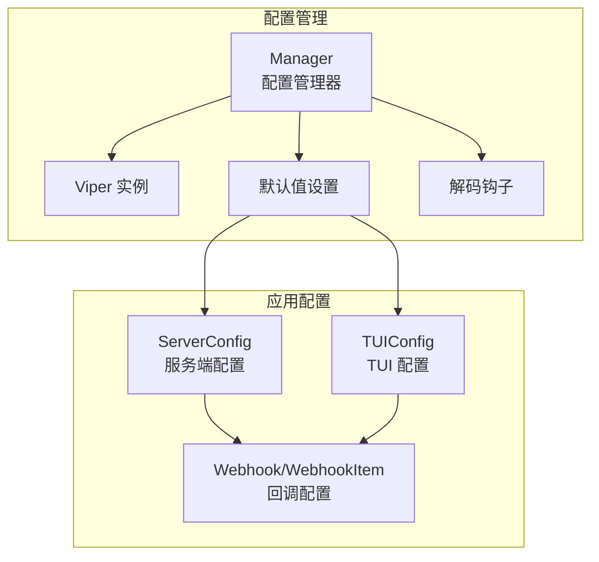
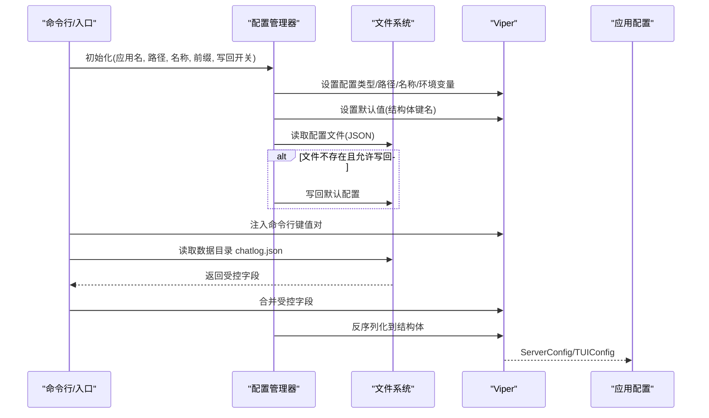
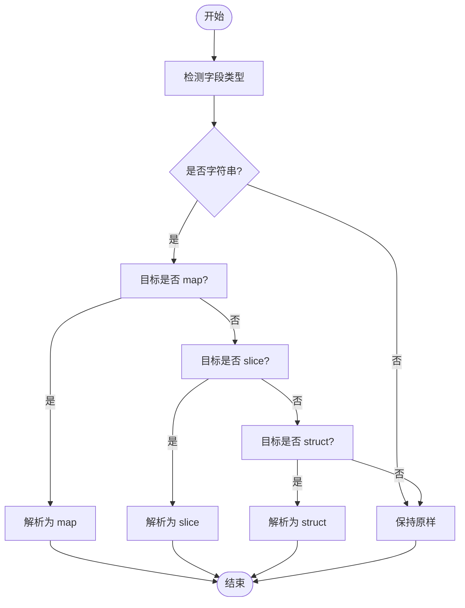
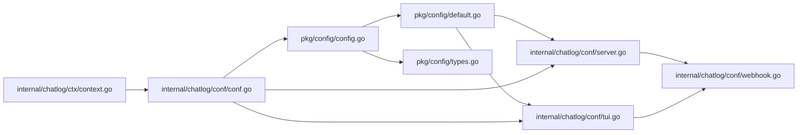

# 配置文件格式

<cite>
**本文引用的文件**
- [pkg/config/config.go](file://pkg/config/config.go)
- [pkg/config/default.go](file://pkg/config/default.go)
- [pkg/config/types.go](file://pkg/config/types.go)
- [pkg/config/struct_kerys.go](file://pkg/config/struct_kerys.go)
- [internal/chatlog/conf/conf.go](file://internal/chatlog/conf/conf.go)
- [internal/chatlog/conf/server.go](file://internal/chatlog/conf/server.go)
- [internal/chatlog/conf/tui.go](file://internal/chatlog/conf/tui.go)
- [internal/chatlog/conf/webhook.go](file://internal/chatlog/conf/webhook.go)
- [internal/chatlog/ctx/context.go](file://internal/chatlog/ctx/context.go)
- [cmd/chatlog/root.go](file://cmd/chatlog/root.go)
- [README.md](file://README.md)
</cite>

## 目录
1. [简介](#简介)
2. [项目结构](#项目结构)
3. [核心组件](#核心组件)
4. [架构总览](#架构总览)
5. [详细组件分析](#详细组件分析)
6. [依赖关系分析](#依赖关系分析)
7. [性能考量](#性能考量)
8. [故障排查指南](#故障排查指南)
9. [结论](#结论)
10. [附录](#附录)

## 简介
本文件系统性说明 Chatlog 的 JSON 配置文件格式与加载机制，覆盖以下主题：
- JSON 配置结构与字段命名规范
- 数据类型与嵌套结构
- 完整配置示例与默认值来源
- 配置加载顺序与优先级规则（文件、环境变量、命令行）
- 配置验证机制与错误处理
- 最佳实践与常见配置模式

## 项目结构
Chatlog 的配置体系由“配置管理器”和“应用配置模型”两部分组成：
- 配置管理器负责解析 JSON、读取环境变量、合并默认值、写回配置等
- 应用配置模型定义了服务端与 TUI 的配置结构体及默认值映射

图表来源
- [pkg/config/config.go](file://pkg/config/config.go#L38-L93)
- [pkg/config/default.go](file://pkg/config/default.go#L25-L33)
- [pkg/config/types.go](file://pkg/config/types.go#L119-L122)
- [internal/chatlog/conf/server.go](file://internal/chatlog/conf/server.go#L7-L19)
- [internal/chatlog/conf/tui.go](file://internal/chatlog/conf/tui.go#L3-L8)
- [internal/chatlog/conf/webhook.go](file://internal/chatlog/conf/webhook.go#L3-L16)

章节来源
- [pkg/config/config.go](file://pkg/config/config.go#L38-L93)
- [pkg/config/default.go](file://pkg/config/default.go#L25-L33)
- [pkg/config/types.go](file://pkg/config/types.go#L119-L122)
- [internal/chatlog/conf/server.go](file://internal/chatlog/conf/server.go#L7-L19)
- [internal/chatlog/conf/tui.go](file://internal/chatlog/conf/tui.go#L3-L8)
- [internal/chatlog/conf/webhook.go](file://internal/chatlog/conf/webhook.go#L3-L16)

## 核心组件
- 配置管理器（Manager）
  - 负责初始化 Viper、设置配置文件类型、配置路径与名称、环境变量前缀、读取与反序列化配置、写回配置等
- 默认值设置（SetDefaults）
  - 基于结构体标签生成键名，批量设置默认值
- 解码钩子（CompositeDecodeHook）
  - 提供字符串到 map、slice、struct 的转换能力，增强 JSON 字符串的兼容性
- 应用配置模型
  - ServerConfig：服务端运行参数与数据目录密钥
  - TUIConfig：TUI 模式下的历史账户、工作目录、回调配置等
  - Webhook/WebhookItem：消息回调的主机、延迟与过滤规则

章节来源
- [pkg/config/config.go](file://pkg/config/config.go#L38-L160)
- [pkg/config/default.go](file://pkg/config/default.go#L25-L33)
- [pkg/config/types.go](file://pkg/config/types.go#L119-L122)
- [internal/chatlog/conf/server.go](file://internal/chatlog/conf/server.go#L7-L19)
- [internal/chatlog/conf/tui.go](file://internal/chatlog/conf/tui.go#L3-L8)
- [internal/chatlog/conf/webhook.go](file://internal/chatlog/conf/webhook.go#L3-L16)

## 架构总览
配置加载流程（服务端模式）：
- 初始化配置管理器（指定应用名、配置路径、配置文件名、环境变量前缀）
- 设置默认值（从结构体标签与默认映射）
- 读取配置文件（JSON），必要时写回默认配置
- 将命令行传入的键值对注入到 Viper
- 读取数据目录下的 chatlog.json 并合并其中受控字段
- 反序列化到 ServerConfig 结构体

图表来源
- [internal/chatlog/conf/conf.go](file://internal/chatlog/conf/conf.go#L47-L96)
- [pkg/config/config.go](file://pkg/config/config.go#L95-L123)
- [pkg/config/default.go](file://pkg/config/default.go#L25-L33)
- [internal/chatlog/ctx/context.go](file://internal/chatlog/ctx/context.go#L296-L302)

章节来源
- [internal/chatlog/conf/conf.go](file://internal/chatlog/conf/conf.go#L47-L96)
- [pkg/config/config.go](file://pkg/config/config.go#L95-L123)
- [pkg/config/default.go](file://pkg/config/default.go#L25-L33)
- [internal/chatlog/ctx/context.go](file://internal/chatlog/ctx/context.go#L296-L302)

## 详细组件分析

### 配置文件结构与字段规范
- 文件类型与扩展名
  - 类型固定为 JSON；文件名在服务端模式下默认为 chatlog-server；TUI 模式下默认为应用名
- 文件位置
  - 默认位于用户主目录下的隐藏目录中（不同平台路径不同），可通过环境变量或参数指定
- 字段命名规范
  - 字段名来自结构体标签 mapstructure 的值；若未显式标注，则使用小写的字段名
  - 嵌套结构按点号分隔的层级键访问
- 数据类型
  - 字符串、整数、布尔、数组、对象、指针对象
  - 特殊字符串到复合类型的转换由解码钩子提供

章节来源
- [pkg/config/config.go](file://pkg/config/config.go#L28-L30)
- [pkg/config/config.go](file://pkg/config/config.go#L50-L93)
- [pkg/config/types.go](file://pkg/config/types.go#L119-L122)
- [internal/chatlog/conf/server.go](file://internal/chatlog/conf/server.go#L7-L19)
- [internal/chatlog/conf/tui.go](file://internal/chatlog/conf/tui.go#L3-L8)
- [internal/chatlog/conf/webhook.go](file://internal/chatlog/conf/webhook.go#L3-L16)

### 服务端配置（ServerConfig）
- 关键字段
  - type、platform、version、full_version：微信版本与平台标识
  - data_dir、data_key、img_key：数据目录与密钥
  - work_dir：工作目录
  - http_addr：HTTP 服务监听地址，默认值在代码中定义
  - auto_decrypt：是否自动解密
  - webhook：回调配置对象
- 默认值来源
  - ServerDefaults 映射为空，实际默认值主要来源于结构体字段的零值与方法默认行为
- 读取顺序
  - 优先读取配置文件；若未设置 http_addr，则使用默认地址
  - 若存在数据目录，读取其中的 chatlog.json 并合并受控字段

章节来源
- [internal/chatlog/conf/server.go](file://internal/chatlog/conf/server.go#L7-L19)
- [internal/chatlog/conf/server.go](file://internal/chatlog/conf/server.go#L51-L56)
- [internal/chatlog/conf/conf.go](file://internal/chatlog/conf/conf.go#L47-L96)
- [internal/chatlog/conf/conf.go](file://internal/chatlog/conf/conf.go#L98-L105)

### TUI 配置（TUIConfig）
- 关键字段
  - config_dir：配置所在目录（仅 JSON 输出使用）
  - last_account：最近使用的账号
  - history：进程历史列表，每项包含类型、账号、平台、版本、数据目录、密钥、工作目录、HTTP 开关与地址、最后时间、文件列表
  - webhook：回调配置对象
- 默认值来源
  - TUIDefaults 映射为空，通过结构体标签生成键名并设置默认值

章节来源
- [internal/chatlog/conf/tui.go](file://internal/chatlog/conf/tui.go#L3-L8)
- [internal/chatlog/conf/tui.go](file://internal/chatlog/conf/tui.go#L12-L32)
- [pkg/config/default.go](file://pkg/config/default.go#L25-L33)

### 回调配置（Webhook/WebhookItem）
- Webhook
  - host：消息资源 URL 主机
  - delay_ms：回调延迟（毫秒）
  - items：回调条目列表
- WebhookItem
  - type、url：类型与回调地址（必填）
  - talker、sender、keyword：目标聊天对象、发送者、关键词过滤（选填）
  - disabled：是否禁用该条目

章节来源
- [internal/chatlog/conf/webhook.go](file://internal/chatlog/conf/webhook.go#L3-L16)

### 配置加载顺序与优先级
- 文件优先级
  - 服务端模式：先读取 chatlog-server.json；若未设置 http_addr 则回退默认值
  - TUI 模式：读取应用名对应的 JSON 文件
  - 数据目录：若存在 data_dir，读取其中的 chatlog.json 并合并受控字段
- 环境变量优先级
  - 当设置了环境变量前缀时，Viper 自动读取对应键（点号替换为下划线）
  - 服务端模式支持通过环境变量直接注入 webhook 等复杂结构
- 命令行优先级
  - 通过命令行传入的键值对会被注入到 Viper，参与最终合并
- 写回策略
  - 当允许写回时，若读取失败会尝试写回默认配置；也可手动写回当前配置

章节来源
- [pkg/config/config.go](file://pkg/config/config.go#L95-L135)
- [internal/chatlog/conf/conf.go](file://internal/chatlog/conf/conf.go#L47-L96)
- [internal/chatlog/conf/conf.go](file://internal/chatlog/conf/conf.go#L74-L90)
- [internal/chatlog/ctx/context.go](file://internal/chatlog/ctx/context.go#L296-L302)

### 配置验证与错误处理
- 键名生成与校验
  - 通过结构体标签生成键集合，用于设置默认值与后续校验
- 缺失必填键检测
  - 可基于结构体标签的 required 标记检测缺失字段（适用于标量字段）
- 解码钩子错误
  - 字符串到 map/slice/struct 的转换失败会返回原始数据或报错
- 文件与目录错误
  - 目录不存在会尝试创建；非目录会返回错误
- 日志与回退
  - 失败时记录日志；在允许写回的情况下写回默认配置

章节来源
- [pkg/config/struct_kerys.go](file://pkg/config/struct_kerys.go#L15-L66)
- [pkg/config/types.go](file://pkg/config/types.go#L119-L122)
- [pkg/config/config.go](file://pkg/config/config.go#L144-L159)
- [pkg/config/config.go](file://pkg/config/config.go#L95-L110)

### 配置示例与默认值
- TUI 模式示例（含 webhook）
  - 参考文档中的示例 JSON，包含 history、last_account、webhook 等字段
- 服务端模式示例（含 webhook 环境变量）
  - 可通过单个 JSON 字符串或拆分的键（host/items）注入
- 默认值
  - 服务端：http_addr 若未设置则使用默认地址
  - TUI：history 为空数组，last_account 为空字符串
  - webhook：host 为空字符串，delay_ms 为 0，items 为空数组

章节来源
- [README.md](file://README.md#L226-L253)
- [internal/chatlog/conf/server.go](file://internal/chatlog/conf/server.go#L51-L56)
- [internal/chatlog/conf/tui.go](file://internal/chatlog/conf/tui.go#L10-L10)

### 解码钩子详解
- 字符串到 map[string]string
  - 以逗号分隔键值对，键与值以等号分隔
- 字符串到切片（JSON 数组）
  - 支持以字符串形式提供 JSON 数组，自动解析为切片
- 字符串到结构体（JSON 对象）
  - 支持以字符串形式提供 JSON 对象，自动解析为结构体

图表来源
- [pkg/config/types.go](file://pkg/config/types.go#L16-L46)
- [pkg/config/types.go](file://pkg/config/types.go#L53-L75)
- [pkg/config/types.go](file://pkg/config/types.go#L82-L107)

章节来源
- [pkg/config/types.go](file://pkg/config/types.go#L119-L122)

## 依赖关系分析
- 配置管理器依赖 Viper 完成文件读取、环境变量注入与反序列化
- 默认值设置依赖结构体标签生成键名
- 解码钩子组合多种转换策略，提升 JSON 字符串的兼容性
- 应用配置模型定义了服务端与 TUI 的结构，以及回调配置

图表来源
- [pkg/config/config.go](file://pkg/config/config.go#L38-L93)
- [pkg/config/default.go](file://pkg/config/default.go#L25-L33)
- [pkg/config/types.go](file://pkg/config/types.go#L119-L122)
- [internal/chatlog/conf/server.go](file://internal/chatlog/conf/server.go#L7-L19)
- [internal/chatlog/conf/tui.go](file://internal/chatlog/conf/tui.go#L3-L8)
- [internal/chatlog/conf/webhook.go](file://internal/chatlog/conf/webhook.go#L3-L16)
- [internal/chatlog/conf/conf.go](file://internal/chatlog/conf/conf.go#L47-L96)
- [internal/chatlog/ctx/context.go](file://internal/chatlog/ctx/context.go#L296-L302)

章节来源
- [pkg/config/config.go](file://pkg/config/config.go#L38-L93)
- [pkg/config/default.go](file://pkg/config/default.go#L25-L33)
- [pkg/config/types.go](file://pkg/config/types.go#L119-L122)
- [internal/chatlog/conf/server.go](file://internal/chatlog/conf/server.go#L7-L19)
- [internal/chatlog/conf/tui.go](file://internal/chatlog/conf/tui.go#L3-L8)
- [internal/chatlog/conf/webhook.go](file://internal/chatlog/conf/webhook.go#L3-L16)
- [internal/chatlog/conf/conf.go](file://internal/chatlog/conf/conf.go#L47-L96)
- [internal/chatlog/ctx/context.go](file://internal/chatlog/ctx/context.go#L296-L302)

## 性能考量
- 配置读取与反序列化开销较小，通常在毫秒级
- 解码钩子仅在字符串与复合类型之间转换时触发，避免不必要的解析
- 建议将大型 JSON 数组或对象以环境变量或外部文件方式提供，减少 JSON 解析负担

## 故障排查指南
- 无法读取配置文件
  - 检查配置路径是否存在且为目录；确认权限正确
  - 若允许写回，首次运行可能自动写回默认配置
- 环境变量未生效
  - 确认设置了正确的环境变量前缀；点号会被替换为下划线
  - webhook 等复杂结构建议使用 JSON 字符串或拆分键
- 数据目录 chatlog.json 未被合并
  - 确认 data_dir 存在且包含 chatlog.json
  - 仅受控字段会被合并（如 type、platform、version、full_version、data_key、img_key）
- 回调未触发
  - 检查 webhook.host 与 talker、sender、keyword 是否匹配
  - 确认服务监听地址与回调 URL 正确

章节来源
- [pkg/config/config.go](file://pkg/config/config.go#L144-L159)
- [pkg/config/config.go](file://pkg/config/config.go#L95-L110)
- [internal/chatlog/conf/conf.go](file://internal/chatlog/conf/conf.go#L74-L90)
- [internal/chatlog/conf/webhook.go](file://internal/chatlog/conf/webhook.go#L3-L16)

## 结论
Chatlog 的配置体系以 Viper 为核心，结合默认值设置与解码钩子，提供了灵活、可扩展的 JSON 配置方案。通过明确的加载顺序与优先级规则，用户可在文件、环境变量与命令行之间自由选择最合适的配置方式。建议在生产环境中优先使用文件配置，并配合环境变量进行敏感信息注入。

## 附录

### 字段与默认值对照表
- 服务端配置（ServerConfig）
  - type/platform/version/full_version/data_dir/data_key/img_key/work_dir/http_addr/auto_decrypt/webhook
  - 默认值：http_addr 若未设置则使用默认地址；其他字段为零值
- TUI 配置（TUIConfig）
  - config_dir/last_account/history/webhook
  - 默认值：history 为空数组；last_account 为空字符串
- 回调配置（Webhook/WebhookItem）
  - host/delay_ms/items；items 中的 type/url 必填，其余选填
  - 默认值：host 为空字符串；delay_ms 为 0；items 为空数组

章节来源
- [internal/chatlog/conf/server.go](file://internal/chatlog/conf/server.go#L7-L19)
- [internal/chatlog/conf/server.go](file://internal/chatlog/conf/server.go#L51-L56)
- [internal/chatlog/conf/tui.go](file://internal/chatlog/conf/tui.go#L3-L8)
- [internal/chatlog/conf/webhook.go](file://internal/chatlog/conf/webhook.go#L3-L16)