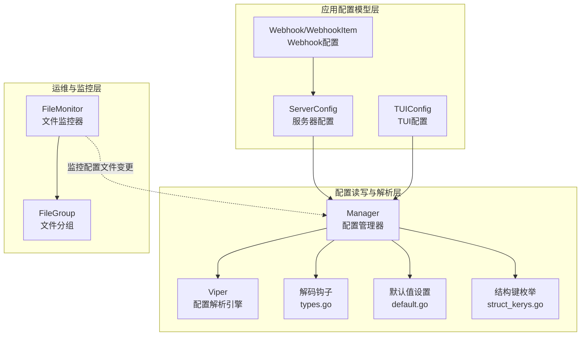
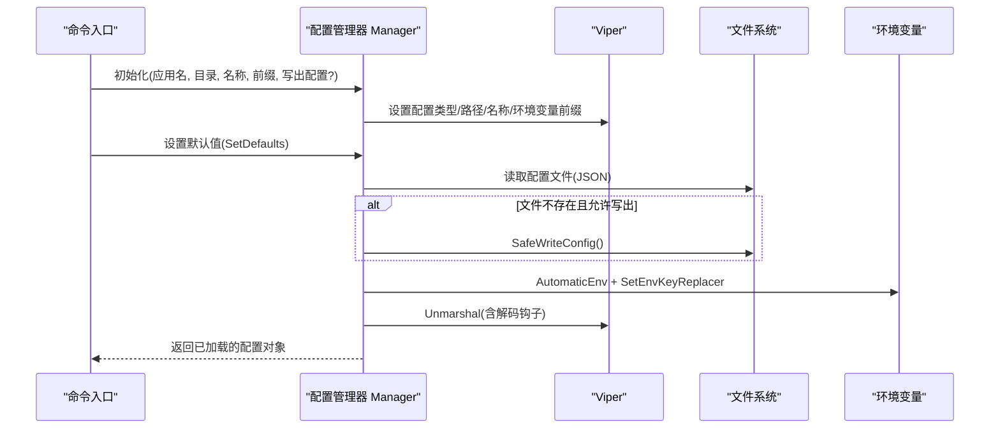
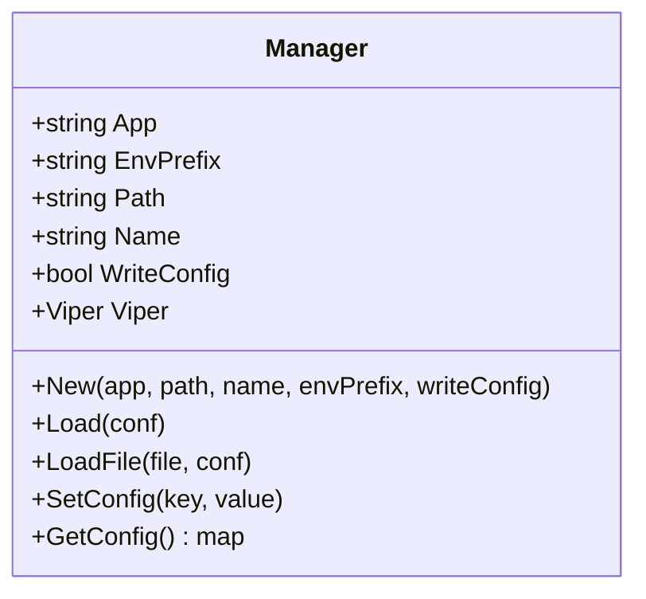
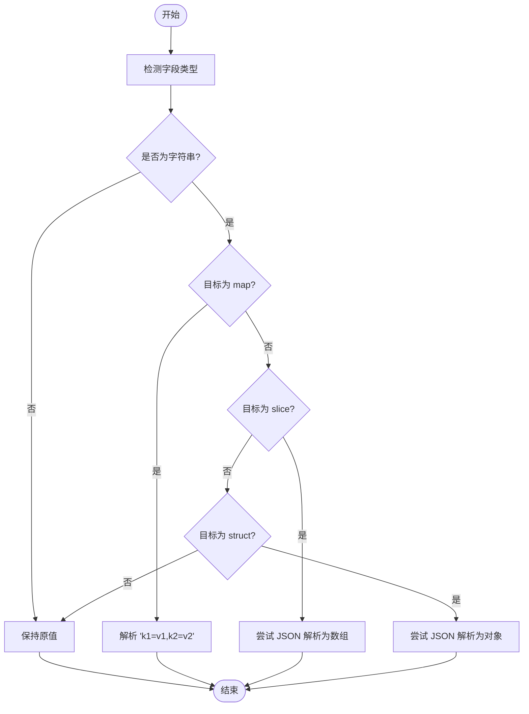
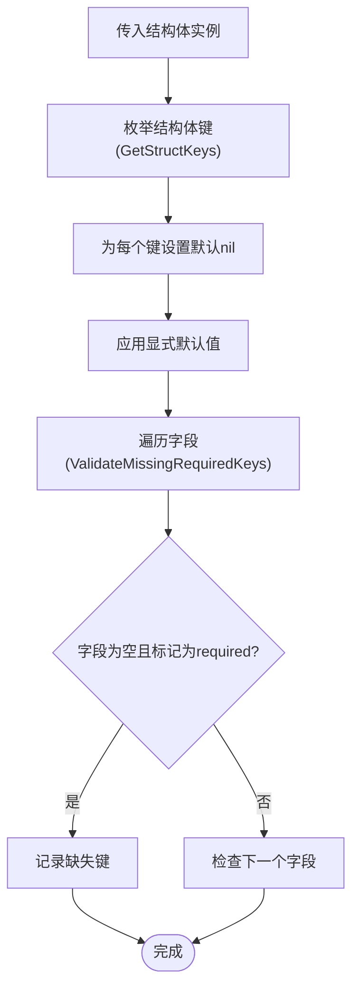
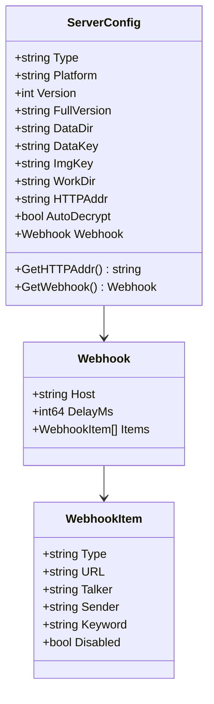
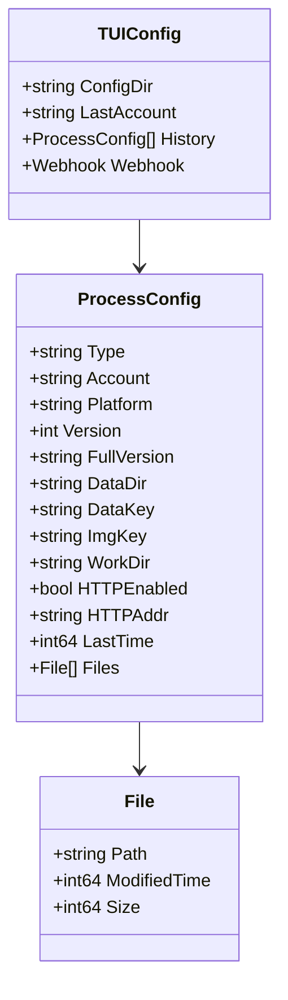
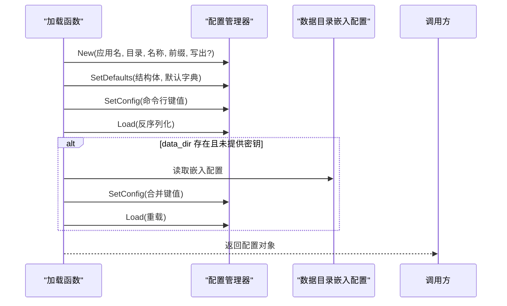
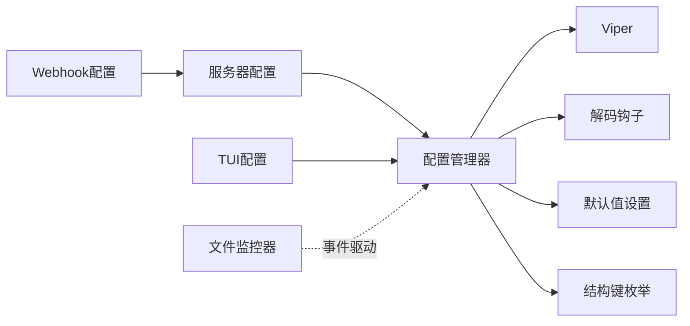
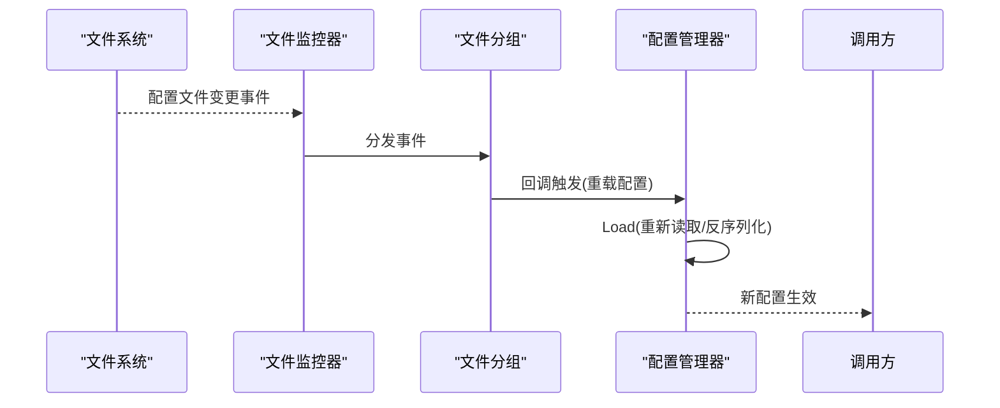

# 配置管理

<cite>
**本文引用的文件**
- [pkg/config/config.go](file://pkg/config/config.go)
- [pkg/config/default.go](file://pkg/config/default.go)
- [pkg/config/types.go](file://pkg/config/types.go)
- [pkg/config/struct_kerys.go](file://pkg/config/struct_kerys.go)
- [internal/chatlog/conf/conf.go](file://internal/chatlog/conf/conf.go)
- [internal/chatlog/conf/server.go](file://internal/chatlog/conf/server.go)
- [internal/chatlog/conf/tui.go](file://internal/chatlog/conf/tui.go)
- [internal/chatlog/conf/webhook.go](file://internal/chatlog/conf/webhook.go)
- [pkg/filemonitor/filemonitor.go](file://pkg/filemonitor/filemonitor.go)
- [pkg/filemonitor/filegroup.go](file://pkg/filemonitor/filegroup.go)
- [cmd/chatlog/root.go](file://cmd/chatlog/root.go)
</cite>

## 目录
1. [简介](#简介)
2. [项目结构](#项目结构)
3. [核心组件](#核心组件)
4. [架构总览](#架构总览)
5. [详细组件分析](#详细组件分析)
6. [依赖关系分析](#依赖关系分析)
7. [性能与可靠性](#性能与可靠性)
8. [配置验证与热更新](#配置验证与热更新)
9. [故障排除指南](#故障排除指南)
10. [结论](#结论)
11. [附录：配置参数参考](#附录配置参数参考)

## 简介
本文件系统性阐述 Chatlog 的配置管理系统，涵盖配置文件结构与格式（JSON）、环境变量注入、配置项语义与默认值、优先级与覆盖规则、配置验证、热更新能力以及常见问题排查。目标是帮助开发者与运维人员快速理解并正确使用配置体系。

## 项目结构
配置管理由三层组成：
- 配置读写与解析层：基于 Viper 的通用配置管理器，负责文件加载、环境变量映射、类型转换钩子与默认值设置。
- 应用配置模型层：定义服务器配置、TUI 配置与 Webhook 配置的数据结构及默认值。
- 运维与监控层：文件监控工具，支持目录与文件变更事件，为“热更新”场景提供基础能力。

图表来源
- [pkg/config/config.go](file://pkg/config/config.go#L38-L93)
- [pkg/config/types.go](file://pkg/config/types.go#L119-L122)
- [pkg/config/default.go](file://pkg/config/default.go#L25-L33)
- [pkg/config/struct_kerys.go](file://pkg/config/struct_kerys.go#L15-L60)
- [internal/chatlog/conf/server.go](file://internal/chatlog/conf/server.go#L7-L19)
- [internal/chatlog/conf/tui.go](file://internal/chatlog/conf/tui.go#L3-L8)
- [internal/chatlog/conf/webhook.go](file://internal/chatlog/conf/webhook.go#L3-L16)
- [pkg/filemonitor/filemonitor.go](file://pkg/filemonitor/filemonitor.go#L15-L26)
- [pkg/filemonitor/filegroup.go](file://pkg/filemonitor/filegroup.go#L20-L29)

章节来源
- [pkg/config/config.go](file://pkg/config/config.go#L38-L93)
- [internal/chatlog/conf/conf.go](file://internal/chatlog/conf/conf.go#L12-L17)

## 核心组件
- 配置管理器（Manager）
  - 负责初始化配置路径、名称、环境变量前缀，读取配置、反序列化、设置与查询配置。
  - 支持在读取失败时安全写出默认配置文件（可选）。
- 解码钩子（DecoderConfig）
  - 提供字符串到 Map、Slice、Struct 的复合转换，便于从字符串或 JSON 字符串中解析复杂配置。
- 默认值设置（SetDefaults）
  - 基于结构体标签自动生成默认键，并设置默认值。
- 结构体键枚举（GetStructKeys/ValidateMissingRequiredKeys）
  - 用于生成默认键集合与必填字段校验。
- 应用配置模型
  - 服务器配置（ServerConfig）、TUI 配置（TUIConfig）、Webhook 配置（Webhook/WebhookItem）。
- 文件监控（FileMonitor/FileGroup）
  - 监听目录与文件变更，为“热更新”提供事件驱动能力。

章节来源
- [pkg/config/config.go](file://pkg/config/config.go#L38-L93)
- [pkg/config/types.go](file://pkg/config/types.go#L119-L122)
- [pkg/config/default.go](file://pkg/config/default.go#L25-L33)
- [pkg/config/struct_kerys.go](file://pkg/config/struct_kerys.go#L64-L66)
- [internal/chatlog/conf/server.go](file://internal/chatlog/conf/server.go#L7-L19)
- [internal/chatlog/conf/tui.go](file://internal/chatlog/conf/tui.go#L3-L8)
- [internal/chatlog/conf/webhook.go](file://internal/chatlog/conf/webhook.go#L3-L16)
- [pkg/filemonitor/filemonitor.go](file://pkg/filemonitor/filemonitor.go#L15-L26)
- [pkg/filemonitor/filegroup.go](file://pkg/filemonitor/filegroup.go#L20-L29)

## 架构总览
配置加载流程（以服务器配置为例）：
- 初始化配置管理器（指定应用名、配置目录、配置文件名、环境变量前缀）。
- 设置默认值（基于结构体标签与显式默认字典）。
- 读取配置文件（JSON），必要时自动写出默认配置。
- 将环境变量映射到配置键（点号转下划线，自动大写）。
- 反序列化为结构体，应用解码钩子完成复杂类型转换。
- 若存在数据目录中的嵌入配置，可将其合并回主配置并重新加载。

图表来源
- [pkg/config/config.go](file://pkg/config/config.go#L50-L93)
- [pkg/config/config.go](file://pkg/config/config.go#L97-L110)
- [pkg/config/types.go](file://pkg/config/types.go#L119-L122)
- [internal/chatlog/conf/conf.go](file://internal/chatlog/conf/conf.go#L48-L96)

章节来源
- [internal/chatlog/conf/conf.go](file://internal/chatlog/conf/conf.go#L48-L96)
- [pkg/config/config.go](file://pkg/config/config.go#L50-L93)

## 详细组件分析

### 配置管理器（Manager）
- 关键职责
  - 初始化：确定配置文件类型、路径、名称、环境变量前缀。
  - 读取：支持从默认路径或指定文件读取配置；失败时可写出默认配置。
  - 反序列化：通过解码钩子将字符串等原始值转换为目标类型。
  - 动态写入：在开启写入时，将新值持久化到配置文件。
  - 查询：返回当前全部配置项。
- 环境变量映射
  - 自动启用环境变量映射，键名替换规则为“点号转下划线”，并统一转为大写。
- 目录准备
  - 若未指定目录，使用用户主目录下的隐藏目录作为默认配置目录；若不存在则创建。

图表来源
- [pkg/config/config.go](file://pkg/config/config.go#L38-L93)
- [pkg/config/config.go](file://pkg/config/config.go#L97-L140)

章节来源
- [pkg/config/config.go](file://pkg/config/config.go#L38-L93)
- [pkg/config/config.go](file://pkg/config/config.go#L97-L140)

### 解码钩子与类型转换
- 字符串到 Map 的转换：支持“key1=v1,key2=v2”形式的字符串解析为 map[string]string。
- 字符串到 Slice 的转换：支持 JSON 数组字符串解析为切片。
- 字符串到 Struct 的转换：支持 JSON 对象字符串解析为结构体。
- 复合钩子：按顺序组合上述钩子，确保复杂配置的灵活输入。

图表来源
- [pkg/config/types.go](file://pkg/config/types.go#L13-L46)
- [pkg/config/types.go](file://pkg/config/types.go#L48-L75)
- [pkg/config/types.go](file://pkg/config/types.go#L77-L107)
- [pkg/config/types.go](file://pkg/config/types.go#L119-L122)

章节来源
- [pkg/config/types.go](file://pkg/config/types.go#L13-L46)
- [pkg/config/types.go](file://pkg/config/types.go#L48-L75)
- [pkg/config/types.go](file://pkg/config/types.go#L77-L107)
- [pkg/config/types.go](file://pkg/config/types.go#L119-L122)

### 默认值与必填校验
- 默认值设置
  - 基于结构体标签（mapstructure）生成所有键，并将显式默认字典中的值设为默认。
- 必填字段校验
  - 通过结构体标签（validate:required）识别必填字段，返回缺失的键列表，便于在启动前进行校验。

图表来源
- [pkg/config/default.go](file://pkg/config/default.go#L25-L33)
- [pkg/config/struct_kerys.go](file://pkg/config/struct_kerys.go#L15-L60)
- [pkg/config/struct_kerys.go](file://pkg/config/struct_kerys.go#L64-L66)

章节来源
- [pkg/config/default.go](file://pkg/config/default.go#L25-L33)
- [pkg/config/struct_kerys.go](file://pkg/config/struct_kerys.go#L64-L66)

### 应用配置模型

#### 服务器配置（ServerConfig）
- 作用域：服务端运行所需的核心配置，如数据目录、密钥、工作目录、HTTP 地址、自动解密开关、Webhook。
- 关键字段与默认行为
  - type/platform/version/full_version：平台与版本标识，用于选择数据库解析策略。
  - data_dir/data_key/img_key：数据库文件所在目录与解密密钥。
  - work_dir：工作目录。
  - http_addr：HTTP 服务监听地址，默认值在访问器中提供。
  - auto_decrypt：是否自动解密数据库文件。
  - webhook：Webhook 发送配置。
- 数据目录嵌入配置
  - 当 data_dir 存在且未显式提供 data_key/img_key 时，会尝试从 data_dir 下读取嵌入配置并合并回主配置，随后重新加载。

图表来源
- [internal/chatlog/conf/server.go](file://internal/chatlog/conf/server.go#L7-L19)
- [internal/chatlog/conf/webhook.go](file://internal/chatlog/conf/webhook.go#L3-L16)

章节来源
- [internal/chatlog/conf/server.go](file://internal/chatlog/conf/server.go#L7-L19)
- [internal/chatlog/conf/webhook.go](file://internal/chatlog/conf/webhook.go#L3-L16)
- [internal/chatlog/conf/conf.go](file://internal/chatlog/conf/conf.go#L73-L90)

#### TUI 配置（TUIConfig）
- 作用域：图形界面（TUI）的用户偏好与历史进程信息，如上次账户、历史进程列表、Webhook。
- 关键字段
  - last_account：最近使用的账号。
  - history：进程历史，包含每个进程的类型、平台、版本、数据目录、密钥、工作目录、HTTP 开关与地址、文件列表等。
  - webhook：全局 Webhook 配置。

图表来源
- [internal/chatlog/conf/tui.go](file://internal/chatlog/conf/tui.go#L3-L8)
- [internal/chatlog/conf/tui.go](file://internal/chatlog/conf/tui.go#L12-L26)
- [internal/chatlog/conf/tui.go](file://internal/chatlog/conf/tui.go#L28-L32)

章节来源
- [internal/chatlog/conf/tui.go](file://internal/chatlog/conf/tui.go#L3-L8)
- [internal/chatlog/conf/tui.go](file://internal/chatlog/conf/tui.go#L12-L26)
- [internal/chatlog/conf/tui.go](file://internal/chatlog/conf/tui.go#L28-L32)

### 配置加载与覆盖流程
- 服务器配置加载流程
  - 通过 conf 包的加载函数创建配置管理器，设置默认值，加载命令行传入的配置，再根据 data_dir 中的嵌入配置进行合并与重载。
  - 最终输出日志记录已加载的配置内容。

图表来源
- [internal/chatlog/conf/conf.go](file://internal/chatlog/conf/conf.go#L48-L96)

章节来源
- [internal/chatlog/conf/conf.go](file://internal/chatlog/conf/conf.go#L48-L96)

## 依赖关系分析
- 配置管理器依赖 Viper 进行配置读取与解析，依赖解码钩子实现复杂类型转换，依赖默认值设置与结构键枚举完善默认行为。
- 应用配置模型依赖配置管理器提供的加载与写入能力。
- 文件监控器与配置文件变更无直接耦合，但可作为“热更新”的基础设施，用于监听配置文件变化并触发重载逻辑。

图表来源
- [pkg/config/config.go](file://pkg/config/config.go#L38-L93)
- [pkg/config/types.go](file://pkg/config/types.go#L119-L122)
- [pkg/config/default.go](file://pkg/config/default.go#L25-L33)
- [pkg/config/struct_kerys.go](file://pkg/config/struct_kerys.go#L15-L60)
- [internal/chatlog/conf/server.go](file://internal/chatlog/conf/server.go#L7-L19)
- [internal/chatlog/conf/tui.go](file://internal/chatlog/conf/tui.go#L3-L8)
- [internal/chatlog/conf/webhook.go](file://internal/chatlog/conf/webhook.go#L3-L16)
- [pkg/filemonitor/filemonitor.go](file://pkg/filemonitor/filemonitor.go#L15-L26)

章节来源
- [pkg/config/config.go](file://pkg/config/config.go#L38-L93)
- [pkg/config/types.go](file://pkg/config/types.go#L119-L122)
- [pkg/config/default.go](file://pkg/config/default.go#L25-L33)
- [pkg/config/struct_kerys.go](file://pkg/config/struct_kerys.go#L15-L60)
- [internal/chatlog/conf/server.go](file://internal/chatlog/conf/server.go#L7-L19)
- [internal/chatlog/conf/tui.go](file://internal/chatlog/conf/tui.go#L3-L8)
- [internal/chatlog/conf/webhook.go](file://internal/chatlog/conf/webhook.go#L3-L16)
- [pkg/filemonitor/filemonitor.go](file://pkg/filemonitor/filemonitor.go#L15-L26)

## 性能与可靠性
- 配置读取
  - 使用 Viper 的缓存与延迟解析机制，避免重复 IO；仅在需要时进行反序列化。
- 类型转换
  - 解码钩子按需执行，仅对匹配的目标类型进行转换，减少不必要的开销。
- 目录准备
  - 在首次启动时创建配置目录，避免后续运行期频繁 IO。
- 文件监控
  - 监控器采用 fsnotify，事件驱动处理，避免轮询带来的 CPU 占用。

[本节为通用建议，不直接分析具体文件]

## 配置验证与热更新

### 配置验证
- 必填字段校验
  - 通过结构体标签（validate:required）识别必填字段，返回缺失键列表，可在启动前集中校验。
- 建议实践
  - 在应用启动阶段调用必填校验函数，结合默认值设置，提前发现配置缺失。
  - 对复杂字段（如 Webhook 列表）在业务层做二次校验（例如 URL 合法性、关键字非空等）。

章节来源
- [pkg/config/struct_kerys.go](file://pkg/config/struct_kerys.go#L64-L66)

### 热更新
- 配置文件热更新
  - 配置管理器支持动态 SetConfig 并在开启写入时持久化；结合文件监控器可实现“文件变更即重载”。
- 文件监控器（FileMonitor/FileGroup）
  - 支持按正则表达式匹配文件，按组回调处理；可扩展为监听配置文件变更后触发配置重载。
- 实施建议
  - 为配置文件建立独立的监控组，设置回调在收到变更事件后调用配置重载逻辑。
  - 对于关键配置（如密钥、地址），建议在回调中进行二次校验后再生效。

图表来源
- [pkg/filemonitor/filemonitor.go](file://pkg/filemonitor/filemonitor.go#L350-L414)
- [pkg/filemonitor/filegroup.go](file://pkg/filemonitor/filegroup.go#L157-L183)
- [pkg/config/config.go](file://pkg/config/config.go#L97-L110)

章节来源
- [pkg/filemonitor/filemonitor.go](file://pkg/filemonitor/filemonitor.go#L350-L414)
- [pkg/filemonitor/filegroup.go](file://pkg/filemonitor/filegroup.go#L157-L183)
- [pkg/config/config.go](file://pkg/config/config.go#L97-L110)

## 故障排除指南
- 无法读取配置文件
  - 检查配置目录是否存在且可写；确认配置文件名与类型正确。
  - 若允许写出默认配置，可观察是否成功生成默认配置文件。
- 环境变量未生效
  - 确认环境变量前缀与键名符合“应用名前缀 + 大写 + 下划线替换点号”的规则。
  - 检查是否启用了自动环境变量映射。
- 类型转换异常
  - 复杂类型（Map/Slice/Struct）请确保输入格式符合期望（如 JSON 字符串、键值对字符串）。
  - 如需自定义转换，可扩展解码钩子。
- 数据目录嵌入配置未生效
  - 确认 data_dir 下存在嵌入配置文件，且键名在允许列表内；检查合并后是否重新加载。
- 文件监控无效
  - 确认监控器已启动且未处于黑名单目录；检查回调是否正确注册。

章节来源
- [pkg/config/config.go](file://pkg/config/config.go#L97-L110)
- [pkg/config/config.go](file://pkg/config/config.go#L144-L159)
- [internal/chatlog/conf/conf.go](file://internal/chatlog/conf/conf.go#L73-L90)
- [pkg/filemonitor/filemonitor.go](file://pkg/filemonitor/filemonitor.go#L142-L200)

## 结论
Chatlog 的配置管理体系以 Viper 为核心，结合解码钩子、默认值与结构键枚举，提供了灵活、可扩展的配置读取与类型转换能力；通过 TUI 与服务器配置模型清晰分离了界面与服务端配置；配合文件监控器可为“热更新”提供基础能力。建议在生产环境中启用必要的配置校验与变更审计，并在关键配置上实施二次校验与回滚策略。

[本节为总结性内容，不直接分析具体文件]

## 附录：配置参数参考

- 服务器配置（ServerConfig）
  - type：平台类型（字符串）
  - platform：平台标识（字符串）
  - version：版本号（整数）
  - full_version：完整版本字符串（字符串）
  - data_dir：数据库文件所在目录（字符串）
  - data_key：数据库解密密钥（字符串）
  - img_key：图片解密密钥（字符串）
  - work_dir：工作目录（字符串）
  - http_addr：HTTP 服务监听地址（字符串，默认值在访问器中提供）
  - auto_decrypt：是否自动解密（布尔）
  - webhook：Webhook 配置（对象）

- Webhook 配置（Webhook/WebhookItem）
  - host：Webhook 主机（字符串）
  - delay_ms：发送延迟（毫秒，整数）
  - items：Webhook 条目列表（数组）
    - type：条目类型（字符串）
    - url：回调地址（字符串）
    - talker：群聊/联系人过滤（字符串）
    - sender：发送者过滤（字符串）
    - keyword：关键词过滤（字符串）
    - disabled：是否禁用（布尔）

- TUI 配置（TUIConfig）
  - last_account：最近账户（字符串）
  - history：进程历史（数组）
    - type/platform/version/full_version/data_dir/data_key/img_key/work_dir：同服务器配置
    - http_enabled：是否启用 HTTP（布尔）
    - http_addr：HTTP 地址（字符串）
    - last_time：最后时间戳（整数）
    - files：文件列表（数组）
      - path：文件路径（字符串）
      - modified_time：修改时间（整数）
      - size：文件大小（整数）

- 环境变量前缀与键名规则
  - 前缀：应用名（全大写）
  - 键名：点号替换为下划线，整体大写
  - 示例：应用名为 chatlog，配置项 data_dir 对应环境变量 CHATLOG_DATA_DIR

章节来源
- [internal/chatlog/conf/server.go](file://internal/chatlog/conf/server.go#L7-L19)
- [internal/chatlog/conf/webhook.go](file://internal/chatlog/conf/webhook.go#L3-L16)
- [internal/chatlog/conf/tui.go](file://internal/chatlog/conf/tui.go#L3-L8)
- [internal/chatlog/conf/conf.go](file://internal/chatlog/conf/conf.go#L12-L17)
- [pkg/config/config.go](file://pkg/config/config.go#L78-L83)