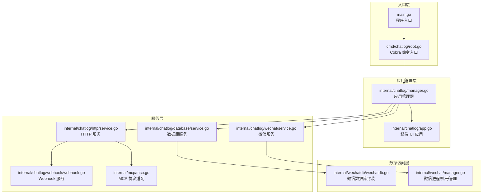
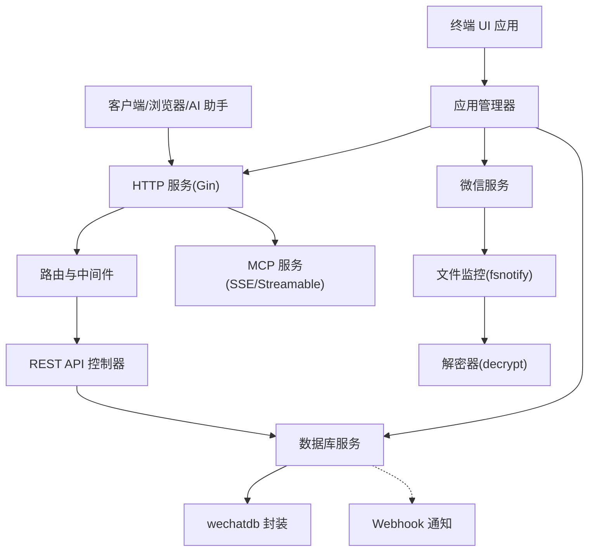
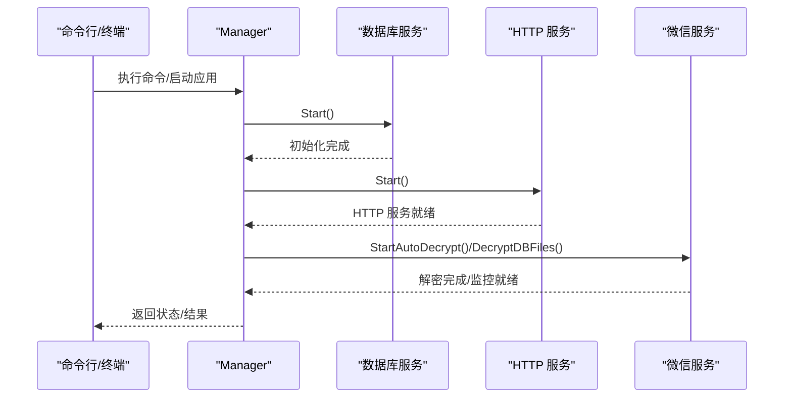
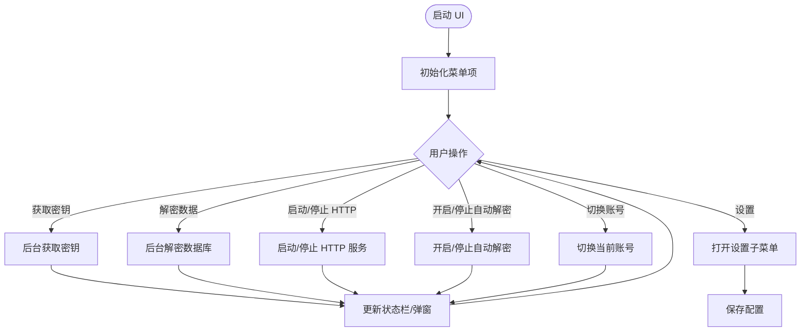
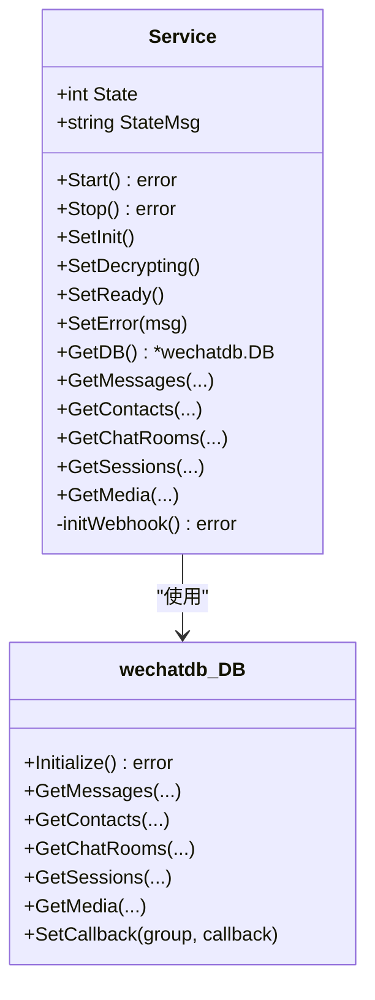
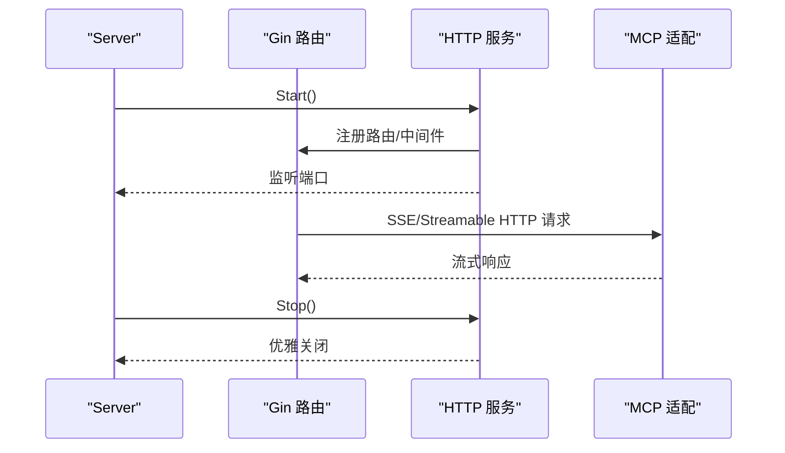
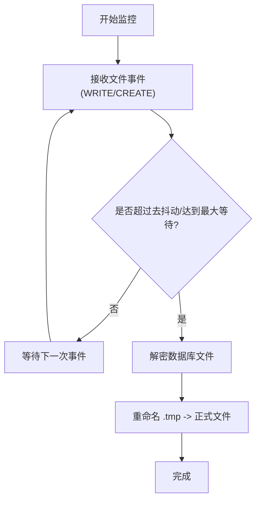
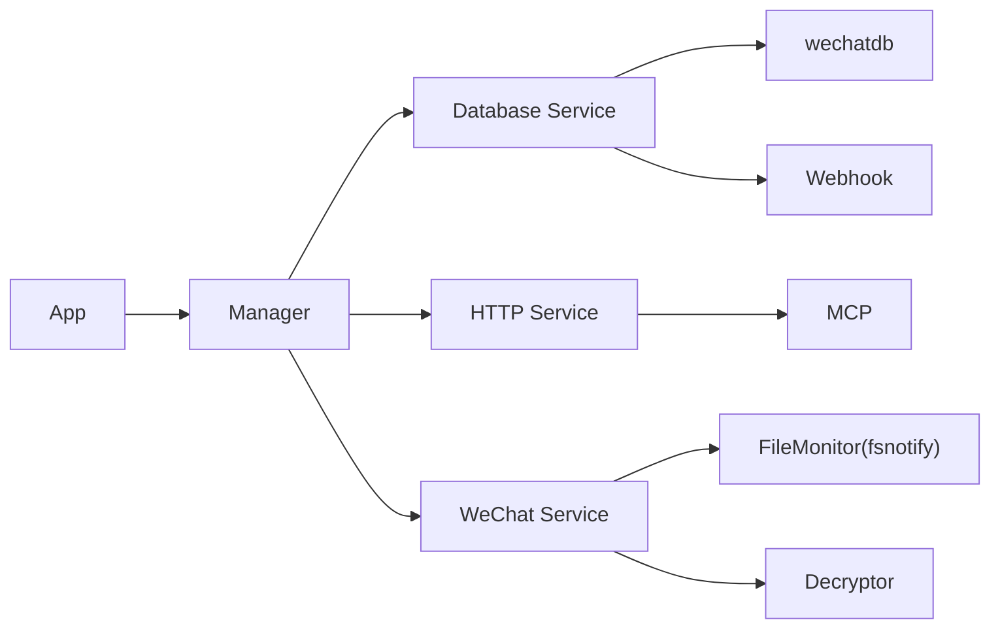

# 项目概述

<cite>
**本文档引用的文件**
- [README.md](file://README.md)
- [main.go](file://main.go)
- [cmd/chatlog/root.go](file://cmd/chatlog/root.go)
- [internal/chatlog/app.go](file://internal/chatlog/app.go)
- [internal/chatlog/manager.go](file://internal/chatlog/manager.go)
- [internal/chatlog/database/service.go](file://internal/chatlog/database/service.go)
- [internal/chatlog/http/service.go](file://internal/chatlog/http/service.go)
- [internal/chatlog/wechat/service.go](file://internal/chatlog/wechat/service.go)
- [internal/chatlog/webhook/webhook.go](file://internal/chatlog/webhook/webhook.go)
- [internal/mcp/mcp.go](file://internal/mcp/mcp.go)
- [internal/wechatdb/wechatdb.go](file://internal/wechatdb/wechatdb.go)
- [internal/wechat/manager.go](file://internal/wechat/manager.go)
</cite>

## 目录
1. [简介](#简介)
2. [项目结构](#项目结构)
3. [核心组件](#核心组件)
4. [架构总览](#架构总览)
5. [详细组件分析](#详细组件分析)
6. [依赖关系分析](#依赖关系分析)
7. [性能考虑](#性能考虑)
8. [故障排除指南](#故障排除指南)
9. [结论](#结论)

## 简介
Chatlog 是一款帮助用户从本地微信数据库文件中提取和查询聊天数据的工具，支持 Windows 与 macOS 系统以及微信 3.x/4.x 版本。项目提供数据解密、密钥管理、HTTP API 服务、MCP 协议集成、Webhook 通知、终端 UI 界面以及 Docker 部署等多种能力，既适合个人使用也便于与 AI 助手集成。

- 主要目标：从本地微信数据库安全地读取聊天记录、联系人、群聊、会话及多媒体内容，并通过 HTTP/MCP/Webhook 等方式对外提供统一访问入口。
- 技术特性：支持自动解密、密钥管理、HTTP API 查询、MCP Streamable HTTP、Webhook 新消息回调、多账号切换、终端 UI 与命令行模式、Docker 部署。
- 应用场景：数据分析、知识检索、自动化流程、AI 助手增强、合规审计等。

**章节来源**
- [README.md](file://README.md#L17-L28)

## 项目结构
项目采用模块化分层设计，核心分为命令行入口、应用管理器、服务层（数据库、HTTP、微信）、MCP 协议适配、Webhook 通知、模型与数据源等模块。

**图表来源**
- [main.go](file://main.go#L1-L13)
- [cmd/chatlog/root.go](file://cmd/chatlog/root.go#L1-L43)
- [internal/chatlog/manager.go](file://internal/chatlog/manager.go#L1-L69)
- [internal/chatlog/app.go](file://internal/chatlog/app.go#L1-L63)
- [internal/chatlog/http/service.go](file://internal/chatlog/http/service.go#L1-L59)
- [internal/chatlog/database/service.go](file://internal/chatlog/database/service.go#L1-L43)
- [internal/chatlog/wechat/service.go](file://internal/chatlog/wechat/service.go#L1-L48)
- [internal/chatlog/webhook/webhook.go](file://internal/chatlog/webhook/webhook.go)
- [internal/mcp/mcp.go](file://internal/mcp/mcp.go#L1-L29)
- [internal/wechatdb/wechatdb.go](file://internal/wechatdb/wechatdb.go#L1-L37)
- [internal/wechat/manager.go](file://internal/wechat/manager.go#L1-L49)

**章节来源**
- [main.go](file://main.go#L1-L13)
- [cmd/chatlog/root.go](file://cmd/chatlog/root.go#L1-L43)
- [internal/chatlog/manager.go](file://internal/chatlog/manager.go#L1-L69)

## 核心组件
- 应用管理器（Manager）：负责初始化上下文、协调数据库、HTTP、微信服务的启动与停止，处理密钥获取、解密、自动解密、HTTP 服务启停、会话刷新等。
- 终端 UI 应用（App）：提供菜单驱动的操作界面，支持密钥获取、解密数据、启动/停止 HTTP 服务、开启/停止自动解密、设置、切换账号等。
- 数据库服务（Database Service）：封装 wechatdb 数据库访问，提供消息、联系人、群聊、会话、多媒体查询接口，并初始化 Webhook 回调。
- HTTP 服务（HTTP Service）：基于 Gin 提供 REST API，包含健康检查、CORS、错误处理中间件；集成 MCP Streamable HTTP 服务。
- 微信服务（WeChat Service）：负责从微信进程提取密钥、监控数据目录变化、批量/增量解密数据库文件、处理去抖动与最大等待时间。
- Webhook 服务：根据配置对新消息进行过滤与回调推送。
- MCP 协议适配：实现 SSE 与消息处理通道，支持会话管理与并发控制。
- 微信进程/账号管理：跨平台检测微信进程、构建账号信息、提供便捷方法。

**章节来源**
- [internal/chatlog/manager.go](file://internal/chatlog/manager.go#L21-L38)
- [internal/chatlog/app.go](file://internal/chatlog/app.go#L25-L43)
- [internal/chatlog/database/service.go](file://internal/chatlog/database/service.go#L22-L43)
- [internal/chatlog/http/service.go](file://internal/chatlog/http/service.go#L16-L31)
- [internal/chatlog/wechat/service.go](file://internal/chatlog/wechat/service.go#L26-L41)
- [internal/mcp/mcp.go](file://internal/mcp/mcp.go#L17-L29)
- [internal/wechatdb/wechatdb.go](file://internal/wechatdb/wechatdb.go#L15-L21)
- [internal/wechat/manager.go](file://internal/wechat/manager.go#L35-L49)

## 架构总览
整体架构遵循“入口层 → 应用管理层 → 服务层 → 数据访问层”的分层设计，服务之间通过接口解耦，支持命令行与终端 UI 两种运行模式，同时提供 HTTP API 与 MCP 协议以满足外部系统集成需求。

**图表来源**
- [internal/chatlog/http/service.go](file://internal/chatlog/http/service.go#L33-L59)
- [internal/chatlog/database/service.go](file://internal/chatlog/database/service.go#L45-L54)
- [internal/chatlog/wechat/service.go](file://internal/chatlog/wechat/service.go#L70-L95)
- [internal/chatlog/manager.go](file://internal/chatlog/manager.go#L98-L120)

## 详细组件分析

### 应用管理器（Manager）
- 职责：初始化上下文与服务，协调启动/停止顺序，处理密钥获取、解密、自动解密、HTTP 服务启停、会话刷新。
- 关键流程：
  - 启动顺序：数据库服务 → HTTP 服务（4.0 版本设置图片 AES 密钥并扫描 XOR 密钥）
  - 停止顺序：HTTP 服务 → 数据库服务
  - 自动解密：基于文件监控组监听数据库文件变更，去抖动与最大等待时间控制解密节奏
  - 命令行模式：支持 key、decrypt、server 子命令，按配置自动解密与启动服务

**图表来源**
- [internal/chatlog/manager.go](file://internal/chatlog/manager.go#L98-L120)
- [internal/chatlog/database/service.go](file://internal/chatlog/database/service.go#L45-L54)
- [internal/chatlog/http/service.go](file://internal/chatlog/http/service.go#L61-L78)
- [internal/chatlog/wechat/service.go](file://internal/chatlog/wechat/service.go#L70-L95)

**章节来源**
- [internal/chatlog/manager.go](file://internal/chatlog/manager.go#L40-L69)
- [internal/chatlog/manager.go](file://internal/chatlog/manager.go#L98-L151)
- [internal/chatlog/manager.go](file://internal/chatlog/manager.go#L201-L224)
- [internal/chatlog/manager.go](file://internal/chatlog/manager.go#L335-L407)

### 终端 UI 应用（App）
- 职责：提供菜单驱动的交互界面，支持密钥获取、解密数据、启动/停止 HTTP 服务、开启/停止自动解密、设置、切换账号等。
- 关键点：菜单项状态随上下文动态更新；定时刷新信息栏；异步执行耗时任务并在 UI 中反馈结果。

**图表来源**
- [internal/chatlog/app.go](file://internal/chatlog/app.go#L202-L460)
- [internal/chatlog/app.go](file://internal/chatlog/app.go#L469-L652)

**章节来源**
- [internal/chatlog/app.go](file://internal/chatlog/app.go#L65-L89)
- [internal/chatlog/app.go](file://internal/chatlog/app.go#L99-L172)
- [internal/chatlog/app.go](file://internal/chatlog/app.go#L202-L460)
- [internal/chatlog/app.go](file://internal/chatlog/app.go#L469-L652)

### 数据库服务（Database Service）
- 职责：封装 wechatdb 数据库访问，提供消息、联系人、群聊、会话、多媒体查询接口；初始化 Webhook 回调。
- 状态管理：初始化/解密中/就绪/错误四种状态，便于 UI 与服务层感知。

**图表来源**
- [internal/chatlog/database/service.go](file://internal/chatlog/database/service.go#L22-L43)
- [internal/wechatdb/wechatdb.go](file://internal/wechatdb/wechatdb.go#L15-L21)
- [internal/wechatdb/wechatdb.go](file://internal/wechatdb/wechatdb.go#L61-L127)

**章节来源**
- [internal/chatlog/database/service.go](file://internal/chatlog/database/service.go#L45-L126)

### HTTP 服务（HTTP Service）
- 职责：基于 Gin 提供 REST API，包含健康检查、CORS、错误处理中间件；集成 MCP Streamable HTTP 服务。
- 生命周期：Start/ListenAndServe/Stop，优雅关闭支持超时控制。

**图表来源**
- [internal/chatlog/http/service.go](file://internal/chatlog/http/service.go#L33-L59)
- [internal/chatlog/http/service.go](file://internal/chatlog/http/service.go#L61-L89)
- [internal/mcp/mcp.go](file://internal/mcp/mcp.go#L31-L51)

**章节来源**
- [internal/chatlog/http/service.go](file://internal/chatlog/http/service.go#L16-L113)

### 微信服务（WeChat Service）
- 职责：从微信进程提取密钥、监控数据目录变化、批量/增量解密数据库文件。
- 文件监控：基于 fsnotify 的文件组，支持去抖动（1s）与最大等待（10s）策略，避免频繁触发与竞态。

**图表来源**
- [internal/chatlog/wechat/service.go](file://internal/chatlog/wechat/service.go#L97-L144)
- [internal/chatlog/wechat/service.go](file://internal/chatlog/wechat/service.go#L146-L184)

**章节来源**
- [internal/chatlog/wechat/service.go](file://internal/chatlog/wechat/service.go#L70-L95)
- [internal/chatlog/wechat/service.go](file://internal/chatlog/wechat/service.go#L97-L184)

### Webhook 服务
- 职责：根据配置对新消息进行过滤与回调推送，支持多条目配置与关键词匹配。
- 集成：数据库服务初始化时注册回调，回调函数通过 wechatdb 的 SetCallback 接口绑定。

**章节来源**
- [internal/chatlog/database/service.go](file://internal/chatlog/database/service.go#L111-L126)
- [internal/chatlog/webhook/webhook.go](file://internal/chatlog/webhook/webhook.go)

### MCP 协议适配
- 职责：实现 SSE 与消息处理通道，支持会话管理与并发控制；处理 session_id 的多种参数形式。
- 集成：HTTP 服务内嵌 MCP 服务器，通过路由暴露 /mcp 接口。

**章节来源**
- [internal/mcp/mcp.go](file://internal/mcp/mcp.go#L17-L51)
- [internal/mcp/mcp.go](file://internal/mcp/mcp.go#L53-L98)
- [internal/chatlog/http/service.go](file://internal/chatlog/http/service.go#L56-L57)

### 微信进程/账号管理
- 职责：跨平台检测微信进程、构建账号信息、提供便捷方法。
- 关键点：默认加载微信进程列表；支持按名称获取进程与账号；提供解密数据库的便捷方法。

**章节来源**
- [internal/wechat/manager.go](file://internal/wechat/manager.go#L51-L76)
- [internal/wechat/manager.go](file://internal/wechat/manager.go#L78-L93)
- [internal/wechat/manager.go](file://internal/wechat/manager.go#L100-L110)

## 依赖关系分析
- 组件耦合：Manager 对数据库、HTTP、微信服务存在强依赖；App 依赖 Manager；HTTP 服务依赖数据库服务与 MCP；微信服务依赖文件监控与解密器；数据库服务依赖 wechatdb 与 Webhook。
- 外部依赖：Gin（HTTP）、fsnotify（文件监控）、SQLite 驱动、MCP Go SDK、tcell/tview（终端 UI）。
- 循环依赖：未发现循环导入；服务通过接口解耦，避免直接耦合。

**图表来源**
- [internal/chatlog/manager.go](file://internal/chatlog/manager.go#L21-L34)
- [internal/chatlog/http/service.go](file://internal/chatlog/http/service.go#L16-L26)
- [internal/chatlog/database/service.go](file://internal/chatlog/database/service.go#L22-L29)
- [internal/chatlog/wechat/service.go](file://internal/chatlog/wechat/service.go#L26-L32)
- [internal/wechatdb/wechatdb.go](file://internal/wechatdb/wechatdb.go#L15-L21)

**章节来源**
- [internal/chatlog/manager.go](file://internal/chatlog/manager.go#L21-L34)
- [internal/chatlog/http/service.go](file://internal/chatlog/http/service.go#L16-L26)
- [internal/chatlog/database/service.go](file://internal/chatlog/database/service.go#L22-L29)
- [internal/chatlog/wechat/service.go](file://internal/chatlog/wechat/service.go#L26-L32)

## 性能考虑
- 文件监控去抖动：通过 1 秒去抖动与 10 秒最大等待时间平衡实时性与资源消耗，避免频繁解密。
- HTTP 服务优雅关闭：支持超时控制，减少连接中断带来的影响。
- 数据库状态机：明确的初始化/解密中/就绪/错误状态，便于 UI 与服务层快速判断与降级。
- Webhook 并发：MCP 的 ProcessChan 采用固定容量队列，防止过载；会话管理通过 map 保证线程安全。

[本节为通用指导，无需具体文件引用]

## 故障排除指南
- macOS SIP：获取密钥前需临时关闭 SIP，完成后可重新启用。
- Windows 显示异常：建议使用 Windows Terminal 运行程序。
- Docker 部署：不支持在容器内获取密钥，需提前在宿主机获取密钥并挂载数据目录。
- 无法获取密钥：检查微信进程是否存在、权限是否足够、是否处于登录状态。
- HTTP 服务启动失败：检查端口占用、防火墙设置、配置文件路径。
- 自动解密无效：确认数据目录正确、密钥已配置、文件监控已启动且无错误。
- Webhook 未回调：检查配置项 host、items.url、talker、sender、keyword 是否正确。

**章节来源**
- [README.md](file://README.md#L146-L177)
- [README.md](file://README.md#L93-L134)
- [README.md](file://README.md#L215-L293)

## 结论
Chatlog 通过清晰的分层架构与模块化设计，实现了从本地微信数据库中安全、可靠地提取与查询聊天数据的目标。其支持的密钥管理、自动解密、HTTP API、MCP 协议与 Webhook 能力，使其既能满足个人用户的日常使用，也能方便地与 AI 助手、自动化系统进行深度集成。项目在易用性、扩展性与安全性方面具备良好平衡，适合在本地环境中进行合规的数据分析与知识检索。